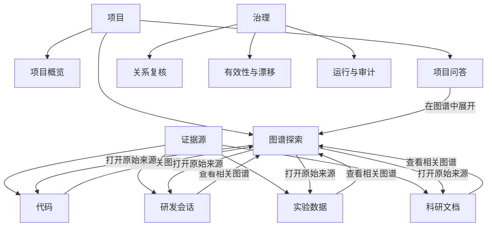
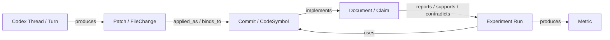

# 多源证据图谱与数据源界面重构方案

版本：v1.0  
目标：先统一页面职责和交互模型，再进入视觉稿与实现

## 1. 设计决策

本轮重构采用五个明确决策：

1. **恢复独立图谱页面**：一级导航新增“图谱探索”，不再把完整图谱藏在回答区 Tab 中。
2. **统一三类来源**：代码、Codex 会话、科研证据。科研证据同时包含文档和实验事实。
3. **增加跨源总览**：三类来源各有自己的图谱，并通过已确认或待复核关系在总览中连接。
4. **完整不等于一次画出全部节点**：全量规模始终可见，通过搜索、分面、逐层展开和列表模式保证可达；画布只加载当前任务相关子图。
5. **资产页一页只做一个主任务**：接入、浏览、详情和运行记录不再同时争夺首屏。

## 2. 新信息架构



建议导航文案：

| 分组 | 页面 | 用户得到什么 |
|---|---|---|
| 项目 | 项目概览 | 当前范围、健康状态、下一步 |
| 项目 | 项目问答 | 提问、答案、证据核对 |
| 项目 | 图谱探索 | 三域结构、跨源联系、路径 |
| 证据源 | 代码 | 仓库、版本、文件、Symbol |
| 证据源 | 研发会话 | Thread、Turn、Goal、Patch、Validation |
| 证据源 | 实验数据 | Experiment、Run、Metric、Dataset、Artifact |
| 证据源 | 科研文档 | Document、Section、Table、Figure、Claim |
| 治理 | 关系复核 | 候选关系及其依据 |
| 治理 | 有效性与漂移 | Claim 是否仍成立 |
| 治理 | 运行与审计 | 接入任务、索引、评测、权限 |

## 3. 独立“图谱探索”页面

### 3.1 页面骨架

桌面端采用固定三段式：

| 区域 | 宽度 | 内容 |
|---|---:|---|
| 左侧控制栏 | 260px，可折叠 | 视图、范围、实体类型、关系状态、时间/版本 |
| 中央画布 | 剩余空间 | 图谱、搜索、缩放、布局、逐层展开 |
| 右侧检查器 | 360px，可收起 | 节点详情、直接关系、证据、来源回跳 |

顶部只保留一行：

- 页面标题与当前项目范围
- `跨源总览 / 代码图谱 / 会话图谱 / 科研图谱`
- 搜索
- `保存视图 / 导出`

不再保留项目问答的大输入框、答案 Tab 和来源浏览器。

### 3.2 四种视图

#### 跨源总览

展示真正跨域的关系链，默认只显示已确认关系：



边样式：

- 实线：deterministic / parser_extracted
- 长虚线：human_confirmed / matched
- 点线：rule_derived / inferred
- 灰色：未复核
- 红色：冲突或 contradicted

跨源计数必须只统计端点属于不同来源域的边。当前 `contains_diff` 和 `parent` 不能再显示为“跨源关系”。

#### 代码图谱

默认骨架：

`Repository → Commit → FileVersion → CodeSymbol → TestResult`

可选关系层：

`DEFINES / CALLS / IMPORTS / MODIFIES / VALIDATED_BY / PARENT`

默认隐藏大批 DiffHunk，只在选中 Commit 或开启“显示变更细节”后展开。

#### 会话图谱

默认骨架：

`Thread → Turn → Goal / Decision → Patch / FileChange → Validation`

Command、ToolCall、ToolResult 默认按 Turn 折叠成“执行记录”簇，避免泛化标签淹没主线。

#### 科研图谱

统一原先分裂的文档与实验：

`Document → Section → Claim → ExperimentRun → Metric / Dataset / Artifact → Commit`

第三域不再叫“文档图谱”。即使只有实验而没有文档，也能形成科研图谱；只有文档而没有实验时，也能明确显示缺失验证。

### 3.3 加载与完整性

当前固定 24/36/60 节点的策略改为：

1. 首次加载 100–200 个“类型平衡”的骨架节点。
2. 每种实体有配额，单一叶子类型默认不超过可见节点的 40%。
3. 双击节点是“展开一跳”，不是把其他节点全部隐藏。
4. 可选择 `100 / 300 / 1000` 加载预算；超过画布预算时自动聚类。
5. 始终同时显示：
   - 全量索引：57,206
   - 已加载：180
   - 筛选后可见：126
6. 提供与画布同步的可搜索列表，用户无需靠视觉扫描找到所有实体。

建议代码域初始配额：

| 类型 | 默认配额 |
|---|---:|
| Repository | 全部或最多 8 |
| Commit | 12 |
| FileVersion | 24 |
| CodeSymbol | 60 |
| TestResult | 12 |
| DiffHunk | 仅上下文展开，默认最多 12 |

会话域和科研域采用相同原则：先保证主链完整，再加入细节节点。

### 3.4 图谱交互

| 操作 | 结果 |
|---|---|
| 单击节点 | 选中并打开右侧检查器 |
| 双击节点 | 加载并展开一跳邻居 |
| 拖动节点 | 移动节点并临时固定 |
| 拖动空白画布 | 平移 |
| Shift + 单击 | 多选 |
| 框选 | 批量选择 |
| 搜索实体 | 定位、闪烁强调并自动展开路径 |
| 右键节点 | 展开、隐藏、设为起点、复制 ID、打开来源 |
| Esc | 清除当前选择/关闭菜单 |
| `F` | 适配当前选择 |

拖动实现必须保存 `nodeId → {x, y, pinned}`，重渲染不能重新计算并覆盖用户位置。画布平移和节点拖动使用不同的 pointer 状态。

### 3.5 视觉规则

- 画布背景使用低对比浅色，不用高密度网格抢夺注意力。
- 节点主体保持简洁；只为选中节点、一跳邻居和高权重节点常驻标签。
- 长文本进入右侧检查器，画布只显示短名称与类型。
- 边标签默认隐藏，选中节点或路径时再显示。
- 来源域使用颜色，实体类型同时使用图标/形状，不能只靠颜色区分。
- 正文不小于 12px，控件文字不小于 13px，主要点击区不小于 32px。
- 1280px 宽度不得出现页面级横向滚动。

## 4. 四类资产页统一模板

所有资产页统一为：

1. 页面标题 + 一个主操作。
2. 紧凑状态摘要，不超过一行。
3. 主列表/树。
4. 内容阅读区。
5. 右侧详情抽屉，仅在选中对象后打开。
6. “运行记录”进入独立抽屉或二级 Tab。

### 4.1 代码

- 主操作：`添加代码仓库`
- 主区：仓库/目录树 → 代码阅读器
- 详情抽屉：版本、Symbol、关系、索引状态
- 次级入口：Git 历史、摄取任务
- 固定操作：`在图谱中查看当前仓库/文件/Symbol`

### 4.2 研发会话

- 主操作：`同步会话`
- 主区：会话列表 → 摘要时间线
- 默认可见：Goal、Decision、Patch、Validation
- 默认折叠：Command、ToolCall、ToolResult、原始 JSON
- 详情抽屉：当前 Turn 的证据包
- 对照功能只在勾选至少两个会话后出现

### 4.3 实验数据

首次使用只显示一个引导器：

`选择接入方式 → 创建/映射 Experiment → 查看 Runs`

有数据后：

- 主操作：`接入实验数据`
- 主区：Experiment 列表 → Runs 表格
- 详情抽屉：Config、Dataset、Metric、Artifact、Commit
- MLflow / Notebook / 手工 Run 放在接入向导中，不作为四个同级主按钮

### 4.4 科研文档

首次使用只显示 `接入科研文档`。

有数据后：

- 主区：文档列表 → 原文与结构阅读器
- 右侧抽屉：选中 Claim 的证据与验证状态
- “扫描匹配候选”只在已有 Claim 时出现
- 提供 `在科研图谱中展开`，并带入当前 Document/Claim

## 5. 页面间状态

跨页面保留一个统一上下文：

```text
project
repository / branch / commit
source domain
selected entity
question
graph view + filters
```

关键跳转：

- 问答证据卡 → 图谱：以证据实体为中心展开两跳。
- 图谱节点 → 原始来源：打开对应代码、会话、Run 或文档定位。
- 资产页 → 图谱：继承当前仓库、Thread、Run、Document 或 Claim。
- 关系复核 → 图谱：同时高亮候选边、两端节点和支持证据。

## 6. 后端与前端改造边界

当前 `/v1/graph` 只有 `code / codex / document`，并且最大 60 节点，无法支撑新交互。建议拆成：

| 接口 | 用途 |
|---|---|
| `GET /v1/graph/stats` | 三域与跨源真实总量 |
| `GET /v1/graph/facets` | 类型、关系、来源、版本分面 |
| `GET /v1/graph/overview` | 跨源确认关系总览 |
| `GET /v1/graph/neighborhood` | 按节点、深度、关系类型逐层展开 |
| `GET /v1/graph/search` | 查找实体并返回最短上下文路径 |
| `POST /v1/graph/subgraph` | 根据筛选和节点预算构建稳定子图 |

第三域的数据解析应合并：

- 文档：Document、Section、Claim、Table、Figure
- 实验：Experiment、Run、Metric、Dataset、Artifact、Notebook
- 跨源：Claim ↔ Run、Run ↔ Commit、Turn/Patch ↔ Commit/Symbol

## 7. 实施顺序

### P0：结构正确

1. 新增独立 `graph` 视图和一级导航。
2. 从项目问答移除完整图谱，只保留“在图谱中展开”。
3. 新增跨源总览，把第三域改为科研图谱。
4. 修正“跨源关系”统计口径。

### P0：图谱可用

1. 按类型配额构建骨架子图。
2. 实现邻居展开、搜索定位、节点拖动与固定。
3. 处理标签碰撞、聚类和大节点预算。
4. 补齐右侧检查器与原始来源回跳。

### P1：资产页收敛

1. 代码页拆出运行记录。
2. 会话页默认折叠底层执行事件。
3. 实验页改为接入向导。
4. 文档页改为响应式主从结构。

### P1：一致性与可访问性

1. 统一字号、间距、按钮、空态和抽屉。
2. 完成键盘、焦点、对比度、200% 缩放和 1280px 回归。

## 8. 验收标准

- 一级导航可直接进入图谱探索。
- 有跨源总览、代码、会话、科研四个视图；后三个分别对应三类来源。
- 科研图谱同时支持文档和实验实体。
- 默认代码子图不再被 DiffHunk 主导，主链实体类型齐全。
- 用户可拖动并固定节点，空白画布仍可平移。
- 双击节点能继续加载邻居，不需要重新查询整个图谱。
- 全量、已加载、可见三个数字明确区分。
- 跨源关系计数只包含跨域边。
- 1280px 桌面宽度无页面级横向滚动。
- 正文最小 12px，图谱核心功能可用键盘完成。
- 实验和文档无数据时只有明确的接入主操作，不展示重复空面板。
