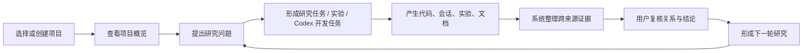

# 多项目科研工作台、全局检索与多源理解重构方案

> 日期：2026-07-24  
> 范围：全局导航、多项目管理、项目创建、全局搜索、科研文档、代码理解、跨来源关联、图谱、主题系统与前端工程结构  
> 目标：先修正产品结构和状态模型，再重建前端；不继续在现有单页 DOM 上叠加局部补丁。

---

## 1. 结论

当前系统的主要问题不是某几个卡片不好看，而是四层结构没有被分开：

1. **全局层与项目层混在一起**：后端已有项目实体，但前端仍把 `project-rag` 当作唯一项目，项目切换器只有外观，没有真正的项目上下文。
2. **导航 URL、页面状态和选中对象没有统一状态源**：页面内部用 `switchView()` 改 DOM，再用 `history.replaceState()` 改 URL；浏览器历史、直接修改 hash、页面刷新和内部跳转无法稳定保持一致。
3. **系统直接展示存储对象，而没有面向科研用户的理解层**：稳定 ID、绝对路径、英文 predicate、技术 derivation 和原始会话文本直接进入主要界面。
4. **所有页面都同时承担浏览、检索、编辑、审计和技术诊断**：结果是面板多、空白多、辅助文字多，但用户的主任务不突出。

因此本轮不能继续给旧页面增加更多卡片、标签或说明文字。应建立新的项目上下文、路由、检索和实体展示模型，再逐页迁移。

---

## 2. 本轮实测审计

### 2.1 已确认的功能与状态问题

| 编号 | 现象 | 根因 | 影响 | 优先级 |
|---|---|---|---|---|
| R-01 | URL 从 `#codex` 改为 `#workspace` 后，画面仍停留在 Codex 会话；刷新后才进入工作台 | `switchView()` 只在初始化和按钮事件中执行，没有统一监听浏览器历史与 hash 变化 | 跳转错乱、返回/前进不可靠、深链接不可靠 | P0 |
| R-02 | 顶部项目切换器显示项目名，但点击没有完整项目管理和切换流程 | 后端已有 `/v1/projects`，前端没有 `currentProjectId` 上下文，多个请求固定使用 `project-rag` | 多项目能力实际上未接入前端 | P0 |
| R-03 | 顶部全局搜索输入后回车，内容停留在输入框，没有形成稳定的搜索任务或结果状态 | 全局搜索只是调用 `switchView("search")` 并直接提交另一个页面表单，没有查询路由、搜索会话和结果模型 | 用户无法判断搜索是否执行、搜索范围是什么、如何返回结果 | P0 |
| R-04 | 图谱页面在深色模式下主画布和多个控件仍为浅色 | 图谱内部仍使用局部固定背景，未完全消费语义主题变量 | 深浅色断裂，视觉层级失真 | P0 |
| R-05 | 图谱首次进入长期显示“正在构建关系网络” | `/v1/graph/stats` 实测约 6.7 秒，`/v1/graph` 实测约 12.3 秒，前端顺序加载 | 接近 19 秒的空白等待，用户误以为功能损坏 | P0 |
| R-06 | 项目工作台有大量空画布，节点信息小，关系网像演示图而非可管理项目 | 工作台只有当前项目视图，没有项目级首页、任务摘要和聚焦规则 | 用户无法快速判断下一步要做什么 | P1 |
| R-07 | 代码仓库页首先显示仓库 ID、类型、Symbol 数量和大面积空白 | 缺少“代码理解/总结”产品层，代码数据仍按索引对象展示 | 不懂代码的用户无法快速理解仓库 | P1 |
| R-08 | 科研文档为空时，整页只剩两个空面板；导入时仍要求版本、作者、标签、迭代等共享字段 | 文档没有科研分类、自动推断和导入后整理流程 | 导入动作重，空状态没有科研语义 | P1 |
| R-09 | 关系复核列表展示 `Patch → FileVersion`、`path_suffix_unique`、绝对路径和 0.78 | 后端关系对象直接成为展示对象，缺少关系语义词典和展示 DTO | 用户看不懂“为什么关联”“要确认什么” | P1 |
| R-10 | “跨来源关联”展开后展示 raw predicate、source ID 和 target ID | `rag-workbench.js` 直接渲染 lineage edge | 技术对象淹没研究含义，无法支持管理判断 | P1 |
| R-11 | Codex 会话中出现完整安全包装文本和超长原始记录作为标题/摘要 | 会话解析结果没有经过用户目标提取、噪声清理和展示分级 | 会话列表、节点和详情严重失真 | P1 |
| R-12 | 代码、文档、图谱、会话、实验等页面都各自维护局部跳转逻辑 | 页面间通过散落的 `switchView()`、DOM ID 和全局 state 相互调用 | 修改一个页面容易破坏其他页面 | P0 |

### 2.2 已确认的底层能力

这次重构不是从零开始，以下后端能力已经存在并通过针对性测试：

- 项目、研究主题、研究迭代、工作任务和审计数据模型；
- 代码历史、Git ref、历史文件读取和双版本比较；
- 文档批量导入、章节、表格、图、引用和 Claim；
- 多源检索、证据包、关系链和权限过滤；
- Codex 会话、实验、评测、关系复核和 Codex Bridge；
- 目标测试集 `workspace / documents / web contract / code history refs` 共 21 项通过。

问题集中在：

- 前端没有把已有项目能力接成真正的多项目产品；
- 多个前端请求仍固定使用默认项目；
- 展示层没有把底层实体转换为用户可理解的信息；
- 路由、加载、主题和页面布局缺乏统一基础。

### 2.3 工程结构风险

当前前端约 13,968 行，主要由一个 1,325 行 HTML、一个 2,310 行全局脚本和多个超长 CSS/JS 文件组成。页面之间通过全局变量、DOM ID 和函数直接互调。继续局部修补会进一步增加以下问题：

- 一个事件被多个脚本重复注册；
- hash、当前视图、当前项目和当前实体彼此不同步；
- CSS 覆盖顺序代替了组件状态；
- 深浅色需要在每个页面重复兜底；
- 无法单独测试一个页面或一个跳转。

本方案要求建立新前端壳层和模块化页面，不在旧 DOM 上继续扩展第二套逻辑。

---

## 3. 产品目标与设计原则

### 3.1 用户最终看到的工作方式



### 3.2 必须坚持的原则

1. **先项目，后功能**：除项目中心和跨项目搜索外，所有业务页面必须有明确项目上下文。
2. **总结优先，原始内容按需展开**：代码、会话、实验、文档和关系都先展示“它是什么、为什么重要、当前状态”，再提供原文。
3. **一个页面只有一个主要任务**：浏览、编辑、审计和技术诊断不同时抢占主区域。
4. **系统推断优先于用户填写**：可从文件、仓库、当前主题、当前迭代和当前分支获得的信息，不要求重复输入。
5. **稳定 ID 保留但默认隐藏**：ID、hash、derivation 和原始 locator 进入“技术详情”，不进入主标题和主要卡片。
6. **只在真实执行任务中使用进度条**：研究状态、项目健康和关系完整度不使用伪进度条。
7. **无内容不等于空白面板**：空状态必须提供当前可执行动作或解释真正阻塞条件。
8. **深浅色由同一组语义变量驱动**：组件不得决定自己属于亮色还是暗色。

---

## 4. 新的信息架构

### 4.1 两级导航

参考用户提供的边栏结构，导航分为“全局入口”和“当前项目”两级。

```text
全局
├─ 开始解析
├─ 项目仓库
├─ 全局搜索
└─ 最近活动

当前项目：多源协同 RAG
├─ 项目概览
├─ 研究关系
├─ 代码理解
├─ 研发会话
├─ 实验与数据
├─ 科研文档
├─ 证据核验
├─ 关系复核
└─ 评测与治理

集成
├─ Codex 联动
└─ 项目设置
```

### 4.2 边栏行为

- 未选择项目时，“当前项目”区域显示禁用状态，不渲染十个无上下文入口。
- 选中项目后，项目名与状态显示在分组标题中；点击标题打开项目切换 Popover。
- 项目切换 Popover只包含：
  - 最近项目；
  - 搜索项目；
  - 查看全部项目；
  - 新建项目。
- 桌面宽度大于 1280px 时默认展开；1180–1279px 时默认图标栏。
- 折叠后使用图标和 tooltip，不保留会遮挡展开按钮的竖排文字。
- 当前项目的导航选择、详情选择和 Inspector 状态互不覆盖。

### 4.3 新路由

| 路由 | 页面 |
|---|---|
| `#/start` | 开始解析 / 接入来源 |
| `#/projects` | 多项目管理 |
| `#/projects/new` | 新建项目 |
| `#/search?q=` | 跨项目搜索结果 |
| `#/p/:projectId/overview` | 项目概览 |
| `#/p/:projectId/map` | 研究关系网 |
| `#/p/:projectId/code` | 代码理解 |
| `#/p/:projectId/code/:repositoryId` | 仓库概览 |
| `#/p/:projectId/code/:repositoryId/file/*path` | 代码文件 |
| `#/p/:projectId/sessions` | 研发会话 |
| `#/p/:projectId/experiments` | 实验与数据 |
| `#/p/:projectId/documents` | 科研文档 |
| `#/p/:projectId/evidence` | 证据核验 |
| `#/p/:projectId/relations` | 关系复核 |
| `#/p/:projectId/governance` | 评测与治理 |
| `#/p/:projectId/codex` | Codex 联动 |
| `#/p/:projectId/settings` | 项目设置 |

旧路由保留一次兼容跳转，例如 `#repository` 重定向到当前项目的 `/code`，但旧路由不再作为内部导航目标。

---

## 5. 多项目管理

### 5.1 项目仓库页面

项目仓库是系统的总入口，不使用当前“进入后直接看到单项目关系网”的方式。

页面结构：

1. 顶部：
   - 标题“项目仓库”；
   - 搜索；
   - 状态、标签和最近使用筛选；
   - 主按钮“新建项目”。
2. “继续工作”：
   - 最近 3 个项目；
   - 每个项目展示最后活动、当前研究主题、待复核数量和 Codex 执行状态；
   - 不展示百分比进度。
3. “所有项目”：
   - 默认使用可排序的紧凑列表；
   - 用户可切换为卡片；
   - 支持分页或虚拟列表。

项目列表行只展示：

- 项目名称；
- 一句话研究目标；
- 当前研究主题；
- 已接入来源：代码 / 会话 / 实验 / 文档；
- 需要处理的事项：待复核、失败任务、缺失证据；
- 最后活动和状态。

内部项目 ID、ACL、分类字段和索引代次不进入主列表。

### 5.2 项目概览

项目概览不是数据统计看板，而是“这个项目现在应该做什么”：

- 当前研究问题；
- 当前迭代和下一步动作；
- 最近产物；
- 待确认关系或结论；
- 正在运行的 Codex / 索引任务；
- 四类来源的可用状态；
- 最近活动。

页面只保留一个主要动作，根据状态动态变化：

- 没有研究主题：`创建研究问题`
- 没有来源：`接入项目来源`
- 有任务待执行：`继续当前任务`
- 有复核事项：`开始复核`
- 项目稳定：`提出下一步研究目标`

### 5.3 新建项目

创建对话框只要求一个字段：

- 项目名称或研究问题。

可选快捷项：

- 本地工作目录；
- 代码仓库路径；
- 文档目录。

系统自动完成：

- 项目 ID、ACL 和默认设置；
- 本地路径识别；
- Git 仓库和默认分支识别；
- 项目描述草案；
- 初始研究主题草案；
- 来源接入建议。

创建后直接进入项目概览，并显示“建议接入”而不是继续要求填写完整表单。所有高级字段放在项目设置中。

### 5.4 项目切换的状态规则

- `currentProjectId` 是路由的一部分，不再由全局常量决定。
- 切换项目时清理当前实体选择、历史 ref 和临时筛选。
- 仅保存布局偏好和最近项目，不保存历史代码版本。
- 有未保存编辑时，切换项目使用真正 Dialog 确认。
- 所有 API 客户端默认从项目上下文注入 `project_id`，禁止页面手写默认项目。

---

## 6. 全局搜索

### 6.1 两种入口

1. 顶部搜索框 / `⌘K`：打开 Command Palette。
2. 左侧“全局搜索”：进入完整搜索结果页面。

### 6.2 Command Palette

输入后同时提供四组结果：

- **向当前项目提问**
- **查找对象**：项目、代码模块、会话、实验、文档、结论
- **跳转到页面**
- **执行动作**：新建任务、导入文档、交给 Codex

每项必须显示来源项目和类型。跨项目结果不能假定当前项目。

键盘行为：

- `↑/↓` 选择；
- `Enter` 打开；
- `⌘Enter` 直接向当前项目提问；
- `Esc` 关闭并恢复原焦点。

### 6.3 完整搜索结果页

页面结构：

- 查询标题和作用域；
- “综合回答 / 对象 / 证据 / 关系”四个标签；
- 左侧轻量筛选器；
- 中间结果；
- 右侧 Inspector。

结果不按底层表名混排，按用户意图组织：

- “系统如何工作”
- “谁修改了它”
- “有哪些实验支持”
- “哪些文档提出了结论”
- “还有什么证据缺失”

每条结果展示：

- 人类可读标题；
- 一句话摘要；
- 来源类型和项目；
- 版本 / 时间；
- 为什么命中；
- 打开原始来源。

### 6.4 搜索会话

一次搜索是一个可恢复状态：

```ts
type SearchSession = {
  id: string
  query: string
  scope: { projectIds: string[]; sources: SourceType[] }
  intent: string | null
  status: "loading" | "ready" | "partial" | "failed"
  answer: AnswerSummary | null
  groups: SearchResultGroup[]
  selectedResultId: string | null
}
```

查询写入 URL，刷新、后退和分享链接都应恢复同一搜索状态。

---

## 7. 科研文档体系

### 7.1 一级分类

| 一级分类 | 用途 |
|---|---|
| 参考资料 | 参考文献条目、参考论文、综述、书籍、标准、数据集说明 |
| 研究设计 | 研究计划、问题定义、假设、实验计划、分析计划、研究协议 |
| 技术设计 | 系统设计、架构设计、接口设计、实现说明、变更设计 |
| 过程记录 | 工作记录、会议记录、决策记录、Codex 工作摘要、阶段总结 |
| 实验与证据 | 实验报告、结果分析、基准结果、观察记录、负结果 |
| 结论与复核 | 结论草稿、复核意见、审计报告、复现检查、投稿材料 |

### 7.2 二级类型

建议稳定枚举：

```text
reference_entry, paper, survey, book, standard, dataset_documentation
research_proposal, hypothesis_note, experiment_plan, analysis_plan, protocol
architecture, design_spec, api_spec, implementation_note, change_design
work_log, meeting_note, decision_record, codex_summary, milestone_report
experiment_report, result_analysis, benchmark, observation, negative_result
claim_draft, review_comment, audit_report, reproducibility_checklist, submission
```

### 7.3 文档导入

导入流程改为：

1. 选择文件、目录或文本；
2. 系统根据文件名、路径和内容推断标题与分类；
3. 用户只处理“无法确定”的少数项；
4. 导入后在文档库中批量调整分类和关联。

默认不要求：

- 版本；
- 作者；
- 标签；
- 迭代；
- Claim 提取规则。

这些字段由系统推断，或在“批量设置 / 高级设置”中修改。

本地直读与批量导入继续不设置产品级大小上限。处理策略为：

- 流式读取；
- 任务队列；
- 文件级状态；
- 失败项可单独重试；
- 大列表虚拟化；
- 原始工件与解析结果分离。

### 7.4 文档库页面

左侧不是只有“文档版本”，而是分类树：

```text
全部文档
参考资料
  ├─ 参考论文
  ├─ 参考文献
  └─ 数据集说明
研究设计
技术设计
过程记录
实验与证据
结论与复核
```

中间区域显示文档列表或文档阅读器；右侧 Inspector 显示：

- 文档摘要；
- 当前分类；
- 关联研究问题 / 迭代；
- 提取出的结论；
- 支持或反驳证据；
- 版本和技术信息。

空状态只展示：

- “导入文档”
- “连接本地目录”

不保留占满页面的空详情框。

---

## 8. 代码理解与代码总结

### 8.1 默认入口

用户进入“代码理解”后，默认看到仓库总结，不直接看到仓库 ID 和文件数量表。

仓库总结回答六个问题：

1. 这个仓库解决什么问题？
2. 如何启动或运行？
3. 主要模块是什么？
4. 请求 / 数据如何在模块间流动？
5. 测试和验证在哪里？
6. 当前最重要的风险和最近变化是什么？

### 8.2 页面层级

```text
代码理解
├─ 仓库概览
├─ 模块地图
├─ 入口与数据流
├─ 测试与风险
├─ 代码浏览
├─ 历史与 Diff
└─ 索引任务
```

仓库概览由连续内容区组成，不使用一屏十几个方形卡片：

- 一段仓库摘要；
- 3–8 个主要模块；
- 关键入口和运行方式；
- 最近变化；
- 测试状态；
- 推荐下一步。

点击模块后，Inspector 展示：

- 模块职责；
- 关键文件；
- 公开入口；
- 依赖与被依赖关系；
- 关联会话、任务、实验和文档；
- “在代码中打开”。

### 8.3 总结生成

总结采用两层生成：

1. **确定性结构层**
   - 语言分布；
   - 目录结构；
   - 入口文件；
   - import / call graph；
   - 公开 Symbol；
   - 测试目录和命令；
   - README / manifest / CI；
   - 最近 commit。
2. **可追溯语义层**
   - 仓库目的；
   - 模块职责；
   - 数据流；
   - 变更含义；
   - 风险；
   - 每个总结段绑定源码证据。

总结必须绑定 commit SHA。代码变化后旧总结标记“基于旧版本”，不静默复用。

### 8.4 建议数据模型

```text
code_summaries
  id
  project_id
  repository_id
  commit_sha
  scope_type         repository / directory / file / symbol
  scope_locator
  status
  summary_json
  generator
  generator_version
  created_at
  updated_at

code_summary_evidence
  summary_id
  section_key
  entity_id
  locator
  confidence
```

建议接口：

- `GET /v1/code/summary?repository_id=&ref=&scope=`
- `POST /v1/code/summary/jobs`
- `GET /v1/code/summary/jobs/{job_id}`
- `GET /v1/code/modules?repository_id=&ref=`
- `GET /v1/code/flows?repository_id=&ref=`

---

## 9. 跨来源关联重新设计

### 9.1 不再展示 raw lineage

当前形式：

```text
HAS_TURN
codex://thread/... → codex://thread/.../turn/...
```

新形式：

```text
会话“实现代码转 RAG 能力”
产生了代码变更
README.md · commit 39a2438

为什么关联：会话中记录了该文件修改，且版本与当前仓库一致
状态：系统确定 · 已确认
```

### 9.2 关系展示 DTO

后端保留稳定实体和 predicate，同时提供专门的展示对象：

```ts
type RelationPresentation = {
  id: string
  source: EntityPresentation
  target: EntityPresentation
  verb: string
  explanation: string
  evidenceSummary: string
  confidence: number
  confidenceLabel: "确定" | "较强" | "待核对"
  reviewStatus: "confirmed" | "unreviewed" | "rejected"
  technical: {
    predicate: string
    derivation: string
    sourceId: string
    targetId: string
  }
}
```

技术字段只在“技术详情”折叠区出现。

### 9.3 关系语义词典

建立统一映射，前端不得直接显示 predicate：

| 原始 predicate | 展示动词 |
|---|---|
| `HAS_TURN` | 包含研发轮次 |
| `HAS_ITEM` | 包含操作记录 |
| `HAS_EPISODE` | 形成开发阶段 |
| `contains_diff` | 产生代码变更 |
| `MODIFIES` | 修改 |
| `CALLS` | 调用 |
| `IMPORTS` | 依赖 |
| `supports` | 支持结论 |
| `refutes` | 反驳结论 |
| `qualifies` | 限定结论 |
| `implements` | 实现任务 |
| `validated_by` | 由实验验证 |

未知 predicate 显示“存在关联”，原始值只进入技术详情。

### 9.4 “跨来源关联”区的结构

按研究含义分组：

- 对当前研究问题的作用；
- 由什么任务产生；
- 修改了哪些代码；
- 使用了哪些实验验证；
- 支持或反驳哪些结论；
- 还缺什么证据。

每组只展示 3–5 条最有用关系，其余使用“查看全部”。用户可执行：

- 打开来源；
- 关联到当前研究；
- 请求复核；
- 解除关联；
- 在图谱中定位。

### 9.5 关系复核页

列表主标题改为一句可判断的陈述：

> “会话‘实现代码转 RAG 能力’可能修改了 `pyproject.toml`”

副信息：

- 为什么匹配；
- 目标版本；
- 影响的研究任务；
- 是否已有其他证据。

右侧对照区展示两个来源及差异，底部只有：

- 拒绝；
- 确认关系；
- 需要更多证据。

算法名、路径匹配规则和 confidence 小数放入技术详情。

---

## 10. 关键页面前端设计

### 10.1 全局壳层

- 左侧：实体边栏，不使用玻璃背景；
- 顶部：当前项目、全局搜索、主题、Codex 状态；
- 中间：页面内容；
- 右侧：按需出现的非模态 Inspector；
- Dialog 只用于创建、删除、执行和高风险确认。

### 10.2 项目关系网

保留参考图中的卡片关系语言，但数据必须动态生成：

- 中央主链：研究问题 → 研究迭代 → 当前任务 / 实验 → 结论；
- 左右分支：代码、Codex 会话、文档、评测；
- 关系线显示人类可读动词；
- 节点卡按来源类型使用细边和图标区分；
- 节点选中时打开右侧 Inspector；
- 新增节点从当前上下文创建；
- 画布支持拖动、滚轮缩放、适合视图、展开一阶和路径聚焦；
- 不按固定模板生成空节点。

项目关系网只呈现当前研究上下文的几十个关键实体。全量 60,000+ 实体进入独立图谱探索，不强行塞进项目概览。

### 10.3 全量图谱

- 使用 WebGL 图渲染器承载大规模节点；
- 初始只取项目骨架和高权重节点；
- 邻居按需分页加载；
- 图谱统计和首屏图数据并行请求；
- 元数据缓存；
- 取消旧请求，避免切换 domain 后旧结果覆盖新结果；
- 加载时显示骨架和当前阶段，不显示大面积空白；
- 深色模式下画布、控件、节点标签和 minimap 全部来自语义色。

### 10.4 Codex 会话

默认展示：

- 用户真正的任务目标；
- 执行结果；
- 代码变化；
- 测试结果；
- 风险和待复核项。

安全包装、工具协议和完整 JSONL 只放在“原始记录”。会话标题由以下优先级确定：

1. 用户显式标题；
2. 第一个有效用户目标；
3. 系统提取的短标题；
4. 时间 + 工作目录。

时间线卡片默认不展示长原文，展开后按“目标 / 动作 / 结果 / 验证”组织。

### 10.5 证据核验

默认不是 Files、代码和回答三栏同时开启。进入页面后：

- 左侧 280px：来源导航；
- 中间：回答和证据；
- 右侧 Inspector：所选证据；
- 代码或文档原文通过“打开来源”替换中间内容，或使用可切换 Split View。

用户可以选择“回答 + 来源”双栏，不保留四种意义不清的布局按钮。

---

## 11. 视觉系统

### 11.1 设计语言

目标是“研究桌面与实体工作台”，不是“毛玻璃仪表盘”：

- 主要表面为实体色；
- 1px 精准边界；
- 极轻的层级阴影只用于浮层和选中对象；
- 卡片圆角 8–10px；
- 按钮圆角 6–8px；
- 胶囊只用于状态、标签和计数；
- 页面不使用大段全大写等宽字作为装饰；
- 不以英文系统术语制造“专业感”。

### 11.2 字体

- 中文正文：系统中文无衬线；
- 拉丁和数字：系统 UI 字体；
- 代码、commit 和稳定 ID：等宽字体；
- 页面标题：28px / 1.25；
- 区块标题：17px / 1.35；
- 正文：14–15px / 1.55；
- 元信息：12–13px / 1.45；
- 代码：13px / 1.55。

### 11.3 颜色

基础色只承担层级；来源色只作为窄边、图标或关系线：

- 代码：蓝；
- 会话：紫；
- 实验：青绿；
- 文档：琥珀；
- 结论：绿色；
- 风险 / 阻塞：红。

禁止整张卡片使用高饱和来源底色。

语义 token：

```css
--surface-canvas
--surface-primary
--surface-secondary
--surface-elevated
--surface-selected
--border-subtle
--border-strong
--text-primary
--text-secondary
--text-muted
--accent-primary
--accent-hover
--focus-ring
--status-success
--status-warning
--status-danger
--source-code
--source-session
--source-experiment
--source-document
```

组件只能使用语义 token，不直接写亮色或暗色常量。

### 11.4 空间与密度

- 全局边栏展开宽度：220–240px；
- 图标栏：64px；
- 顶栏：56px；
- 内容最大宽度：1600px，图谱和代码页面可全宽；
- 主内容边距：24–32px；
- 普通行高：44–48px；
- 主要按钮高度：38–40px；
- Inspector：360–440px；
- 最低桌面宽度：1180px。

---

## 12. 前端技术架构

### 12.1 重建策略

在现有仓库中建立新的 `web/src` 应用，保持 FastAPI 后端不变。旧页面冻结，仅用于迁移对照。新页面通过 feature flag 逐步替换，最终删除旧 DOM 和重复 CSS。

推荐结构：

```text
web/
├─ src/
│  ├─ app/
│  │  ├─ router/
│  │  ├─ project-context/
│  │  ├─ query-client/
│  │  └─ theme/
│  ├─ components/
│  │  ├─ shell/
│  │  ├─ inspector/
│  │  ├─ dialog/
│  │  ├─ data-view/
│  │  ├─ entity/
│  │  ├─ code/
│  │  └─ graph/
│  ├─ features/
│  │  ├─ projects/
│  │  ├─ global-search/
│  │  ├─ research-map/
│  │  ├─ code-understanding/
│  │  ├─ sessions/
│  │  ├─ experiments/
│  │  ├─ documents/
│  │  ├─ evidence/
│  │  ├─ relations/
│  │  └─ codex-bridge/
│  ├─ api/
│  ├─ design-tokens/
│  └─ types/
└─ legacy/
```

推荐技术：

- React + TypeScript + Vite；
- 类型化路由；
- Query cache 处理服务端状态；
- 少量全局 store 只保存当前项目、布局和短期选择；
- WebGL 图谱用于全量图；
- CodeMirror 或 Monaco 用于代码与 Diff；
- 虚拟列表用于文件、文档、会话和关系候选。

### 12.2 路由状态

路由是页面状态的唯一真相：

```ts
type RouteState = {
  projectId?: string
  page: AppPage
  entityId?: string
  query?: string
  filters?: Record<string, string>
}
```

必须支持：

- 地址栏直接访问；
- 刷新恢复；
- 浏览器前进 / 后退；
- 页内跳转；
- 跨来源打开；
- 复制链接；
- 未保存编辑保护。

禁止：

- 页面只切 class 不更新路由；
- URL 更新但页面不响应；
- 组件直接调用另一个页面内部函数。

### 12.3 项目上下文

```ts
type ProjectContextValue = {
  currentProject: ProjectSummary | null
  projectId: string | null
  switchProject(projectId: string): Promise<void>
  capabilities: ProjectCapabilities
}
```

API 请求必须通过统一 client：

```ts
api.projects(projectId).documents.list()
api.projects(projectId).code.summary(repositoryId, ref)
api.projects(projectId).search.run(request)
```

禁止业务组件拼接 `project-rag`。

### 12.4 展示模型

前端不直接消费数据库行。为五类主要对象增加 presentation DTO：

- `ProjectSummary`
- `EntityPresentation`
- `RelationPresentation`
- `DocumentPresentation`
- `CodeSummaryPresentation`

DTO 负责：

- 人类可读标题；
- 一句话摘要；
- 来源图标和颜色；
- 状态文案；
- 主操作；
- 技术详情。

---

## 13. 后端与数据模型调整

### 13.1 项目

扩展项目列表，支持：

- 查询；
- 状态；
- 分页；
- 来源计数；
- 待复核计数；
- 当前主题；
- 最后活动；
- Codex 执行状态。

接口建议：

- `GET /v1/projects?q=&status=&cursor=&limit=`
- `GET /v1/projects/{project_id}/summary`
- `GET /v1/projects/{project_id}/sources`
- `POST /v1/projects/{project_id}/detect-sources`
- `POST /v1/projects/{project_id}/attach-sources`

### 13.2 全局搜索

保留当前 `/v1/search` 作为证据检索核心，新增用于 UI 的聚合层：

- `POST /v1/search/global`
- 支持单项目或多项目；
- 返回项目分组、对象分组、回答摘要、命令建议；
- 默认不返回完整 raw lineage；
- 结果包含 presentation。

### 13.3 文档

`scientific_documents` 增加：

- `category`
- `document_type`
- `lifecycle_stage`
- `summary`
- `classification_confidence`
- `metadata_json`

增加批量修改接口：

- `PATCH /v1/documents/batch`
- `GET /v1/documents/categories`
- `POST /v1/documents/classify`

迁移规则：

- 旧文档分类为 `uncategorized`；
- 后台任务尝试推断；
- 不阻塞现有文档读取。

### 13.4 关系展示

新增：

- `GET /v1/entities/presentation?entity_id=`
- `GET /v1/relations/presentation?entity_id=&cursor=`
- `GET /v1/relations/review-queue?project_id=&cursor=`

关系复核仍写回原关系表；presentation 只是安全的展示层。

### 13.5 图谱性能

- 合并首屏 metadata 与初始子图，或并行请求；
- graph metadata 增加缓存；
- 大查询在仓储层建立预计算摘要；
- API 返回超时前的 partial 状态；
- 图谱请求支持 AbortController；
- 首屏目标：2 秒内出现项目骨架，完整高权重子图 5 秒内可操作。

---

## 14. 实施顺序

### Phase 0：冻结旧 UI 与建立行为契约（1–2 天）

- 冻结旧页面新增需求；
- 保存关键页面截图和交互录像；
- 建立旧路由到新路由映射；
- 增加 hash / history / direct-load 路由测试；
- 增加项目上下文契约；
- 增加深浅色截图基线。

交付：

- 路由契约测试；
- 页面清单；
- 迁移 feature flag；
- 设计 token 初版。

### Phase 1：新壳层、路由与项目上下文（4–6 天）

- 新 AppShell；
- 两级边栏；
- 类型化路由；
- ProjectContext；
- Project Switcher；
- Inspector / Dialog / Popover；
- 统一主题和字体；
- legacy route redirect。

验收：

- 地址栏、刷新、前进后退、页面按钮行为一致；
- 切换项目后所有请求都使用目标项目；
- 非模态 Inspector 不阻塞页面；
- 深浅色无局部反色。

### Phase 2：多项目中心、项目创建与全局搜索（5–7 天）

- 项目仓库；
- 最近项目；
- 快速创建；
- 来源自动检测；
- Command Palette；
- 跨项目完整搜索；
- 搜索 URL 和搜索会话。

验收：

- 1 个字段可创建项目；
- 项目切换不串数据；
- `⌘K` 可搜索、跳转和执行主要动作；
- 搜索结果刷新后可恢复。

### Phase 3：科研文档和代码理解（7–10 天）

- 文档分类模型；
- 新文档库；
- 自动分类与批量调整；
- 代码总结数据模型；
- 仓库概览、模块和数据流；
- 代码证据定位；
- 代码浏览与历史能力接入。

验收：

- 新用户进入代码页面无需先阅读源码；
- 文档按科研语义分类；
- 导入不强制填写版本、作者、标签和迭代；
- 总结绑定明确 commit 和源码证据。

### Phase 4：跨来源关联和关系复核（6–8 天）

- Entity / Relation presentation；
- 关系语义词典；
- 新跨来源关联区；
- 新关系复核队列；
- 技术详情折叠；
- 图谱 Inspector 接入。

验收：

- 主要界面不出现 raw entity URI；
- 用户能看懂关系陈述及确认对象；
- 关系确认仍写回原审计和关系表。

### Phase 5：图谱、会话、实验、证据与治理迁移（8–12 天）

- WebGL 全量图谱；
- 项目关系网；
- Codex 会话摘要；
- 实验与证据页；
- 评测与治理；
- 所有空状态和加载状态重构。

验收：

- 图谱首屏不再长时间全白；
- 会话标题和摘要不含安全包装文本；
- 证据工作台默认只展示当前任务所需区域；
- 所有页面遵守新壳层和展示模型。

### Phase 6：删除旧前端与完整回归（4–6 天）

- 删除旧全局 DOM 和重复 CSS；
- 删除散落的 `switchView()` 调用；
- 删除前端 `project-rag` 默认值；
- 视觉回归；
- 键盘与可访问性测试；
- 多项目权限和数据隔离测试；
- 大数据性能测试。

---

## 15. 第一批实现任务

### P0：必须先完成

1. 建立 `AppRouter`，修复 hash、刷新、后退和深链接；
2. 建立 `ProjectContext`，移除前端固定项目；
3. 让项目切换器打开真实项目 Popover；
4. 新建项目仓库页面；
5. 重建全局搜索为 Command Palette + SearchSession；
6. 图谱统计与数据并行加载；
7. 图谱主题颜色全部 token 化；
8. 增加页面级错误边界和超时状态。

### P1：直接改善理解

1. 科研文档分类与新文档库；
2. 代码仓库总结和模块地图；
3. Relation presentation；
4. 关系复核人类可读化；
5. Codex 会话标题与目标清理；
6. 删除主要页面 raw ID、英文 predicate 和绝对路径。

### P2：完整迁移

1. 项目关系网；
2. 全量 WebGL 图谱；
3. 证据工作台；
4. 实验与数据；
5. 治理与评测；
6. 删除旧页面。

---

## 16. 测试与验收

### 16.1 路由

- 每个新路由可直接打开；
- 刷新不丢失项目和页面；
- 浏览器前进 / 后退正确；
- 内部跳转后 URL 与画面一致；
- 旧 hash 正确重定向；
- 跨来源打开能定位到正确项目和对象。

### 16.2 多项目

- 至少 10 个项目的搜索、筛选和分页；
- 项目 A 的仓库、会话、文档和关系不会出现在项目 B；
- 切换项目取消旧请求；
- 权限不足时不暴露项目名称和计数；
- 创建、归档和恢复操作有审计。

### 16.3 搜索

- 当前项目和跨项目范围清晰；
- 搜索结果有项目、来源、版本和命中原因；
- 查询 URL 可恢复；
- 无证据、部分证据和失败状态可区分；
- raw lineage 不出现在默认结果。

### 16.4 文档

- 支持批量文件、目录和文本；
- 不设置产品级文件大小上限；
- 自动分类失败时进入“待分类”；
- 批量分类和关联；
- 大列表虚拟滚动；
- 单文件失败不影响整个批次。

### 16.5 代码理解

- Summary 与 commit 一致；
- 切换 ref 后总结、模块和代码同步；
- 旧总结明确标记过期；
- 每个总结段能打开源码证据；
- 二进制和超大文件不会阻塞浏览。

### 16.6 关系与图谱

- 关系主界面只显示人类可读语义；
- 技术详情仍可审计；
- 图谱首次可操作时间符合预算；
- 拖动、滚轮缩放、适合视图和展开邻居稳定；
- 深色和浅色画布一致；
- 60,000+ 节点索引下按需展开，不一次渲染全部 DOM。

### 16.7 视觉

在 1180×800、1440×900、1920×1080 下测试：

- 导航不遮挡；
- Inspector 不挤成窄条；
- 主内容不出现无意义大空白；
- 文字不低于既定字号；
- 只有状态和标签使用胶囊；
- 无毛玻璃嵌套；
- 浅色、深色分别完成页面级视觉回归。

---

## 17. 明确不做的事情

- 不继续在旧 `index.html` 中添加新的整页 DOM；
- 不通过再增加说明文字解决流程问题；
- 不把所有底层对象都暴露给普通用户；
- 不用假进度条表达科研成熟度；
- 不为了“信息多”恢复三栏常驻；
- 不在未绑定项目上下文时猜测项目；
- 不用静态模板伪造动态关系网；
- 不破坏现有后端科研、证据、Git 历史和 Codex Bridge 数据模型。

---

## 18. 最终验收标准

重构完成后，一个第一次使用系统的用户应当能够：

1. 在项目仓库中找到或创建项目；
2. 一眼看懂项目当前研究问题和下一步；
3. 通过全局搜索找到代码、会话、实验和文档；
4. 不读源码也能理解代码仓库的结构、入口、测试和风险；
5. 按科研语义管理参考论文、设计文档、工作记录和实验结果；
6. 看懂一条跨来源关系为何成立；
7. 将任务交给 Codex，并回到系统核对结果；
8. 在需要时进入原始代码、原始会话、实验工件和技术关系详情；
9. 在深色和浅色模式下获得一致且清晰的界面；
10. 使用地址栏、刷新和前进后退时不再遇到页面与 URL 不一致。

