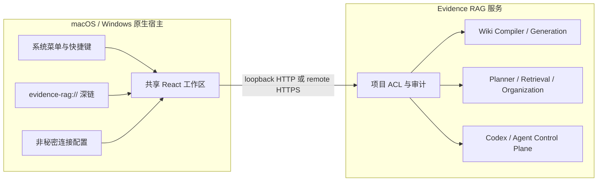

# TraceWiki 桌面端架构（当前正式 App）

> 2026-08-04 状态：Tauri + React 工作台继续作为当前正式 App UI，以保留完整 Wiki、RAG、图谱、会话与智能体体验。macOS SwiftUI 与 Windows WinUI 3 作为并行原生增强线，见 [NATIVE_DESKTOP_UI_ARCHITECTURE.md](./NATIVE_DESKTOP_UI_ARCHITECTURE.md)。下文“原生”仅指宿主、系统集成和安装包，不代表 UI 控件原生。

## 1. 产品边界

该方案不是另一套 RAG。仓库中的 React/Vite 页面是 Tauri 内嵌的正式 UI 资产和开发调试面，不作为独立 Web 产品发布。并行的两套原生增强客户端继续共用同一套：

- 项目、ACL、证据定位器与 generation；
- Wiki 编译、暂存、显式发布和原始证据回看；
- 智能查询规划、跨源检索、知识组织、反证、冲突与缺口合同；
- Codex 会话、关系复核、智能体审批和审计记录。

桌面宿主只负责 OS 能力、服务连接和窗口生命周期。任何证据判定、权限判断、查询组织都仍由 Python RAG 服务完成。

## 2. 技术选型

当前实现采用 Tauri 2：Rust 原生宿主 + macOS WKWebView / Windows WebView2。它获得了原生应用包、系统菜单、单实例、深链和较小的运行体积，UI 使用成熟 React 工作台渲染。

它是一套真正安装在操作系统中的桌面应用，但不是平台控件原生 UI。当前优先保证功能完整、交互清晰和性能稳定；SwiftUI/WinUI 3 只有达到同等覆盖才会成为默认界面，RAG 主权边界始终不变。

## 3. 运行结构

连接模式：

1. `managed_local`：仅允许 `localhost`、`127.0.0.1` 或 `::1` 的 HTTP 服务；默认端口 8765，与仓库正式数据库和开发端口隔离。
2. `remote`：只允许 HTTPS；禁止 URL 内嵌账号、密码、query 或 fragment。

连接配置写入 OS 应用配置目录，使用临时文件 + rename 原子发布，只保存服务地址、最近项目和 LLM 的公开
base URL/model。LLM API key 已由 native command 写入 macOS Keychain / Windows Credential Manager；启动后
native host 直接注册到后端进程内存，WebView 不可读，项目数据库和证据库也不持久化 secret。

## 4. 原生能力

- 单实例：第二次启动聚焦已有主窗口，并把参数交给现有实例。
- 系统菜单：项目、智能查询、Wiki、会话、智能体、状态与刷新。
- 深链：`evidence-rag://project/<project-id>/<module>` 与受限内部 route。
- 安全连接状态：启动后按 `/health` 合同校验；离线时明确显示查询与写入不可用。
- 模型配置：App 设置管理 OpenAI-compatible base URL/model/keychain key，并可执行不携带证据的健康检查。
- 最小权限：主窗口只获得 core、文件选择和 deep-link 所需权限；不开放任意 shell 或任意文件系统读取。
- 原生打包：macOS `.app/.dmg`，Windows `NSIS/MSI`；CI 分别在对应操作系统构建，避免伪交叉编译。

## 5. 信息架构与交互

桌面 App 使用两级导航：

- 全局层：项目、智能查询、关系网络、Wiki、智能体；
- 项目层：理解与查询、研发证据、执行与治理。

这替代原先十余模块全部挤在窄图标栏的方式。`⌘K/Ctrl+K`、系统菜单和页面导航最终都解析到同一受项目约束的 route。

智能查询结果按“问题 → 证据义务 → 支持/反证 → 冲突与版本风险 → 证据缺口 → 可审计关系路径 → 结论”组织，而不是返回一条扁平命中列表。

## 6. 发布与质量门

工程验证分四层：

1. React 单测、类型检查和确定性生产构建；
2. Rust 宿主单测与 `cargo check`；
3. macOS 本机构建 `.app` 并做启动/菜单/深链/服务离线恢复自测；
4. Windows CI 原生构建 NSIS/MSI，并在签名发布前保留 `unsigned` 标识。

代码工程完成不等于商店发布。正式分发还需要 Apple Developer ID/notarization、Windows code-signing certificate、更新签名密钥和真实目标机 QA。这些外部凭据不能由仓库测试伪造。
