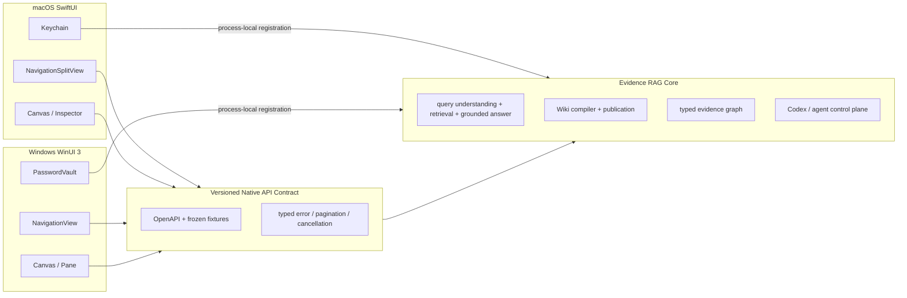

# TraceWiki 平台原生 UI 增强架构

状态：`PARALLEL_ENHANCEMENT / NOT_DEFAULT`  
日期：2026-08-04  
当前边界：`frontend/src-tauri` 的 React 工作台继续作为正式 App UI；SwiftUI/WinUI 3 是并行原生增强线，只有达到 Web 工作台的功能、交互与可访问性覆盖后才允许切换。

## 1. 决策

仓库同时维护两套真正的平台原生客户端，但当前不替代 TraceWiki 正式 App：

- macOS：Swift 6、SwiftUI、NavigationSplitView、Settings、Keychain；
- Windows：C#、Windows App SDK、WinUI 3、NavigationView、PasswordVault；
- 共享核心：同一个 Python Evidence RAG 服务和同一套版本化 HTTP/OpenAPI 合同；
- 原生增强线禁止：嵌入 WKWebView、WebView2、Electron 页面或把 React 页面截图式迁移到原生控件。

这不是复制两套 RAG。查询理解、混合检索、证据组织、Wiki 编译、ACL、版本水位、引用校验和智能体治理仍由后端负责；原生客户端负责平台交互、状态呈现、分页、取消、窗口、快捷键、凭据和可访问性。

## 2. 为什么保留成熟 Web UI

现有 `frontend/src-tauri/tauri.conf.json` 把 `../../web` 作为 `frontendDist`，macOS 使用 WKWebView，Windows 还声明了 WebView2 bootstrapper。Rust 层已经实现菜单、深链、连接配置和系统凭据库，但查询、Wiki、图谱、会话和智能体界面全部由 React 渲染。

因此它是可安装的桌面应用，不是平台控件原生 UI；但当前 Web 工作台的查询、Wiki、图谱、会话和智能体交互覆盖明显高于首批原生切片。产品决策是先修复 Web UI 的密度、溢出和信息层级，同时保留原生工程，避免为了“原生”牺牲核心功能和使用体验。

## 3. 共享边界

客户端不得从显示文本反推事实，不得在本地重写 evidence status、ACL、generation、citation membership 或 answer mode。所有详情跳转必须携带 canonical locator、project、source、version 和可选 focus，而不是只传标题。

## 4. 原生信息架构

主窗口采用稳定的“侧栏—内容—检查器”模型，而不是网页路由堆叠：

1. **项目**：原生表格、搜索、排序、最近项目；选择后固定 project context。
2. **可信查询**：问题编辑器、来源和预算工具栏；结果区按查询理解、证据义务、回答、声明引用、来源状态排列；证据在检查器中打开。
3. **Wiki**：左侧层级大纲，中间页面，右侧证据/版本/发布状态；支持原生查找和章节跳转。
4. **关系图谱**：可缩放网络、LOD 聚合、选中路径高亮、节点检查器；会话—代码—实验—文档边在同一画布中显示。
5. **研发会话**：分页列表、turn 时间线、工具调用、补丁与代码节点联动；大体量会话按窗口加载。
6. **智能体**：连接状态、能力、审批、运行记录和失败边界；高风险动作必须显示原生确认面板。
7. **设置**：独立系统 Settings 窗口；连接配置与 LLM 公开字段持久化，密钥只进入系统凭据库。

macOS 的核心命令同时出现在菜单、工具栏和快捷键；Windows 的核心命令同时出现在 CommandBar、快捷键和上下文菜单。两端保留相同业务语义，但不强求像素一致。

## 5. 状态与性能

- 所有远程请求都有 `idle/loading/loaded/empty/partial/error/cancelled` 明确状态；
- 查询和图谱请求支持取消，切换项目会取消旧 project 的在途请求；
- 列表默认分页 50 条，不再把全部会话、关系或历史一次性渲染；
- 图谱先加载摘要和聚合簇，再按视口展开节点与边；不可见节点不参与布局；
- 查询回答与 evidence inspector 分离，长 snippet 按需加载；
- 目标：本地服务已就绪时首屏可交互 P95 小于 2 秒，普通列表滚动保持平台刷新率，单次 UI 更新不在主线程解析大型图谱；
- 解码、排序和图谱布局在后台任务执行，UI 状态更新回到主线程；
- 缓存键必须包含 project、scope、generation/watermark 和请求合同版本。

## 6. 安全

- macOS 使用 Keychain，Windows 使用 PasswordVault；日志、崩溃报告、持久配置、导航状态和测试 fixture 不得出现 API key；
- loopback HTTP 只允许本机地址，remote 强制 HTTPS，拒绝带 credentials/query/fragment 的 base URL；
- provider key 只在用户保存或 App 恢复连接时注册到后端进程内存；
- UI 只渲染后端的脱敏 public contract，不缓存 raw ACL、secret、prompt 或未授权 evidence；
- 外部链接、文件定位和深链均经过 scheme、project、scope 与 canonical locator 校验；
- 正式服务库继续视为外部可变服务资产，客户端验收只使用 system-temp/in-memory 环境。

## 7. 迁移与兼容

迁移按功能切片，而不是先做一套空壳：

| 切片 | macOS | Windows | 共同完成条件 |
|---|---|---|---|
| 项目/连接/设置 | SwiftUI 原生 | WinUI 原生 | 真实项目与 provider public status；密钥不落盘 |
| 可信查询 | SwiftUI 原生 | WinUI 原生 | 真实 query request、理解、证据、引用、历史和取消 |
| Wiki | outline/detail/inspector | tree/detail/pane | 真实页面、版本、证据定位和发布状态 |
| 图谱 | Canvas + inspector | native canvas + pane | 分页/LOD、路径高亮、会话与代码互联 |
| 会话 | Table/Timeline | ListView/Timeline | 分页、turn、diff、代码影响 |
| 智能体 | controls + approval | controls + ContentDialog | 状态、能力、审批、审计 |

React/Tauri 只有在两端对应切片通过契约测试、原生交互验收，并达到 Web 工作台的功能与体验覆盖后才退出主路径；退出前不得删除它。

## 8. 验收门

只有同时满足以下条件，才能写“原生桌面完成”：

- App 主窗口的功能界面不包含 WebView；
- macOS `swift build`、`swift test`、`.app` 启动和真实 API 冒烟通过；
- Windows 在 Windows runner 完成 restore/build/test/package；macOS 上不冒充 Windows 真机结果；
- 两端对共享 redacted fixtures 解码一致，关键请求体与 OpenAPI 合同一致；
- 项目切换、查询、Wiki、图谱、会话、智能体和设置至少各有一个真实后端垂直切片；
- 分页、取消、错误、空状态、离线恢复、键盘操作和辅助功能通过；
- 密钥扫描、绝对路径扫描和正式库隔离通过；
- 原有 RAG 后端安全回归不退化。

当前 canonical 状态：

`TRACEWIKI_WEB_UI_DEFAULT / NATIVE_UI_PARALLEL_ENHANCEMENT / RAG_CORE_REUSED / NO_RELEASE`
