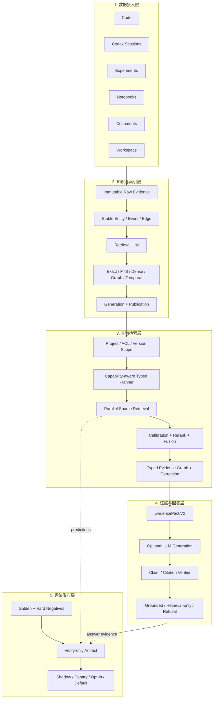

# 六源 RAG 底座技术附录（历史基线）

> 当前完整 Wiki + RAG 技术权威已迁移到
> [Evidence-Compiled Agent-Native Wiki + RAG 技术报告](../rag-optimization/development/07_RAG_END_TO_END_DEVELOPMENT_ROADMAP_AND_TECHNICAL_REPORT.md)。
> 本文保留六源 typed RAG 的实现细节；其中“Wiki 尚未实现”和“下一阶段实现 Wiki”的历史表述已被
> 2026-08-03 WR0–WR7 实施结果取代，不得用于判断当前状态。

版本：2026-08-03  
项目：`/Users/example/project/rag`  
当前状态：`MULTI_SOURCE_BASE_COMPLETE / WIKI_RAG_ENGINEERING_COMPLETE / DEFAULT_V1 / QUALITY_HOLD / NO_RELEASE`

这份文档只回答三个问题：

1. 当前 RAG 系统是怎样设计的；
2. 这套设计在仓库中是怎样实现的；
3. 实际使用了哪些技术，目前哪些能力已完成、哪些仍未达到生产资格。

论文、厂商产品和未来选型只在文末作为对照，不是本文主体。

## 1. 这个项目中的 RAG 是什么

这是一个面向研发活动的**多源证据 RAG 系统**。

它的输入不是单一文档库，而是六类研发证据：

```text
Code + Codex + Experiment + Notebook + Document + Workspace
```

它的输出不是若干个相似文本块，而是一个可检查的 `EvidencePackV2`：

- 支持结论的证据；
- 否定或限制结论的反证；
- 证据所属的项目、版本、generation 和 ACL；
- 事实状态和来源 authority；
- 可回跳的 citation locator；
- 当前仍然缺失的证据与拒答原因。

完整链路是：

```text
多源数据接入
→ 领域对象与检索单元
→ 多通道索引
→ Typed Query Plan
→ 分源召回
→ 校准、重排与证据图
→ Evidence Pack
→ Grounded Answer / Retrieval-only / Refusal
```

所以这个项目的 RAG 核心不是“向量搜索后调用 LLM”，而是：

> 在正确项目、权限和版本范围内，从多个研发系统中构造一份具备回答资格的证据上下文。

## 2. 整体架构

系统可分为五层：数据接入层、知识与索引层、查询检索层、证据与回答层、评估发布层。



### 2.1 为什么不是一个全源向量索引

六个来源的真实性标准不同：

- Code 要求 repository/ref/commit 一致；
- Codex 要求 ToolCall/Result、Patch 和 Validation 状态真实；
- Experiment 要求 dataset、seed、unit、direction 可比；
- Notebook 要求 cell 执行序、output/error 可观测；
- Document 要求 version/page/bbox/table/figure/citation 稳定；
- Workspace 要求 Topic/Iteration/Task 状态与时间关系成立。

因此系统只统一跨源 `CandidateV2` 合同，不把六源强行压成相同文本 chunk。

## 3. 数据如何进入 RAG

### 3.1 六类数据接入

| 来源 | 实际接入方式 | 主要对象 |
| --- | --- | --- |
| Code | 本地/Git 仓库、Git 历史、Tree-sitter 解析 | Repository、Commit、FileVersion、CodeSymbol、DiffHunk、TestResult |
| Codex | Codex session JSONL 和工作区关联 | Thread、Turn、Goal、Command、Patch、ToolResult、Validation |
| Experiment | MLflow FileStore/HTTP adapter 与手工 Run | Experiment、Run、MetricDefinition、MetricSeries、Observation、Artifact |
| Notebook | `.ipynb` JSON 结构 | Notebook、Cell、Parameter、Output、Error、Artifact |
| Document | Markdown、HTML、PDF、DOCX、纯文本 | DocumentVersion、Section、Page、Table、Figure、Claim、Citation |
| Workspace | 项目研究工作区和状态事件 | Project、Topic、Iteration、Task、Decision、EvidenceBinding |

### 3.2 摄取管线

```text
Source Adapter
→ Immutable Raw Evidence
→ Normalized Entity / Event / Edge
→ Retrieval Unit
→ Index Generation
→ Validation
→ Active Publication
```

关键实现原则：

- raw evidence 保留原始字节与 content digest，不被派生索引覆盖；
- parser 和 index 可从 raw evidence 重建；
- 每次构建形成独立 generation；
- 只有验证通过的 generation 才会切换为 active publication；
- 新 generation 失败不会覆盖上一个可查询版本；
- tombstone 表达当前失效，但保留历史审计。

### 3.3 Stable Entity 与 Retrieval Unit

系统将“可稳定引用的业务对象”和“为检索优化的小单元”分开：

```text
Stable Entity
  负责业务身份、版本、关系和 citation

Retrieval Unit
  负责 exact/sparse/dense 召回、小粒度区分和 context_ref
```

例如 CodeSymbol 是稳定实体，函数内的 AST block 可以是 retrieval unit；CodexTurn 是稳定实体，ToolResult window 是 retrieval unit。

这样可以同时获得：

- 小单元的高区分度召回；
- 通过 `context_ref` 加载完整父结构；
- 切块策略升级时 citation 不随 chunk ID 失效。

## 4. 查询是如何执行的

### 4.1 Query Scope

检索前先解析：

```text
project
repository / source instance
ref / commit / as-of time
ACL
active generation / publication
```

如果 scope 无法唯一确定，系统在来源检索前 fail-closed，不会自动放宽为整个项目。

### 4.2 Capability-aware Typed Planner

每个来源通过 Capability Registry 声明：

- 支持的 typed task；
- 可使用的 exact/sparse/dense/graph/temporal channel；
- 支持的 entity/filter/version 语义；
- 当前 generation、watermark、ACL model 和 health。

Planner 将自然语言问题编译为 `MultiSourcePlanV2`：

```text
Question
→ Intent / Complexity
→ Subquestions
→ Evidence Roles
→ Source Routes
→ Typed Tasks
→ Budgets / Deadlines / Stop Conditions
```

Typed task 会以结构化字段直达来源 runtime，例如：

```text
code.impact_analysis
experiment.compare
notebook.output
document.citation
workspace.lineage
```

它不会先全部降级为 `search`，再依赖 query marker 重新贴标签。

### 4.3 来源内多通道召回

| 通道 | 主要用途 | 当前实现 |
| --- | --- | --- |
| Exact | symbol、path、run ID、thread ID、metric、error code | 稳定 ID、字段索引和精确过滤 |
| Sparse | 错误串、命令、专有词、函数名、原文短语 | SQLite FTS5 |
| Dense | 低词面重合的语义问题 | `local-hash-v2` 本地特征向量 |
| Graph | calls、imports、modified-by、validated-by、derived-from、supports/refutes | typed edge + bounded traversal |
| Temporal | commit、generation、run、cell execution、document version、workspace state | 来源专属版本/时间过滤 |

目前的真实边界是：

> `local-hash-v2` 用于无外部模型时的可重现本地基线，不是生产 semantic embedding；当前也没有获得 HNSW/IVF 容量和延迟资格。

### 4.4 六来源的检索重点

| 来源 | 检索重点 |
| --- | --- |
| Code | repository/ref/commit、symbol/AST、diff、call/import graph、当前与历史版本 |
| Codex | goal、turn、ToolCall/Result pairing、Patch、Validation、事件时序 |
| Experiment | run/metric、dataset/seed/config、unit/direction、comparability |
| Notebook | cell order、parameter、output/error、reproduction、lineage |
| Document | section/page/table/figure/claim/citation、version、层级上下文 |
| Workspace | topic/iteration/task/decision 状态、evidence binding、版本漂移 |

### 4.5 并行、超时与部分结果

多来源路由并行执行，并对每个来源记录：

- deadline 与执行时间；
- candidate 数量与使用通道；
- available、timeout、error、unauthorized、not-indexed 等状态；
- cooperative cancellation 和 early stop。

来源超时不会被隐藏为“没有相关结果”；是否可继续回答，取决于它是否承担必需 evidence role。

## 5. 多源候选如何变成 Evidence Pack

### 5.1 统一 Candidate 合同

各来源将结果投影为统一候选，核心字段包含：

```text
candidate_id / source / entity_type
stable_uri / locator
retrieval_channel / raw_score / calibrated_score
authority / fact_status / review_status
version / generation / acl
evidence_roles / provenance / content
```

统一 Candidate 使跨源重排成为可能，但不会抹去来源原有的事实状态。

### 5.2 校准与重排

不同来源的 raw score 不可直接比较。系统先在来源内做 reviewed calibration，再综合：

- calibrated relevance；
- authority；
- version alignment；
- fact status；
- review status；
- freshness；
- counter-evidence；
- root provenance independence。

当前重排器是确定性的校准与业务因子组合，没有接入 production cross-encoder 或 LLM reranker。

### 5.3 Role-aware Fusion

普通 Top-K 容易选出多条重复支持证据。当前 Fusion 优先补齐问题所需的角色：

```text
Primary
Supporting
Counter
Validation
Historical
```

选择目标是在 token 预算内最大化证据角色覆盖和来源独立性，不是简单选择分数最高的 K 条。

### 5.4 Typed Evidence Graph

图用于验证证据之间的关系路径，例如：

```text
CodexTurn
→ produced Patch
→ changed FileVersion
→ contains CodeSymbol
→ validated_by ValidationResult
```

只有 relation type、scope、version、ACL 和 provenance 都通过的边才能进入路径。遍历有 hop、beam 和 edge budget，不做无界图扩展。

### 5.5 Corrective Retrieval

第一轮检索后，系统检查必需 evidence role 是否齐全。

如果缺失 Validation、Current Code 或 Counter Evidence，会使用缺口定向生成补检索任务。补检索最多两轮，不会自动扩大 ACL、改变 repository 或进入开放 Web。

### 5.6 EvidencePackV2

Evidence Pack 是检索和生成之间的正式交付物，包含：

- question 与 governed scope；
- selected evidence units；
- supporting/counter/validation 角色；
- verified/reported/observed/inferred 事实状态；
- typed evidence paths；
- citation map；
- source status 与超时/错误；
- missing roles、gaps 与 remediation；
- token budget 与上下文取舍。

这是当前 RAG 系统最核心的抽象。

## 6. 回答如何生成和验证

### 6.1 Answerability 先于 Generation

系统先根据 Evidence Pack 判断：

- 是否具备必需证据角色；
- 是否有必需来源超时或不可用；
- 是否存在未解决冲突；
- scope、version、ACL 和 citation 是否完整。

然后在三种输出中选择：

```text
grounded answer
retrieval-only
structured refusal
```

### 6.2 可选 LLM 生成

`UnifiedQueryService` 在以下三项都配置时，可以通过 `httpx` 调用 OpenAI-compatible `/chat/completions`：

```text
RAG_LLM_BASE_URL
RAG_LLM_API_KEY
RAG_LLM_MODEL
```

未配置 LLM 时，系统仍可返回确定性 evidence summary、partial 结果或 refusal。

### 6.3 Claim/Citation Verification

生成结果被解析为 `AnswerClaimV2` 与 `GroundedAnswerV2`。每个事实 claim 必须引用 Evidence Pack 中存在且属于当前 scope 的 evidence ID。

如果 citation repair 后仍不完整，或 generator 调用失败，系统降级为 retrieval-only，不把无证据回答当成成功。

## 7. 评估、安全与发布

### 7.1 Evaluation-first

每个来源和多源联合层都使用冻结 Golden，主要保留：

- ordered case membership；
- positive evidence 与 hard negative；
- slice 和 eligible metrics；
- 稳定 locator；
- 完整 denominator；
- component/config/seed identity。

指标实行三态：

| 状态 | 含义 |
| --- | --- |
| `AVAILABLE` | 证据和 denominator 足以正式计算 |
| `PROVISIONAL` | 已有结果，但生产资格或样本仍不足 |
| `UNAVAILABLE` | 无法诚实计算，不得填 0 或默认满分 |

### 7.2 Verify-only Artifact

评估产物保存 predictions、metrics、slices、errors、latency、security 和 checksums。Verifier 可以只依赖 artifact 重算结果，不重跑检索、不打开生产 DB、不依赖原机器绝对路径。

### 7.3 安全边界

安全检查不只在 API 入口，而是贯穿：

```text
request scope
→ source retrieval
→ candidate
→ graph edge
→ context
→ outbound LLM payload
→ citation
→ evaluation artifact
```

主要约束包括：

- project/repository/source ACL；
- version/generation 一致性；
- canonical relative locator；
- secret、credential、绝对路径、UNC/device path 和编码路径拒绝；
- internal reasoning 不入库；
- 未授权 scope 在来源执行前失败。

### 7.4 发布策略

```text
OFFLINE
→ SHADOW_INTERNAL_100
→ CANARY_5
→ CANARY_25
→ OPT_IN_100
→ DEFAULT_V2
```

工程完成、质量 qualified 与正式 release 是三个独立状态。当前仓库的正确口径仍是：

```text
ENGINEERING COMPLETE
DEFAULT_V1
QUALITY_HOLD
NO_RELEASE
```

## 8. 实际使用的技术

### 8.1 后端与 RAG 核心技术

| 技术 | 在当前项目中的用途 |
| --- | --- |
| Python 3.12/3.13 | 后端、摄取、RAG runtime、评估与 CLI |
| FastAPI + Uvicorn | REST API、后台任务与 Web 服务 |
| Pydantic v2 | Entity、Candidate、Plan、Evidence Pack、Answer、Release 等 typed contract |
| SQLite | 本地事务存储、generation/publication、来源派生事实与评估隔离库 |
| SQLite FTS5 | 词法召回、identifier 与错误文本检索 |
| `local-hash-v2` | 无外部 embedding 时的本地 deterministic dense baseline |
| Tree-sitter + language pack | 多语言 Code symbol/AST 解析和结构边界 |
| Git | repository、commit、branch、diff 和版本漂移 |
| HTTPX | MLflow HTTP、OpenAI-compatible generation 和外部 HTTP adapter |
| pypdf + python-docx | PDF/DOCX 文档解析 |
| PyYAML / JSON / JSONL | 配置、Notebook、Codex session、artifact 和 manifest |
| cryptography + HMAC/hash | attestation、component/evidence identity 与完整性验证 |
| pytest + Ruff | 回归、对抗测试与静态检查 |

### 8.2 前端与审阅技术

| 技术 | 用途 |
| --- | --- |
| React 19 + TypeScript | 研发证据工作台 |
| React Router | 项目、会话、RAG 查询、图谱和治理页路由 |
| TanStack Query | API 请求、缓存与状态同步 |
| React Markdown + remark-gfm | 答案、证据和文档内容展示 |
| Vite + Vitest + Testing Library | 前端构建、类型检查和交互测试 |
| 自研 graph workbench | 会话—代码—实验网络、分层/力导向布局、路径与节点详情 |

### 8.3 当前没有使用的技术

为避免把接口预留写成已实现，以下能力目前不应对外宣称已完成：

- production embedding model；
- HNSW、IVF 或分布式 ANN serving；
- Elasticsearch/OpenSearch/pgvector/Qdrant/Milvus/Weaviate 生产后端；
- SPLADE、ColBERT、BGE-M3 multi-vector serving；
- production cross-encoder/LLM reranker；
- RAPTOR 递归摘要树；
- Microsoft 式 community-summary GraphRAG；
- ColPali 类视觉页面检索；
- 开放自治 Agentic RAG 和生产 Agent 写入闭环。

## 9. 主要实现模块

| 责任 | 主要实现 |
| --- | --- |
| V1 query/answer/optional LLM | `query/service.py`、`query/interaction_v2.py` |
| Capability/Plan/Calibration/Fusion | `rag/multisource_foundation_v2.py` |
| 并行与 Corrective Pipeline | `rag/multisource_pipeline_v2.py` |
| Platform 到来源 typed runtime | `rag/multisource_runtime_v2.py`、`rag/production_sources_v2.py` |
| Evidence Graph | `rag/evidence_graph_v2.py` |
| Evidence Pack/Grounded Answer | `rag/answer_v2.py` |
| Governance/Switch | `rag/global_governance_v2.py`、`rag/global_switches_v2.py` |
| Release | `rag/release_admission_v2.py`、`rag/release_control_plane_v2.py` |
| Performance | `rag/performance_v2.py`、`rag/performance_runtime_v2.py` |
| 六来源 RAG | `rag/sources/{code,codex,experiment,notebook,document,workspace}/` |
| Evaluation | `evaluation/`、`evals/`、`tests/fixtures/` |
| API/Runtime | `api.py`、`runtime.py`、`cli.py` |
| Web | `frontend/src/`、构建产物 `web/` |

## 10. 一次查询的真实执行过程

以“哪次会话修改了这个函数，修改是否通过验证，当前代码是否仍保留”为例：

1. API 接收 question、project、repository/ref/commit 和 ACL；
2. scope resolver 确认唯一可见 repository 与 active generation；
3. Planner 生成 Codex history、Code current-state 和 Validation 三类证据角色；
4. Codex 执行 thread/turn/patch/validation 检索；
5. Code 执行 symbol/path/diff/current version 检索；
6. 结果投影为统一 Candidate，做 calibration 和 authority/version/fact rerank；
7. Evidence Graph 尝试构建 `Turn → Patch → FileVersion → Symbol → Validation` 路径；
8. 如果缺少 Validation 或 Current Code，执行定向 corrective retrieval；
9. Role-aware Fusion 在 token 预算中选择历史修改、当前代码、验证与反证；
10. Context Builder 生成 Evidence Pack 与 citation map；
11. Answerability 决定 grounded answer、retrieval-only 或 refusal；
12. 如果调用 LLM，生成后逐 claim 验证 citation；
13. trace 记录计划、各源状态、候选、图路径、上下文取舍和回答模式。

## 11. 当前已完成与未完成的边界

### 11.1 仓库内已完成

- 六来源 adapter、领域对象和 source-local retrieval；
- immutable raw、Stable Entity、Retrieval Unit 和 generation/publication；
- exact/sparse/dense baseline/graph/temporal 多通道检索；
- Capability Registry 和 typed multi-source planner；
- 并行分源检索、校准、重排、role-aware fusion；
- typed evidence graph 和 bounded corrective retrieval；
- EvidencePackV2、answerability、citation verifier 与 fallback；
- Golden、verify-only artifact、release contract 和对抗 Gate；
- FastAPI/CLI/React 工作台与人工审阅链路。

### 11.2 尚未完成生产资格

- 真实 production embedding/ANN 的质量、容量与 SLO；
- production cross-encoder/reranker 实验；
- 六来源和多源在正式数据分布上的持续 reviewed replay；
- 外部 LLM 的 faithfulness、latency 和 cost qualification；
- 正式库迁移/backfill；
- 真实 shadow/canary/rollback 运行证据；
- DEFAULT_V2；
- Agent 生产凭据、写入、人审和回滚闭环。

## 12. 这套 RAG 的主要技术特点

### 12.1 Source-local Truth

不用单一文本相似度取代代码版本、会话执行状态、实验可比性、Notebook 执行序和文档引用真值。

### 12.2 Evidence-first

检索阶段先生产可验证 Evidence Pack，生成器不拥有证据 authority。

### 12.3 Role-aware Context Selection

上下文选择优化的是必需证据角色覆盖，而不是重复相似文本的 Top-K。

### 12.4 Typed Evidence Graph

图用来证明影响、lineage、修改和验证路径，不是仅用于可视化。

### 12.5 Evaluation 与 Release 属于 RAG 本体

评估 denominator、component identity、artifact 和 release stage 与检索/生成同样是主链合同，不是项目结束时的附加报告。

## 13. 与当前成熟 RAG 技术的关系

当前仓库内的六源 typed RAG 是事实与治理底座；下一阶段的系统核心是把这些证据编译成
agent-native Wiki，并让检索从一次 top-k lookup 升级为可搜索、读取、沿链接导航、回查原始
证据和自修复的 retrieval-as-reasoning。完整实施合同见
[Agent-Native Wiki + RAG 完整技术优化方案](../rag-optimization/development/08_PRODUCTION_RAG_CORE_COMPLETION_PLAN.md)。

以下对照说明各类成熟技术在目标架构中的位置：

| 当前技术方案 | 与本项目的关系 |
| --- | --- |
| [LLM-Wiki](https://arxiv.org/abs/2605.25480)、[WikiKV](https://arxiv.org/abs/2606.14275)、[WikiLoop](https://arxiv.org/abs/2607.26604) | 知识编译、路径存储、Navigator 与 Builder 反馈闭环的主技术基线；WR0–WR7 仓库工程已实现 |
| [Microsoft GraphRAG Local/Global/DRIFT](https://microsoft.github.io/graphrag/query/overview/) | 作为局部、全局和探索 query mode，不替代 Wiki 与 raw evidence |
| [OpenAI Vector Stores/File Search](https://developers.openai.com/api/reference/resources/vector_stores)、[Bedrock Knowledge Bases](https://docs.aws.amazon.com/bedrock/latest/userguide/kb-how-retrieval.html)、[Vertex AI RAG Engine](https://docs.cloud.google.com/vertex-ai/generative-ai/docs/rag-quickstart) | 可替代标准文档 ingestion/retrieval，但不直接替代六源领域真值与 Evidence Pack |
| [Azure AI Search](https://learn.microsoft.com/en-us/azure/search/retrieval-augmented-generation-overview)、[Elasticsearch Hybrid Search](https://www.elastic.co/docs/solutions/search/hybrid-search)、OpenSearch | 可作为未来 production exact/sparse/dense/hybrid candidate backend |
| [pgvector](https://github.com/pgvector/pgvector)、[Qdrant](https://qdrant.tech/documentation/search/hybrid-queries/)、[Weaviate](https://docs.weaviate.io/weaviate/concepts/search/hybrid-search)、[Milvus](https://milvus.io/docs/multi-vector-search.md) | 可作为 production vector/ANN 后端；应使用当前 Golden 和 SLO 竞标选择 |
| [Neo4j GraphRAG](https://www.neo4j.com/docs/neo4j-graphrag-python/current/) | 可作为大规模 typed graph serving；当前图语义在应用层已定义 |
| [LangGraph](https://docs.langchain.com/oss/python/langgraph/agentic-rag)、LlamaIndex、[Haystack](https://docs.haystack.deepset.ai/docs/pipelines) | 是可选编排层；当前项目使用自有 typed planner/pipeline |
| RAGAS、ARES、[OpenTelemetry GenAI](https://opentelemetry.io/docs/specs/semconv/registry/attributes/gen-ai/)、[LangSmith](https://docs.langchain.com/langsmith/observability) | 可补充 LLM judge、trace 与在线观测；不取代 frozen Golden 和 verify-only artifact |

## 14. 当前最合理的技术升级顺序

现有六源合同未重做，以下升级已在 2026-08-03 的 WR0–WR7 中完成：

1. 冻结 Wiki IR、120-case Wiki Golden、current-V2/Wiki-only/Wiki+raw 对照；
2. 实现 path-indexed WikiStore、generation snapshot、ACL fragment 和原子发布/回滚；
3. 实现六源增量 Compiler、source-grounding validators 与持久 Error Book；
4. 实现 Evidence Obligation Graph 和 bounded Navigator 的 search/read/follow/raw-verify；
5. 接入 production embedding、hybrid search、cross-encoder/late-interaction rerank，但只作为候选加速器；
6. 实现 Builder patch 的 before/after marginal utility 和 guard regression；
7. 完成容量、并发、缓存、stale、rollback 和安全压测；
8. 真实 shadow/canary 证据达标后才讨论默认 Wiki RAG（外部延期，继续 HOLD）。

上层 `CandidateV2`、typed task、canonical locator、Evidence Pack、Golden 和 release contract 应保持稳定，以便不同检索后端可以用同一证据标准比较。

## 15. 配套设计与证据

- [Agent-Native Wiki + RAG 完整技术优化方案](../rag-optimization/development/08_PRODUCTION_RAG_CORE_COMPLETION_PLAN.md)
- [单来源 RAG 设计](../rag-optimization/01_SINGLE_SOURCE_RAG_DESIGN.md)
- [多来源融合 RAG 设计](../rag-optimization/02_MULTI_SOURCE_FUSION_RAG_DESIGN.md)
- [全局 RAG 加固](../rag-optimization/03_GLOBAL_RAG_HARDENING.md)
- [来源统一合同](../rag-optimization/sources/00_SOURCE_DESIGN_CONTRACT.md)
- [最终完整性 Gate](../rag-optimization/development/reviews/13_RAG_FINAL_COMPLETENESS_GATE_REVIEW.md)
- [产品与交互设计](02_PRODUCT_AND_INTERACTION_DESIGN.md)
- [RAG 面试 QA](03_INTERVIEW_QA.md)
