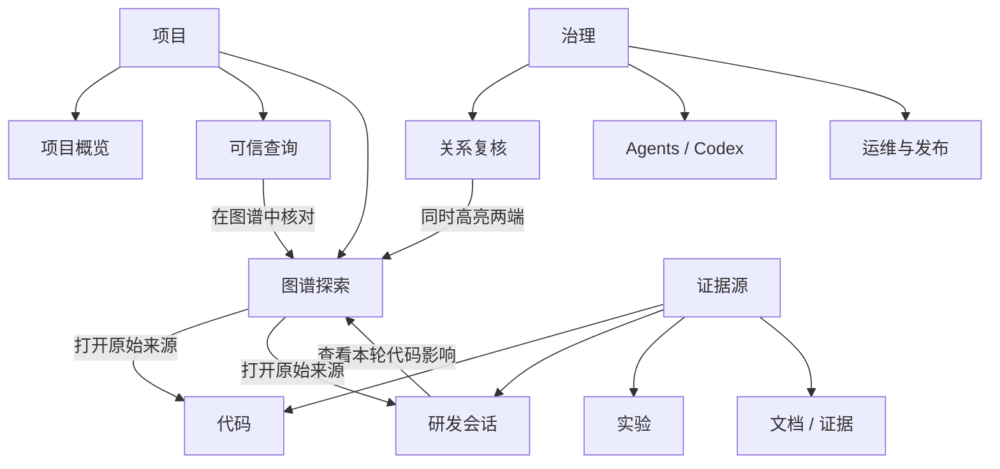
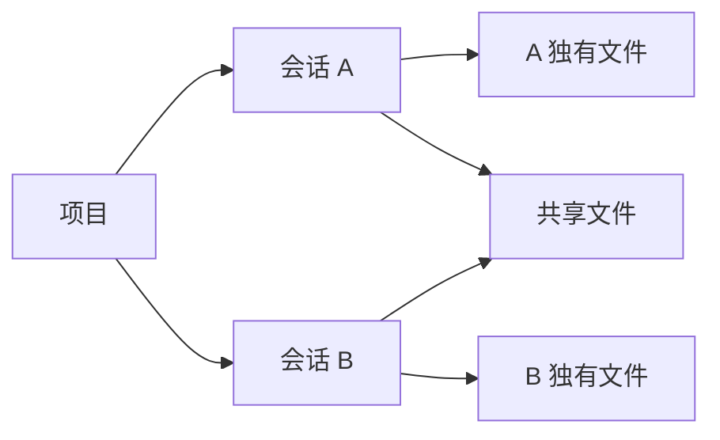

# 多源研发证据 RAG 产品与交互设计文档

版本：2026-08-02  
设计状态：仓库 L0–L3 产品面已实现；生产质量与默认 V2 仍处于 HOLD

## 1. 产品定义

### 1.1 产品目标

帮助研发人员、研究人员和审阅者回答三个问题：

1. 某个结论来自哪些原始证据？
2. 一次会话、代码变更、实验结果和文档 claim 之间是什么关系？
3. 当前证据是否足以回答、复核或发布？

产品主对象不是“数据源列表”，而是：

```text
项目 / 研究问题
→ 查询或审阅任务
→ 多源 Evidence Pack
→ 证据关系与原始定位
→ 回答、复核、拒答或下一步行动
```

### 1.2 用户角色

| 角色 | 核心任务 |
| --- | --- |
| 研发人员 | 查代码、追踪会话修改、定位验证和影响范围 |
| 研究人员 | 比较实验、查看 Notebook 复现链和文档 claim |
| 人工审阅者 | 审核候选关系、证据角色、冲突和引用 |
| 项目负责人 | 查看阶段、风险、覆盖率、阻塞和下一步 |
| 平台管理员 | 管理接入、索引、权限、质量门和发布状态 |

### 1.3 设计原则

1. **证据优先**：摘要不能替代原始定位和版本。
2. **关系可解释**：边必须说明来源、状态和依据。
3. **渐进披露**：列表负责浏览，图谱负责关系；细节按需展开。
4. **状态诚实**：空、慢、失败、未授权和不可用必须清楚表达。
5. **上下文不丢失**：跨页面保留项目、问题、会话、轮次、文件和焦点。
6. **有界加载**：不为了“看起来完整”一次渲染全量节点或超大会话。
7. **人工可复核**：重要结论可以回到原始会话、代码、Run、cell 或页码。
8. **危险操作显式确认**：批量复核、摄取、同步和执行必须说明影响范围。

## 2. 信息架构



### 2.1 当前路由与职责

| 路由 | 页面 | 首要任务 |
| --- | --- | --- |
| `/projects` | 项目中心 | 选择、创建和进入项目 |
| `/p/:projectId/overview` | 项目概览 | 状态、来源覆盖、风险、下一步 |
| `/search` | 全局可信查询 | 跨项目/项目级提问和证据查看 |
| `/p/:projectId/map` | 图谱探索 | 跨源网络、会话影响、代码白板 |
| `/p/:projectId/code` | 代码工作台 | 仓库、版本、文件、符号和历史 |
| `/p/:projectId/sessions` | 会话列表 | 查找、筛选、分页和同步会话 |
| `/p/:projectId/sessions/:threadId` | 会话详情 | 回合、消息、命令、变更和代码影响 |
| `/p/:projectId/codex` | Codex 控制面 | 客户端、token、execution、approval |
| `/p/:projectId/agents` | Agents | 查看代理状态、能力和权限边界 |
| `/p/:projectId/documents` | 科研文档 | 文档、结构、claim 和证据 |
| `/p/:projectId/experiments` | 实验与数据 | Experiment、Run、Metric、Artifact |
| `/p/:projectId/evidence` | 研究资产 | 统一浏览可审阅证据 |
| `/p/:projectId/relations` | 关系复核 | 扫描、逐条审阅、全部确认 |
| `/p/:projectId/ops` | 运维 | 来源健康、引擎、质量门和 release |

## 3. 全局交互模型

### 3.1 持久上下文

跨页面跳转保留：

```text
project_id
repository / ref / commit
source domain
thread / turn
selected entity / focus
question
graph board / filters / load budget
return path
```

可分享、可回退的焦点写入 URL；纯视觉偏好（主题、分栏比例、部分折叠状态）可存浏览器本地状态。

### 3.2 状态层级

每个页面必须支持：

- skeleton/loading；
- empty with next action；
- partial/provisional；
- success；
- permission denied；
- fail-closed/refusal；
- recoverable error + retry；
- stale/version changed。

页面不能把 `UNAVAILABLE` 显示成 0 分或成功，也不能把只读能力显示成可执行按钮。

### 3.3 原始来源回跳

每张 Evidence Card 或图谱节点至少提供一个动作：

- 在当前工作台核对；
- 打开原始代码；
- 查看会话轮次；
- 打开 Run/Metric；
- 定位 Notebook cell/output；
- 定位文档页/section/claim。

## 4. 关键用户流程

### 4.1 项目接入与首次使用


要求：

- 接入任务异步化并可查看失败原因；
- 成功后显示发布版本而不是笼统“已同步”；
- 超大文件或会话明确说明为何跳过和如何处置；
- 不把 Raw Object、WAL 或 generation table 作为一级业务导航。

### 4.2 可信查询

1. 用户输入问题；默认 scope 为当前项目。
2. 预览系统理解、来源计划、typed tasks 和预算。
3. 执行后展示来源状态、引擎路由和 Evidence Pack。
4. 回答区先显示原问题、系统理解、范围和回答模式。
5. 用户点击证据，在同一工作台定位原始来源。
6. 证据不足时显示拒答原因、缺失角色和下一步，而不是空白答案。

### 4.3 会话浏览与代码影响

会话列表只在“研发会话”页面呈现，图谱不复制一个完整会话目录。

流程：

```text
筛选/分页查找会话
→ 打开会话详情
→ 在有界时间线中选择回合
→ 查看该回合 Goal / Command / Patch / Validation
→ “查看本轮代码影响”
→ 图谱保留 thread + turn_focus
→ 展示相邻回合与关联文件
→ 点击文件进入代码详情，同时保留会话焦点
```

大会话规则：

- 列表分页；
- 时间线窗口化；
- 图谱只加载焦点附近回合和少量关联文件；
- 超过安全体积的会话提供解释和处置建议；
- 不取消安全上限来换取表面“全部加载”。

### 4.4 关系复核

流程：

```text
扫描候选
→ 查看待处理总数
→ 分页审阅高置信候选
→ 对照源、目标和信号
→ 单条通过/拒绝
→ 或确认“全部通过”完整快照
→ 服务端原子校验并写入 audit
```

“全部通过”必须：

- 显示将处理的完整数量；
- 二次确认；
- 使用服务端可信 reviewer；
- 校验 pending snapshot、source generation 和 target generation；
- 任一变化返回 409，不能部分成功；
- 逻辑关系去重但保留全部候选 ID 和路径。

### 4.5 Agents 与 Codex 接入

当前产品区分“可见”和“可执行”：

- 未授权时可查看同步状态、能力和审计；
- token pending 或 client unauthorized 时执行按钮禁用；
- 未来执行需要凭据、scope、approval、claim/report 和撤销流程；
- 插件安装属于独立 privileged workflow，不能从普通查询隐式触发。

## 5. 图谱探索设计

### 5.1 图谱职责

图谱用于回答“哪些对象如何相互影响”，不是替代会话列表、代码树或文档目录。

提供三种工作方式：

1. **研究总图**：跨会话与代码的整体影响网络；
2. **会话影响**：围绕一个 thread/turn 展开代码变更；
3. **代码白板**：围绕仓库、模块、文件和符号查看结构关系。

### 5.2 研究总图的自动组织

总图使用确定性左到右分层，而不是每次变化的随机力导向：



布局规则：

- 项目位于左侧；
- 会话按拥有文件数和稳定 identity 排序；
- 会话本地文件组成紧凑网格；
- 多会话共同影响的文件进入共享列；
- 布局结果由数据决定，刷新后保持稳定；
- 默认隐藏边标签，放大或选中时显示；
- “会话 → 代码影响映射”辅助面板默认折叠；
- 点击映射同步选中节点、关系链、详情和 URL focus。

### 5.3 图谱节点与边

节点至少显示短名称、类型、状态；完整 identity、scope、ACL、版本和 locator 放入详情检查器。

边视觉：

- 实线：deterministic / confirmed；
- 虚线：project scope / context；
- 点线：candidate / inferred；
- 红色：conflict / rejected；
- 选中路径高亮，其他关系降噪。

### 5.4 节点详情

详情分为：

- 概览：为何重要、上下游数量、当前状态；
- 层级：项目—来源—实体结构；
- 关系：传入、传出、可复核边；
- 定位：canonical URI、版本、路径/行号/回合；
- 证据与权限：来源、ACL、citation 和可执行动作。

打开详情时必须有可见反馈：选中描边、焦点标题、审阅路径更新和 URL 变化，避免“跳转无痕”。

### 5.5 大图性能

- 区分全量索引、已载入、筛选后可见；
- 采用节点预算、类型配额和逐层展开；
- 会话影响窗口最多展示受控回合和文件组；
- 过多节点时聚类或切换同步列表；
- 拖拽节点与平移画布使用不同 pointer 状态；
- 用户拖拽后保留 pinned 坐标，不被自动布局覆盖。

## 6. 页面设计规范

### 6.1 统一资产页模板

1. 标题、范围和一个主操作；
2. 单行状态摘要；
3. 左侧列表/树；
4. 中央内容阅读区；
5. 右侧详情抽屉；
6. 运行记录放次级 Tab/抽屉。

### 6.2 长列表

| 数据 | 当前策略 |
| --- | --- |
| 会话列表 | 20 条/页 |
| 会话时间线 | 18 轮/页；API offset/limit |
| 研究资产 | 24 条/页 |
| 代码提交 | 20 条/页 |
| 关系复核 | 20 条/页；服务端候选窗口有界 |
| 图谱 | 节点预算 + 局部展开，不做全量 DOM |

分页必须显示总量、当前范围、前后页和筛选后的数量；不能只做前端截断却声称是全量。

### 6.3 密度与排版

- 页面正文至少 12px，交互控件至少 13px；
- 核心点击区不小于 32px；
- 画布长文本进入检查器；
- 颜色同时配合图标/形状，不只靠颜色表达；
- 复杂工具区支持折叠；
- 重要风险、拒答和未授权状态使用清晰文案而不是只有颜色。

### 6.4 响应式

桌面优先，但核心流程在窄屏应可用：

- 侧栏可折叠；
- 三栏转为画布 + 抽屉；
- 卡片由横向改纵向；
- 图谱详情全屏或底部抽屉；
- 不出现页面级水平滚动；
- 列表、筛选和主要动作不被隐藏。

### 6.5 可访问性

- 所有图标按钮有 accessible name；
- focus 可见；
- Tab 顺序符合视觉顺序；
- Escape 关闭菜单/抽屉；
- 键盘可完成搜索、选择、翻页和打开详情；
- 状态不只用颜色；
- loading/error 使用 live region 或可感知文本。

## 7. 组件与状态合同

### 7.1 通用组件

- `PageHeader`：标题、范围、主操作；
- `StatusStrip`：总量、载入、质量和权限；
- `FilterBar`：搜索、来源、类型、状态、版本；
- `PaginatedList`：分页、空态、选择；
- `EvidenceCard`：角色、来源、locator、回跳；
- `GraphCanvas`：节点、边、缩放、拖拽、框选；
- `NodeInspector`：概览、层级、关系、定位；
- `ReviewPanel`：候选、证据对照、审阅动作；
- `PermissionGate`：未授权原因和申请路径；
- `QualityBanner`：V1/V2、HOLD、NO_RELEASE。

### 7.2 URL 合同

建议查询参数：

```text
board=overview|session|code
focus=<canonical entity id>
thread=<thread id>
turn=<turn id>
turn_focus=<turn locator>
repository=<repository id>
code=<relative path>
relation=<relation id>
```

所有参数进入模型前经过 canonical/安全校验；非法或越 scope 焦点回退到安全总览，并显示原因。

## 8. 文案规范

推荐：

- “证据不足，未生成结论”；
- “当前仅有 2/4 个必要证据角色”；
- “该关系尚未人工确认”；
- “本次只加载 10 个相邻回合，完整会话共 311 轮”；
- “当前默认使用 V1；V2 仍处于质量观察期”；
- “客户端未授权，执行功能不可用”。

避免：

- “成功”但不说明发布版本；
- “无数据”但不给下一步；
- “已验证”但只有助手文字；
- “全部节点”但实际只加载局部子图；
- “Agent 已连接”但没有 token/approval authority。

## 9. 验收标准

### 9.1 全局

- 主导航能到达所有核心任务；
- 跨页面保留项目和焦点；
- 空、慢、失败、拒答和未授权状态可理解；
- mutation 有二次确认和 audit；
- 桌面核心路径无控制台错误。

### 9.2 会话

- 会话列表完整但分页；
- 大会话不会一次渲染全部回合；
- 选中回合能查看真实代码影响；
- 文件跳转后 thread/turn 上下文保留；
- 超大会话有明确处置说明。

### 9.3 图谱

- 总览不是三个来源卡片，而是可展开的实体网络；
- 自动布局稳定、无节点重叠、明显减少交叉；
- 会话与代码通过直接 mapping edges 联动；
- 节点详情包含关系、定位和证据权限；
- 边标签默认降噪；
- 用户拖拽不被重排覆盖；
- 大图采用有界加载和聚类。

### 9.4 关系复核

- 真正待审队列不为空时可见；
- 单条和全量操作都解释影响；
- 全量操作处理服务端完整快照；
- generation 变化时原子拒绝；
- 每条确认关系可追溯 reviewer 和候选依据。

## 10. 后续设计优先级

1. 服务端游标化大会话，消除底层完整聚合；
2. 图谱节点聚类、框选、多选路径对比和保存视图；
3. 会话—代码变更 diff 对比和“该会话带来什么”摘要；
4. 节点详情增加前后版本、证据冲突和人工注释；
5. 关系扫描改为异步增量任务和可恢复进度；
6. 智能查询加入可编辑 plan、预算解释和查询历史对比；
7. Agent 凭据、approval、执行、暂停、撤销和审计完整生命周期；
8. 生产质量通过后再设计 V2 默认发布提示与回滚控制。

## 11. 相关设计证据

- [产品信息架构](../PRODUCT_INFORMATION_ARCHITECTURE.md)
- [图谱与来源 UX 重构](../GRAPH_AND_SOURCE_UX_REDESIGN.md)
- [多项目研究工作台重构](../MULTI_PROJECT_RESEARCH_WORKBENCH_REDESIGN.md)
- [全产品自测](../rag-optimization/development/reviews/15_RAG_FULL_PRODUCT_SELF_TEST_REPORT_2026-08-02.md)
- [会话图谱与分页自测](../rag-optimization/development/reviews/16_SESSION_GRAPH_PAGINATION_SELF_TEST_REPORT_2026-08-02.md)
