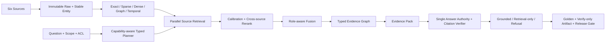

# 当前 RAG 系统面试 QA：设计、实现与技术栈

> 当前主面试口径见
> [Wiki + RAG 项目面试 QA](../rag-optimization/interview/08_RAG_PROJECT_INTERVIEW_QA.md)。
> 本 117 题题库保留六源 typed RAG 的底座追问；其中未包含或仍把 Agent-Native Wiki 写成未来项的回答
> 属于历史基线，不应单独用于介绍当前系统。

版本：2026-08-03  
适用对象：后端、RAG/搜索、AI 应用、平台工程、系统设计面试  
当前口径：`L0–L3 ENGINEERING COMPLETE / DEFAULT_V1 / QUALITY_HOLD / NO_RELEASE`

## 0. 使用方式

这份问答不是功能清单，也不是行业方案调研。回答时始终先讲当前系统：

```text
当前 RAG 解决什么问题
→ 整体架构怎样分层
→ 数据、查询、检索、证据和回答怎样执行
→ 实际使用了哪些技术
→ 哪些已工程完成，哪些仍未 production-qualified
```

主流 RAG 技术只用于解释选型和后续升级，不应代替对当前实现的说明。

需要重点区分三件事：

1. **检索相关**不等于事实正确；
2. **工程实现完成**不等于生产质量达标；
3. **有答案**不等于应该回答。

---

## 1. 开场与项目定位

### Q1：请用一句话介绍项目。

这是一个面向研发活动的六源证据 RAG：它在项目、权限和版本范围内检索 Code、Codex、Experiment、Notebook、Document、Workspace，构造可验证的 Evidence Pack，再决定生成答案、只返回证据还是拒答。

### Q2：请用 30 秒介绍项目。

系统先把六类研发数据保存为 immutable raw evidence，再生成稳定实体、事件、关系和 retrieval unit；查询时先解析 project、ACL、repository、version 和 active generation，再由 typed planner 把问题拆给对应来源。各来源通过 exact、FTS5、`local-hash-v2` dense baseline、graph 和 temporal 通道召回，结果经过校准、重排、角色融合和证据图验证，最终形成 `EvidencePackV2`。生成模型只是可选消费者，引用不完整就降级或拒答。

### Q3：请用三分钟讲完整架构。

我把当前系统分成五层：

- **数据接入层**：六个 source adapter 接入 Code、Codex、Experiment、Notebook、Document 和 Workspace。原始内容保存为不可变证据，再派生 Stable Entity、Event、Edge 和 Retrieval Unit；每次索引构建形成 generation，通过校验后才切换 active publication。
- **知识与索引层**：精确字段和稳定 ID 负责 exact retrieval，SQLite FTS5 负责词法检索，`local-hash-v2` 提供可重现的本地 dense baseline，typed edge 负责关系扩展，各来源自己的 commit、run、cell execution、document version 和 workspace state 负责 temporal filtering。
- **查询检索层**：先解析 project、ACL、repository/ref/commit 或 as-of time；Capability Registry 告诉 planner 各来源能执行什么，planner 生成 typed task、子问题、证据角色、预算和停止条件。分源检索并行运行，结果统一投影为 `CandidateV2`，但保留来源自己的 authority 和事实状态。
- **证据与回答层**：候选经过 reviewed calibration、authority/version/fact rerank、role-aware fusion、typed evidence graph 和最多两轮 corrective retrieval，构造成 `EvidencePackV2`。Answerability 先判断证据是否足以回答；可选 LLM 通过 OpenAI-compatible API 组织答案，claim/citation verifier 再检查每个结论。
- **评估发布层**：冻结 Golden、hard negative、eligible denominator、component identity 和 predictions，产出可离线重算的 verify-only artifact。工程完成、质量 qualified 和正式 release 分开管理；当前正确状态是 `DEFAULT_V1 / QUALITY_HOLD / NO_RELEASE`。

实际技术栈是 Python、FastAPI、Pydantic、SQLite/FTS5、Tree-sitter、Git、HTTPX、pypdf/python-docx，以及 React 19、TypeScript、TanStack Query 和 Vite。当前没有生产 embedding、ANN 或 cross-encoder，因此不能把本地 dense baseline 描述成生产语义检索。

### Q4：这个项目要回答什么类型的问题？

典型问题不是“某个词出现在哪”，而是“哪次会话为什么改了这个函数、实际改了哪些文件、执行了什么验证、当前代码是否仍与当时结论一致”。这类问题同时需要过程证据、代码证据、版本对齐、状态判断和关系推理。

### Q5：项目最核心的技术判断是什么？

研发 RAG 的核心产物不应是若干相似 snippet，而应是一个经过 scope、ACL、generation、事实状态、关系和 token 预算约束的 Evidence Pack。生成只是消费这份证据包的最后一步。

### Q6：当前项目“完成”了吗？

仓库内 L0–L3 的工程能力已经形成闭环，最终完整性 Gate 为 P0/P1/P2=0；但生产 replay、质量资格、正式迁移和 shadow/canary 仍未完成。因此准确口径是“工程完整、默认 V1、质量 HOLD、未发布”，而不是“已经生产上线”。

---

## 2. 为什么不是普通向量 RAG

### Q7：为什么一个向量库加 Top-K 不够？

向量相似度只能近似回答“文本像不像”，不能证明证据属于当前 commit、来自真实 ToolResult、具有相同实验 unit、通过 ACL，或仍然有效。研发问答的主要错误往往来自状态、版本和关系，而不是语义完全召回不到。

### Q8：为什么不能把六个来源统一成一种文本块？

因为不同来源的正确性条件不同：代码依赖 repository/ref/commit，Codex 依赖 call/result pairing，实验依赖 dataset/seed/unit/direction，Notebook 依赖 cell 执行序，文档依赖 version/page/bbox，Workspace 依赖 state history。系统统一的是 Candidate 合同，不是抹平来源真值。

### Q9：相关性为什么不能直接当置信度？

一段历史错误日志可能与问题高度相关，但不能作为当前成功状态的证据。因此候选同时保留 calibrated relevance、authority、fact status、version alignment、review status 和 counter-evidence，最终排序不会只看一个相似度分数。

### Q10：为什么必须支持拒答？

在工程决策中，错误答案可能导致错误修改、错误发布或错误实验结论。如果 scope 不唯一、必要角色缺失、来源超时、证据冲突或引用不完整，系统返回结构化拒答和 remediation，比生成看似完整的答案更安全。

### Q11：Graph RAG 能否替代全部检索？

不能。图适合回答调用、影响、lineage 和跨来源多跳关系，但对精确 ID、错误串、长尾语义和新鲜文本仍需要 exact、sparse 和 dense。图是候选扩展和约束层，不是所有召回问题的唯一解。

### Q12：生成模型在系统里承担什么职责？

它不负责创造来源事实，也不决定 ACL 或 publication。它消费已治理的 Evidence Pack，组织答案、标注不确定性并引用证据；claim/citation verifier 再检查它是否越过证据边界。

---

## 3. 数据面：证据如何进入 RAG

### Q13：从来源对象到可检索数据的链路是什么？

```text
Source Adapter
→ Immutable Raw Evidence
→ Normalized Entity / Event / Edge
→ Retrieval Unit
→ Exact / Sparse / Dense / Graph / Temporal Index
→ Validated Generation
→ Active Publication
```

原始证据与派生索引分开；索引可以重建，raw evidence 不被覆盖。

### Q14：为什么保存 immutable raw evidence？

它提供事实追溯、parser 升级回放和派生结果重建。如果标准化逻辑有 bug，可以从原字节恢复，而不是把错误派生对象当成唯一历史。

### Q15：Stable Entity 和 Retrieval Unit 有什么区别？

Stable Entity 是领域和引用主键，例如 CodeSymbol、CodexTurn、NotebookOutput；Retrieval Unit 是为召回优化的小单元，例如 AST block、episode summary 或 cell error。更换 chunker 或 embedding 时 retrieval unit 可以变化，但 stable entity 和 citation URI 不应变化。

### Q16：为什么 retrieval unit 命中后还要加载 context？

小单元有利于区分和召回，但不足以理解完整语义。系统先用小单元找候选，再通过 `context_ref` 加载父结构、邻近事件或版本上下文，在召回质量与 token 成本之间取平衡。

### Q17：Generation 和 Publication 分别是什么？

Generation 是一批由同一来源快照、builder 和配置产生的实体、关系与索引；Publication 表示这批 generation 已通过身份、ACL、数量和完整性校验并成为可查询版本。新构建失败时保留上一代 active publication。

### Q18：如何保证摄取幂等？

以 source identity、content digest、parser/builder version 和 generation key 去重；raw evidence 只追加；publication 在事务内原子切换。重复摄取同一内容不会产生语义重复，失败也不会留下半发布状态。

### Q19：删除如何处理？

历史证据不能直接物理消失。系统用 tombstone 或 publication 状态表达删除，让当前查询排除失效对象，同时保留历史回放和审计能力。

### Q20：为什么索引必须记录组件和模型版本？

检索结果依赖 parser、chunker、embedding、校准器和 reranker。把这些身份写入 generation 和 artifact，才能区分“数据变了”与“算法变了”，也才能重现和比较质量。

### Q21：canonical locator 解决什么问题？

它为每个来源提供稳定、可回跳且可安全验证的位置，例如 repo-relative path+span、thread+turn、run+metric+step、notebook+cell、document version+page+bbox。它同时防止绝对路径、路径穿越和跨 scope 引用。

---

## 4. 查询理解与规划

### Q22：一次查询最先做什么？

先确定 governed project、可见 source instance、ACL、repository/ref/commit 或时间范围，并读取 active publication。scope 无法唯一解析时在进入检索前失败，不能扩大查询范围兜底。

### Q23：Capability Registry 是什么？

它是各来源的可执行能力快照，记录 domain、supported tasks、channels、entity types、过滤器、时间/版本语义、calibration version、generation、watermark、ACL model 和 health。Planner 只能生成 registry 声明支持的任务。

### Q24：什么是 typed task？

Typed task 表示来源真正要执行的检索意图，例如 Code 的 `impact_analysis`、Experiment 的 `compare`、Notebook 的 `output`、Document 的 `citation`。它必须作为结构化字段贯穿 Platform 到 source runtime，不能降级成普通 `search` 再往 query 里塞 marker。

### Q25：Planner 的输出包含什么？

`MultiSourcePlanV2` 绑定 question digest、intent、complexity、governed scope、registry digest、subquestions、source routes、typed tasks、证据角色、预算、graph templates、context budget、stop conditions、planning gaps 和 plan digest。

### Q26：Planner 如何分配预算？

当前基础 source budget 由问题角色数计算：`clamp(6 + 2 × role_count, 4, 60)`，然后按来源角色适配度增加 bonus，并把单来源预算封顶为 80。它还分配并发、deadline、图扩展和 context token 预算，避免无界检索。

### Q27：证据角色是什么？

角色描述答案需要什么证据，而不是来源名称，例如 Primary、Supporting、Counter、Validation、Historical。融合阶段优先补齐缺失角色，避免 Top-K 全是同一类重复证据。

### Q28：如何处理能力缺失？

Planner 把缺失能力写入 `planning_gaps`，来源状态保持 unavailable/not-indexed 等明确语义。不能把不支持的 filter 丢掉后继续运行，否则会得到内部自洽但超出问题范围的答案。

### Q29：如何判断查询复杂度？

依据子问题数量、涉及来源、关系 hop、时间/版本约束和所需证据角色区分 simple、single、multi 和 multi-hop。复杂度影响选中 evidence unit 的区间、并发和图预算，而不是只改变提示词。

---

## 5. 六个来源各自如何做 RAG

### Q30：Code RAG 如何设计？

Code 保留 repository/ref/commit/generation 边界，以 FileVersion、Symbol、AST block、DiffHunk 和 TestResult 为核心；exact 查符号/路径，sparse 查术语和错误，dense 做语义召回，graph 扩展 calls/imports/defines/validated-by，historical 通道处理版本变化。dirty worktree 使用 `<base-sha>+dirty.<manifest-hash>`，不冒充纯 commit。

### Q31：Codex RAG 如何设计？

会话不只索引 message，而是把 Goal、Plan、AgentMessage、ToolCall、ToolResult、Patch 和 Validation 建成 observable event。call/result 必须严格配对，Plan 或“已修复”声称不能升级为完成事实；检索同时支持 thread、episode、item 和 state 层级。

### Q32：如何确认 Codex 中一次 validation 真的通过？

需要 canonical allowlisted no-shell argv、从 argv 提取并 exact 绑定的 target、正确 provenance 的 call/result，以及可信整数 exit=0。字符串、布尔、缺失、冲突、超深嵌套或未知 target 都不能标记为 passed。

### Q33：Experiment RAG 如何设计？

实验以 Experiment、Run、MetricDefinition、MetricSeries 和 Observation 为稳定实体；候选必须绑定 dataset、seed、unit、direction、split、step、time 和 status。`best/compare/trend/reproduce` 使用不同 typed task，不能把数值相近但单位、方向或数据集不同的 run 当成可比较证据。

### Q34：Notebook RAG 如何设计？

Notebook 以 notebook version、cell identity、execution order、code、output、error、parameter、environment 和 lineage 建模。`output/error/reproduction/code/lineage/parameter` 是独立 typed task；隐藏状态、乱序执行和环境缺失会降低复现资格。

### Q35：Document RAG 如何设计？

文档既做文本/语义召回，也保留 version、page、section/block、bbox、exact span、table cell 和 figure/formula 结构。claim 与 citation 分离；OCR 或布局不确定时保持 provisional，不能伪造精确引用。

### Q36：Workspace RAG 如何设计？

Workspace 以 work item、decision、blocker、status history 和 evidence link 建模。current state、计划、提议和已完成事实分开；`current/decision/blocker/temporal/work` 等任务使用状态和时间通道，而不是只搜标题。

### Q37：六来源怎样统一，又怎样避免过度统一？

统一 `MultiSourceCandidateV2` 的 identity、locator、scores、roles、authority、version、ACL 和 provenance；来源内仍负责构造候选、hard-negative 规则和领域判断。联合层不重新解释单位、exit code 或文档 bbox。

---

## 6. 召回、校准与跨来源排序

### Q38：为什么同时使用 exact、sparse、dense、graph 和 temporal？

exact 处理 ID/路径/符号，sparse 处理错误串和术语，dense 处理低词面语义，graph 处理影响/lineage，temporal 处理当前与历史。多通道先扩大可控召回，再由来源真值、版本和权限收敛。

### Q39：来源检索如何并发？

Pipeline 默认最多四个 worker、总 deadline 三秒，来源支持 cooperative cancellation。某来源超时不会让整个请求伪装成 complete；结果保留 complete、partial、timeout、unavailable、unauthorized、not_indexed 和 no_matching_evidence 等状态。

### Q40：为什么要做来源内校准？

不同 retriever 的 raw score 尺度不可比较。系统按 source/task/entity 使用 reviewed calibration，并记录 ECE、Brier 和 calibration version，让跨来源层接收近似一致语义的 relevance，而不是直接比较 BM25 与 cosine。

### Q41：跨来源 rerank 的公式是什么？

当前实现的核心形式是：

```text
score = calibrated_relevance
        × (0.5 + 0.5 × authority)
        × (1 + role_gain)
        × version_factor
        × fact_factor
        + counter_bonus
```

其中 version exact/historical、compatible、not-applicable、unknown 分别使用不同系数；verified/observed/accepted fact 比未确认事实权重更高；反证获得小额 bonus 以避免被支持证据淹没。

### Q42：为什么反证还要加 bonus？

如果只优化相关性和正向支持，系统会自然忽略少量但关键的失败日志、历史回退或冲突结果。小额 counter bonus 不是把反证判为真，而是保证它进入 Evidence Pack 供冲突判断。

### Q43：Role-aware fusion 如何工作？

候选效用综合 relevance、authority、新增角色、provenance independence、counter evidence、fact status 和 token cost。当前核心形式是：

```text
utility = (0.55R + 0.25A + 1.2×new_roles
           + independence + counter)
          × fact_factor
          / max(1, token_estimate / 256)
```

选择过程在 token 预算内最大化角色覆盖，而不是机械取全局前 K。

### Q44：如何避免重复证据占满上下文？

Candidate 带 `root_provenance`、entity/parent identity 和 content digest。融合按根 provenance、父子关系和内容去重；同一事实的多个派生摘要不会被当成独立支持。

### Q45：如何处理某个来源超时？

保留该来源的 timeout/partial 状态，检查它承担的证据角色是否必要。若其他来源已满足回答合同，可以生成带缺口说明的结果；若它是不可替代的 Primary 或 Validation，则拒答或 retrieval-only，而不是悄悄忽略。

### Q46：corrective retrieval 是什么？

初次融合后若角色或关系缺失，系统依据缺口触发有限补检索。最多两轮，并受来源、候选、hop、deadline 和 token 预算约束；每轮必须减少明确 gap，不能无界自我搜索。

---

## 7. Evidence Graph 与多跳检索

### Q47：Evidence Graph 中有哪些对象？

节点引用稳定实体或 retrieval unit；边具有 typed relation、方向、来源 generation、ACL、review/derivation status 和 evidence identity。图不是把所有相似内容随意连线。

### Q48：哪些边可以参与回答？

只有类型注册表允许、端点存在、scope/ACL/version 相容、review/derivation 状态合格且 generation 有效的边。候选推断边可进入人工复核，但不能自动升级为已确认事实。

### Q49：多跳路径如何控制爆炸？

采用有界 beam search，当前最大 hop 为 4、默认 beam width 为 8、edge budget 为 100；按 relation template、角色增益、authority 和路径独立性剪枝。路径必须能解释每一步为什么与问题有关。

### Q50：会话和代码的影响关系如何表达？

不是简单把“会话卡片”和“文件卡片”分区，而是以 turn/ToolCall/Patch/FileVersion/Symbol/TestResult 等细粒度节点连接 modified、mentions、validated-by、defines、calls 等边。这样可以回答“哪个回合导致哪段代码变化，并由什么结果验证”。

### Q51：人工关系复核在 RAG 中有什么作用？

它把高风险推断关系从候选提升为 reviewed relation，并记录 reviewer、候选快照、generation 和 audit。确认结果可提高 authority，但必须防止过期快照或跨 generation 批量批准。

---

## 8. Context Builder、生成与引用

### Q52：Evidence Pack 与普通 Top-K 上下文有什么差别？

Top-K 只有排序后的文本；Evidence Pack 还包含 verified/reported/observed/inferred fact、counter evidence、version differences、typed paths、source status、missing roles、canonical citation、token 预算和 decision/remediation。它是回答层可验证的输入合同。

### Q53：Fact status 为什么要分层？

`verified`、`reported`、`observed`、`inferred` 的证据强度不同。比如 ToolResult exit=0 是 observed validation signal，AgentMessage“测试通过”只是 reported；生成时必须保留这种差异。

### Q54：Context Builder 如何控制长度？

按复杂度设置 selected unit 区间：simple 2–5、single 5–10、multi 8–15、multi-hop 12–20；再按角色覆盖、authority、独立性和 token 成本选择。长正文通过 context_ref 按需展开，超预算项进入 dropped facts 并记录原因。

### Q55：为什么最终回答只能有一个 authority？

如果 source runtime、query service 和 LLM 各自生成答案，会出现 double answer、引用不一致和责任边界模糊。系统规定检索层只产出 Evidence Pack，最终 authority 统一生成并校验答案。

### Q56：Claim/Citation verifier 检查什么？

它把答案拆成 claim，确认每个事实性 claim 有对应 canonical citation，citation 指向 Evidence Pack 中未被裁剪的内容，scope/version/ACL 一致，span 或 block identity 完整，且没有把 inferred 写成 verified。

### Q57：答案有哪些结果形态？

`grounded answer` 表示必要证据和引用满足；`retrieval-only` 返回证据但不形成强结论；`refusal` 返回固定原因、缺失角色和补救建议。来源超时或质量 unavailable 不会被压成空字符串。

### Q58：如何回答“报告中 8% 提升是否仍成立”？

Planner 会给 Document 分配 claim/citation 任务，Experiment 分配 compare/trend，Notebook 分配 reproduction/lineage，Code 或 Workspace 可能承担实现版本和当前状态角色。系统先找到报告中的 8% claim 和引用，再核对实验 dataset、seed、unit、direction 和当前 run，检查 Notebook 执行环境与代码版本，最后输出“成立、仅在原条件成立、已失效或证据不足”，并逐项引用。

---

## 9. 安全、治理与 fail-closed

### Q59：ACL 在哪里执行？

ACL 不是前端过滤。请求 scope、source retrieval、publication、graph traversal、context builder 和最终 projection 都校验可见性；候选一旦跨 ACL，后续分数再高也不能进入答案。

### Q60：governed attestation 是什么？

它由受信 production pipeline 签发，绑定 request project/repository/ref/ACL、index/watermark/version/generation/path 和完整 result/content。下游验证 issuer、scope 和 digest，不能接受调用方自签的“内部自洽” envelope。

### Q61：为什么要绑定 component identity？

为了阻止 fake、wrapper、subclass、monkeypatch 或 same-code/different-globals 冒充生产实现。身份通常绑定 canonical module/export/qualname、source/code digest、globals/helpers 和版本，并在 I/O 前校验。

### Q62：如何防路径与 secret 泄漏？

只允许 canonical relative locator；原始字符串在截断前检查 POSIX、Windows、UNC/device、编码和多层 decode；artifact verifier 递归扫描 secret、email、credential、绝对路径、DB/sidecar/pyc 和非有限数。错误 diagnostic 不回显恶意原值。

### Q63：为什么 reasoning 不进入检索库？

内部 reasoning 不是用户可观察事实，可能包含隐私、不稳定推断或训练相关内容。系统只保留输入、公开响应、ToolCall/Result、Patch、文件变化和验证等 observable evidence。

### Q64：Fail-closed 会不会让系统过于保守？

会降低覆盖率，但研发证据系统更看重错误成本。系统用 retrieval-only、明确 gap 和 remediation 保持可用性，而不是为了回答率放宽 ACL、版本或事实标准。

---

## 10. Evaluation-first 与发布控制

### Q65：为什么先做 Golden，再做优化？

如果一边改算法一边改样本和 denominator，就无法证明提升来自实现。每个来源先冻结 membership、slice、positive/hard-negative、locator、eligible metrics 和三态语义，再建立 production-shaped baseline。

### Q66：评估哪些层？

至少分 retrieval、state/fact correctness、context packing、citation、answer/refusal、latency/cost 和 security。只看 Recall@K 会漏掉历史误召回、false validation、跨 ACL、无引用答案和上下文噪声。

### Q67：三态指标是什么？

`AVAILABLE` 表示证据和 denominator 足以评分；`PROVISIONAL` 表示有结果但资格不足；`UNAVAILABLE` 表示无法诚实计算。不可用不能当 0，更不能默认满分。

### Q68：为什么 denominator 必须冻结并由 verifier 重算？

调用方可以删难例、传空 membership 或伪造 reviewed_count。Verifier 从 released Golden 的 eligible_metrics 和 ordered membership 重建 denominator，再从 predictions 重算 numerator、slice 和总体指标。

### Q69：什么是 verify-only artifact？

Artifact 保存 run identity、Golden/component/config/seed、predictions、metrics、slice、errors、latency、security 和 checksums。Verifier只读取这些不可变文件重算事实和安全规则，不重新检索、访问 DB 或依赖原机器绝对路径。

### Q70：为什么要保留 NON_QUALIFIED 基线？

只要身份、分母和安全真实，低质量结果就是有价值的固定控制组。删除或重复运行到“好看”为止会污染比较；正确做法是保留并明确标记 NON_QUALIFIED。

### Q71：发布阶段如何设计？

```text
OFFLINE
→ SHADOW_INTERNAL_100
→ CANARY_5
→ CANARY_25
→ OPT_IN_100
→ DEFAULT_V2
```

每一步都绑定前一阶段 evidence digest、真实 metric/guardrail 和 rollback contract。PROVISIONAL/UNAVAILABLE 或硬门失败都会阻止 promotion。

### Q72：为什么当前还是 DEFAULT_V1？

工程 Gate 证明合同、实现和对抗边界存在，但生产数据分布上的质量、延迟、成本、shadow/canary 和回滚证据仍不足。Release evaluator 因此正确输出 HOLD_DEFAULT_V1，而不是把代码完成等同于发布资格。

---

## 11. 性能、可观测性与工程实现

### Q73：RAG 的主要性能成本在哪里？

来源 fan-out、dense/graph 检索、长上下文加载、多跳扩展和回答验证都会消耗延迟。优化要按 trace 分解 planning、source retrieval、rerank、graph、context 和 answer，而不是只缩短 LLM prompt。

### Q74：系统如何控制延迟？

使用 source deadline、最多四 worker、cooperative cancellation、候选/图/token 预算、最多两轮 corrective retrieval，以及对稳定 scope 和 exact 结果的安全缓存。超时以状态进入 Evidence Pack，不隐藏。

### Q75：如何扩展到更大规模？

摄取、publication 和 query runtime 可以独立部署；索引按 project/source/generation 分片；raw evidence、冷热索引和图后端分层。上层 Candidate、locator、authority、Evidence Pack 和 verifier 合同保持稳定，后端可替换。

### Q76：为什么开发和验收大量使用 SQLite/tmp？

SQLite 为本地事务 publication 和可重复测试提供低运维基线；system tmp/in-memory 能隔离正式服务持有的数据库。正式库处于外部 mutable service 管理下，未经授权不能随意 open、checkpoint 或删除 sidecar。

### Q77：如何观测一次查询？

trace 应展示 plan digest、scope、routes、typed tasks、各来源状态/耗时/候选数、calibration、fusion 选择、graph path、context 丢弃、answer decision 和 citation verification；同时对 query、ACL 和 secret 做脱敏。

### Q78：UI 为什么也是 RAG 的一部分？

研发答案需要人工核验。会话详情应显示目标、命令、Patch、验证与代码影响；图谱应显示细粒度会话—代码—实验关系；查询页应展示计划、来源状态、Evidence Pack、引用和拒答原因，而不只是聊天气泡。

---

## 12. 高频系统设计追问

### Q79：如果只能先优化一个环节，你选哪里？

先用 reviewed replay 判断主要损失来自召回、校准、融合还是 context/answer。若没有诊断就直接换 embedding，很可能掩盖版本、hard-negative 或 denominator 问题；本项目优先优化可测的瓶颈而非盲目更换模型。

### Q80：如果 dense 模型升级，哪些东西必须变化？

embedding identity、相关索引 generation、calibration、component digest、baseline artifact 和 qualification 都要更新；Stable Entity 和 canonical citation 不应变化。新 generation 通过验证后再原子发布。

### Q81：如果 Code 来源超时但其他五源有结果，能回答吗？

取决于计划角色。如果问题只需历史过程，Codex/Workspace 可能足够；如果结论要求“当前实现是否仍成立”，Code 是必要角色，系统必须拒答或只返回检索证据并说明缺口。

### Q82：如果两个来源冲突怎么办？

先比较 stable version、时间、authority 和 fact status，再寻找独立 Validation 或 current-state 证据。无法消解时保留 supporting/counter 两组证据，答案明确陈述冲突，不让 reranker 替业务规则偷偷裁决。

### Q83：如果用户问了未授权仓库怎么办？

在 governed scope 阶段返回 unauthorized，source pipeline 零次执行；不能先检索再过滤，也不能回退到更宽 project scope。trace 只记录安全原因，不泄漏仓库存在性和 ACL 内容。

### Q84：如何证明结果不是 labels 直接生成的？

Runner 绑定 production adapter/retriever/component identity，predictions 来自真实执行路径；Golden 只供离线 evaluator 判断。Gate 使用 fake/wrapper/monkeypatch、零检索和篡改攻击验证执行与评分边界。

### Q85：这个系统最难的 bug 是什么类型？

最难的是“内部自洽但 authority 错误”：例如自报 denominator、跨阶段复制 evidence、把 typed task 降级成 search 后重贴标签、或 same-code/different-globals 冒充生产组件。这类问题普通单元测试容易漏，需要独立对抗 Gate。

### Q86：哪些复杂性是必要的，哪些应该继续简化？

来源真值、ACL、generation、citation、denominator、artifact 和 release gate 是必要复杂性；重复阶段文档、手工刷新 authority、过多历史 Gate 循环和重型全量 UI 加载是流程复杂性，应该通过自动生成状态页、统一 verifier 和增量接口简化。

### Q87：如果重新设计，你会怎样排期？

先冻结跨来源合同和 Golden，再完成一个来源的 production-shaped 端到端基线；随后复制 source pattern，尽早加入多源 planner/Evidence Pack 和真实 UI replay；最后才做 release control。这样能更早暴露 authority、denominator 和性能问题。

### Q88：下一阶段优先级是什么？

先取得正式只读 replay 与持续观测授权，完成生产质量、延迟和成本 qualification；修复关键查询和大对象加载瓶颈；再走 shadow/canary。Agent 的写权限和默认 V2 都应在这些证据之后开放。

---

## 13. 当前主流 RAG 技术追问

### Q89：当前主流 RAG 技术栈可以怎样分层？

可以分为六层：数据解析与 chunking、sparse/dense/multi-vector 索引、query rewrite/routing、hybrid retrieval 与 rerank、context compression/Graph/Corrective、grounded generation 与 evaluation。生产系统还必须增加 index generation、ACL、trace、cache、fallback 和 release control。

### Q90：BM25 已经落后了吗？

没有。BM25 对 identifier、错误码、命令和专有名词仍很强，也是 BEIR 中稳健的跨域基线。主流做法不是用 dense 取代 sparse，而是通过 Hybrid Search 合并两类候选，再 rerank。

### Q91：Dense Retrieval 与 ANN 分别是什么？

Dense Retrieval 是用 embedding 表示 query/document；ANN 是在大规模向量上近似搜索的 serving 技术，如 HNSW、IVF 和 IVF-PQ。模型效果与索引效率是两个问题：换 embedding 不等于 ANN 参数自然合适。

### Q92：SPLADE、ColBERT 和普通 embedding 有什么差别？

SPLADE 学习稀疏词项扩展，可继续使用倒排索引；普通 dense 通常每段一个向量；ColBERT 保留 token 多向量并做 late interaction，细粒度更强但存储与计算更高。本项目目前使用 FTS/sparse 和 single-vector 离线基线，没有实现 SPLADE/ColBERT。

### Q93：BGE-M3 代表什么趋势？

它把多语言、dense、sparse、multi-vector 和长文本粒度统一到一个 embedding 模型中，代表“一个模型支持多检索模式”的方向。但是否适合研发语料仍要按 Code/Codex/Experiment 等 slice 做真实评测，不能因模型功能多就直接替换。

### Q94：主流 Chunking 有哪些路线？

fixed overlap、结构化 heading/paragraph、semantic chunking、领域 chunking、parent-child、contextual chunking 和 late chunking。项目采用 stable entity + retrieval unit + context_ref，属于领域结构化和 parent-child 思路；尚未实现模型级 late chunking。

### Q95：Contextual Retrieval 与 Late Chunking 有何不同？

Contextual Retrieval 为 chunk 生成或补充全文位置说明，再建立 embedding/BM25；Late Chunking 先用长上下文 embedding 模型编码全文 token，再在 pooling 前切块。两者都减少小块丢失上下文，但实现位置和成本不同。

### Q96：什么是 HyDE？适合本项目吗？

HyDE 先让模型生成 hypothetical document，再用其 embedding 找真实文档，适合无 relevance label 的语义检索。它生成的内容不是证据；对 commit、identifier、unit 和状态敏感问题可能引入虚构，所以本项目没有默认采用，必须按低词面语义 slice 验证后才可能启用。

### Q97：Cross-encoder reranker 为什么常见？

它让 query 与 candidate 联合编码，通常比独立 embedding 更准确，适合把数百候选压到较小 K；代价是无法像向量一样预计算文档侧全部结果，延迟更高。本项目当前使用 reviewed calibration 与业务因子重排，没有接入生产 cross-encoder。

### Q98：RAPTOR 解决什么问题？

它通过递归聚类和摘要构建多层树，让查询能在原始片段和高层摘要间检索，适合长文档的整体性和多跳问题。本项目的 parent-child/context_ref 与它方向相近，但没有实现递归摘要树。

### Q99：Microsoft GraphRAG 与本项目的图有什么不同？

Microsoft GraphRAG 重点包含从非结构化语料抽取图、community detection、community summary 及 local/global/DRIFT 查询。本项目重点是已有研发实体之间的 typed、versioned、ACL-aware evidence path，不做 LLM community summary；它更偏证据关系治理而非全局叙事摘要。

### Q100：CRAG 与本项目的 Corrective RAG 有什么不同？

CRAG 使用 retrieval evaluator 判断结果质量，并可能调用外部 Web 搜索和分解重组文档。本项目依据 missing evidence role 在已授权来源内最多补两轮，不开放 Web，也不让模型自行扩大 scope；两者共享“先评估检索再纠正”的思想。

### Q101：Self-RAG 与普通 verifier 有什么区别？

Self-RAG 训练模型生成 reflection token，自主决定检索、相关性、支持度和效用；本项目将这些判断放在模型外的 typed contract、answerability 和 citation verifier 中。外部 verifier 灵活性较低，但更可复现、可审计。

### Q102：Agentic RAG 是否一定更先进？

不一定。Agentic RAG 适合动态工具选择和复杂多步任务，但容易出现无界循环、权限扩大、成本不稳定和不可复现。本项目采用 planner + typed task + budget + verifier 的受控编排，Agent 写入生命周期尚未开放。

### Q103：长上下文模型能否代替 RAG？

不能简单替代。长上下文降低了部分切块压力，但仍存在成本、更新、ACL、引用、噪声和 Lost in the Middle。RAG 负责选择和治理外部证据，长上下文只是 Context Builder 可使用的更大预算。

### Q104：Multimodal RAG 的主流方向是什么？

一类是 OCR/layout/table/figure 结构化后做文本检索；另一类如 ColPali 直接对页面图像生成 multi-vector embedding，再使用视觉语言模型回答。本项目已有 page/bbox/table/figure/formula 合同，但尚无视觉 embedding，因此不能称为完整 Multimodal RAG。

### Q105：RAGAS、ARES 这类评估能否替代 Golden？

不能完全替代。它们适合快速测 context relevance、faithfulness 和 answer relevance，但 LLM judge 仍可能漂移。生产资格仍需要冻结 membership、hard negative、denominator、安全规则、人审样本和可重算 predictions；本项目把自动指标作为补充而非唯一 authority。

### Q106：为什么谈 RAG 不能只讲论文？

论文回答方法是什么、为什么可能有效；生产方案还要回答数据怎样更新、索引怎样发布、ACL 怎样下推、延迟/成本如何控制、怎样观测与回滚。因此设计评审要同时对照学术方法、官方产品能力和本域实测。

### Q107：托管 RAG 和自建 RAG 怎样选？

标准文件问答、小团队和上线速度优先时，OpenAI File Search、Azure AI Search、Bedrock Knowledge Bases 或 Vertex AI RAG Engine 可以大幅减少 ingestion/serving 工作。当系统需要复杂源特定真值、严格 generation/ACL、typed task、counter-evidence 和离线 authority verifier 时，应自建或采用“托管召回后端 + 自有证据合同”。

### Q108：OpenAI Vector Stores / File Search 解决了什么？

它提供文件处理、auto/static chunking、vector store search 和 File Search 工具所需的托管存储，非常适合快速建立文件问答。它不自动等于本项目所需的 typed multi-source planner、versioned citation、counter-evidence、Golden denominator 和 release gate，这些仍是应用层责任。

### Q109：Azure AI Search 的经典 RAG 和 Agentic Retrieval 有何差别？

经典路线通常由应用发出一次 keyword/vector/hybrid query，再自行把结果交给 LLM；Agentic Retrieval 可用 LLM 根据对话规划多个子查询、并行检索并做 semantic reranking。后者处理复杂问题更强，但延迟和 token 成本更高，而且截至 2026-08 仍有部分功能需区分 GA 与 Preview，不能概括为全部已成熟。

### Q110：Bedrock Knowledge Bases 和 Vertex AI RAG Engine 适合什么团队？

Bedrock 适合 AWS/IAM/云数据源已成为主体的团队，并提供 Retrieve、RetrieveAndGenerate、citation、rerank 和 agentic retrieval；Vertex RAG Engine 适合 Vertex AI/GCP 模型与合规边界内的托管 corpus/retrieval。两者都应先验证区域、数据保留、网络、权限、锁定成本与导出/退出路径。

### Q111：Elasticsearch/OpenSearch 和专用向量库怎样选？

如果主要负载包含大量 identifier、路径、错误码、多字段过滤、BM25 和搜索运维，优先评估 Elasticsearch/OpenSearch；如果瓶颈是大规模 ANN、multi-vector、低延迟和向量资源隔离，再评估向量原生库。最终选型应用同一 Golden 同时比较 recall、filter、refresh、成本和 SLO。

### Q112：pgvector 什么时候是更好的选择？

当业务真值、ACL 和 metadata 已在 PostgreSQL，数据量属于中等规模，一致性和简化运维比极限向量吞吐更重要时，pgvector 很合适。但 HNSW/IVFFlat、filter 选择性、vacuum/内存和分布式扩展仍需容量测试，并应定期用 exact search 估计 ANN recall。

### Q113：Qdrant、Weaviate、Milvus 和 Pinecone 该怎样比？

不应只比“支持向量”。需要比较 dense+sparse fusion、RRF/加权融合、multi-vector/多阶段检索、filter 语义、一致性、多租户、扩容、backup、托管区域、SDK 和成本。Qdrant 对 hybrid/multistage 有明确管线，Weaviate 强调 BM25+vector fusion，Milvus 适合多向量字段与大规模 serving，Pinecone 提供托管检索/重排；但哪个更好只能由本域 benchmark 决定。

### Q114：什么时候真的需要 Neo4j/GraphRAG 底座？

当关系路径、多跳约束、影响传播和图构建本身是高频业务能力时，图底座才值得引入。如果只是为 UI 画几条线，关系型表或现有 typed edge store 更简单。即使使用 Neo4j，edge provenance、抽取错误、更新和 path budget 仍由应用负责。

### Q115：LangChain/LangGraph、LlamaIndex 和 Haystack 在 RAG 中是什么角色？

它们是数据和工作流编排层：LangGraph 适合有状态 agent/workflow，LlamaIndex 长于 connector、node/index/retriever 抽象，Haystack 用 typed component 和 pipeline 组合 indexing/retrieval/routing。框架可以降低接线成本，但不是召回质量、ACL、Golden、citation 和发布资格的自动保证。

### Q116：成熟 RAG 的可观测应记录什么？

除了 HTTP/DB/LLM 延迟和错误，还应记录 plan/source route、retriever/index generation、candidate ID/score/channel、filter、rerank/fusion、context 取舍、citation、token/cost、refusal 和 evaluation outcome。OpenTelemetry GenAI conventions 可作为开放基线，LangSmith 类平台可用于 trace/feedback/online eval；query 和 document 可能敏感，必须做采样、脱敏和保留策略。

### Q117：本项目现在最合理的生产 RAG 升级路径是什么？

先不改上层 `CandidateV2`、typed task、canonical locator、Evidence Pack、Golden 和 release contract；把后端做成可置换实验臂。第一轮用 production embedding + hybrid backend 解决真实语义召回，再根据数据量与现有基建在 pgvector、Elastic/OpenSearch 或向量原生库中竞标。所有方案重放同一 Golden、ACL、延迟和成本指标，证据达标后再 shadow/canary，而不是因为某个产品流行就替换默认路径。

## 14. 白板讲解模板

面试官要求画架构时，可以画下面这条主线：



讲解顺序：

1. 先说为什么研发证据不能只做向量 Top-K；
2. 再说数据面如何保留来源真值和版本；
3. 说明 typed planner、校准、角色融合和 Evidence Pack；
4. 强调引用、拒答和 verify-only evaluation；
5. 最后诚实说明 `DEFAULT_V1 / QUALITY_HOLD / NO_RELEASE`。

## 15. 容易失分的回答

不要说：

- “把所有数据放进向量数据库就完成了多源 RAG”；
- “相似度高就是真实证据”；
- “测试通过，所以 V2 可以默认上线”；
- “所有关系都是知识图谱自动确认的”；
- “低质量基线应该删除再跑”；
- “正式库没有变化”，除非拥有被授权的生产观测证据。

推荐说：

- “向量召回只是候选通道，最终结论受来源真值、版本、ACL 和 citation 约束”；
- “Evidence Pack 是检索阶段的正式交付物”；
- “工程完成、质量 qualified 和 production release 是三个独立状态”；
- “无法满足必要证据角色时，系统会明确拒答”；
- “低质量但身份、分母和安全真实的结果保留为 NON_QUALIFIED 控制组”。

## 16. 配套阅读

- [RAG 系统技术设计](01_TECHNICAL_ARCHITECTURE.md)
- [产品与交互设计](02_PRODUCT_AND_INTERACTION_DESIGN.md)
- [单来源 RAG 设计](../rag-optimization/01_SINGLE_SOURCE_RAG_DESIGN.md)
- [多来源融合 RAG 设计](../rag-optimization/02_MULTI_SOURCE_FUSION_RAG_DESIGN.md)
- [全局 RAG 加固](../rag-optimization/03_GLOBAL_RAG_HARDENING.md)
- [最终完整性 Gate](../rag-optimization/development/reviews/13_RAG_FINAL_COMPLETENESS_GATE_REVIEW.md)
