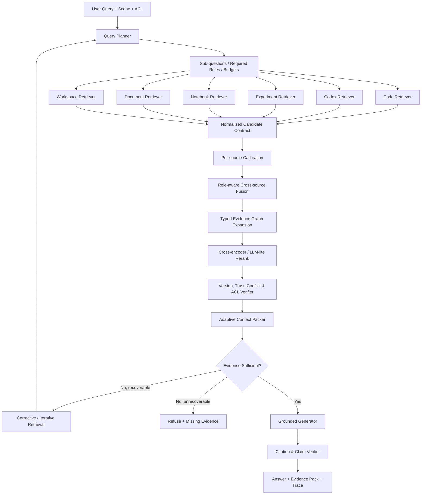

# 当前状态、问题边界与目标架构

## 1. 审查口径

本基线来自 2026-07-27 对当前工作树和 `var/evidence-rag.sqlite3` 活跃 Generation 的
只读检查。历史文档中的演示规模、旧正式库规模和当前活跃快照可能不同；后续优化以
Evaluation Run 固化的数据快照为准。

本次只评价 RAG 链路：

```text
摄取 → 解析 → 实体/关系 → Search View → 候选召回 → 融合/扩展
    → Evidence Pack → 回答/拒答 → 评测/观测
```

产品页面数量或图谱可视化效果不作为检索质量依据。

## 2. 当前可复现基线

### 2.1 活跃数据规模

| 数据域 | 当前活跃规模 |
| --- | ---: |
| Repository | 1 |
| FileVersion | 192 |
| CodeSymbol | 1,406 |
| Code Search View | 1,598 |
| Code Edge | 4,712 |
| Active Codex Thread | 5 |
| Active Codex Search View / Item | 6,178 |
| Scientific Document | 4 |
| Document Section / Table / Cell | 279 / 48 / 1,270 |
| Claim | 32 |
| Experiment / Run | 0 / 0 |
| Notebook Template / Run / Cell / Output | 0 / 0 / 0 / 0 |
| Research Topic / Iteration | 2 / 0 |
| Research WorkItem / IterationLink | 1 cancelled / 0 |
| Golden Question / Evaluation Run | 0 / 0 |

代码边分布：

| 边类型 | 数量 |
| --- | ---: |
| CALLS | 2,052 |
| DEFINES | 1,406 |
| REFERENCES | 815 |
| IMPORTS | 246 |
| CONTAINS | 192 |
| HAS_COMMIT | 1 |

当前解析统计还记录了约 6,273 个未解析调用、15,845 个未解析引用和 531 个未解析导入。
这说明代码图采取保守发布策略，但图覆盖率不足以独立承担仓库级推理。

### 2.2 当前链路

| 层 | 已有能力 | 主要限制 |
| --- | --- | --- |
| 摄取 | Raw Object、Source Event、Generation、Tombstone、版本、ACL | 部分来源缺增量派生与模型重建协议 |
| 代码解析 | Tree-sitter、File/Symbol、CALLS/REFERENCES/IMPORTS | 缺类型解析、数据流、继承、测试关系 |
| Codex 解析 | Thread/Turn/Item/Episode/Patch/Validation | 检索仍以扁平 Item 为主，时序链利用不足 |
| 实验/文档 | Run/Metric/Claim/TableCell 等结构实体 | 查询主要是规则型文本匹配，未形成来源专用检索器 |
| 词法召回 | FTS5 | 查询扩展与字段权重较粗 |
| 向量召回 | `local-hash-v2`，Scope 内全量扫描 | 不是神经语义模型，无 ANN，无代码/文档领域适配 |
| 融合 | 固定权重；跨源多样化 | 原始分数不可比较，无概率校准，无学习排序 |
| Graph | Top-K 后一跳扩展、Lineage、可视化 | Graph 没有充分进入首轮候选生成 |
| Query | 9 类规则意图、Scope、required roles | 复杂问题无子问题计划，`max_hops` 未形成真实策略约束 |
| Evidence Pack | 主证据、支撑、反证、缺口、引用 | 上下文预算和代码/表格专用呈现不足 |
| Evaluation | 已有表与指标实现 | 当前没有 Golden Case 和历史 Evaluation Run |

## 3. 核心判断

系统当前最强的是“证据治理和可追溯建模”，最弱的是“高质量候选召回、来源专用重排和
基于证据图的上下文选择”。它不是从零开始的 Demo，但也不能把已有的实体和图谱直接
等同于先进 RAG。

当前成熟度建议按以下方式表达：

| 能力 | 当前成熟度 | 目标成熟度 |
| --- | ---: | ---: |
| 证据治理与版本 | 7.5/10 | 9/10 |
| 单源结构化 | 6/10 | 8.5/10 |
| 单源召回质量 | 3.5/10 | 8/10 |
| Graph 检索 | 3/10 | 8/10 |
| 跨源融合 | 4/10 | 8.5/10 |
| 上下文与生成 | 4/10 | 8/10 |
| 评测与观测 | 2.5/10 | 9/10 |

评分只是设计排期工具，不是对外宣传指标。对外必须使用 Evaluation Run 的客观结果。

## 4. 目标 RAG 架构



## 5. 统一候选协议

每个单源 Retriever 必须返回统一而不丢失来源特性的候选：

```python
class RetrievalCandidate:
    entity_id: str
    source: Literal["code", "codex", "experiment", "notebook", "document", "workspace"]
    entity_type: str
    retrieval_unit_id: str
    parent_entity_id: str | None

    raw_scores: dict[str, float]
    within_source_rank: int
    relevance_probability: float | None

    matched_query_id: str
    evidence_roles: list[str]
    relation_path_ids: list[str]

    locator: str
    version: str | None
    observed_at: str | None
    acl_ref: str

    derivation: str
    relation_confidence: float | None
    fact_status: str
    payload_ref: str
```

设计约束：

- `raw_scores` 只用于来源内诊断，跨源层禁止直接相加。
- `retrieval_unit_id` 与 `entity_id` 分开。一个 Symbol 可以有多个 AST Retrieval Unit，
  但最终去重和引用仍回到稳定实体。
- `payload_ref` 延迟加载原文，候选阶段不复制大段正文。
- ACL 在任何向量、图扩展、邻居解析和缓存命中之前生效。
- `fact_status` 不允许由相关性分数推断。

## 6. 查询计划协议

Query Planner 输出显式计划，而不是只有一个 intent：

```python
class QueryPlan:
    intent: str
    complexity: Literal["simple", "single_source", "multi_source", "multi_hop"]
    target_scope: ResolvedScope
    sub_questions: list[SubQuestion]
    required_roles: list[str]
    optional_roles: list[str]
    source_routes: list[SourceRoute]
    graph_templates: list[str]
    candidate_budget: int
    rerank_budget: int
    context_token_budget: int
    stop_conditions: list[str]
```

第一版继续使用确定性规则和显式 Scope，避免直接引入不可控 Agent；收集 Golden Query
和 Trace 后，再训练小型路由/复杂度分类器。

## 7. 需要突出的项目技术点

最终项目应形成以下可验证能力：

1. **Typed Code Graph RAG**：AST/SCIP/LSP 语义图参与候选生成，按任务选择不同图遍历模板。
2. **Temporal Development RAG**：把 Codex 目标、操作、Patch、验证构造成有状态事件链，
   支持“为什么改、怎么改、是否验证”的检索。
3. **Heterogeneous Evidence Calibration**：五种来源分别校准相关概率，再按证据角色和来源
   权威度融合，不直接混合 BM25、余弦和 SQL 分数。
4. **Version-aware Evidence Graph**：代码、会话、实验和 Claim 通过带版本、状态、来源和
   置信度的路径连接，能够发现过期证据和跨版本冲突。
5. **Evidence-constrained Generation**：生成前做角色覆盖与冲突裁决，生成后做 Claim-Citation
   一致性检查；证据不足时返回缺口而不是补全想象。
6. **Stage-wise Evaluation Flywheel**：把召回、路径、版本、引用、拒答、延迟、成本分别评测，
   能定位优化到底改善了哪个模块。

## 8. 明确不做的伪优化

- 不因为“GraphRAG”名称就立刻迁移 Neo4j；当前规模首先解决图质量和检索算法。
- 不把向量数据库替换等同于召回质量提升。
- 不使用统一固定 chunk size 处理代码、会话、表格和文档。
- 不让 LLM 在没有结构化过滤的情况下计算实验数值或猜测版本。
- 不用来源配额强行塞入无关结果；来源多样性必须服从相关性与 required roles。
- 不以 LLM-as-a-judge 的单个总分替代人工 Golden Set 和分阶段指标。
