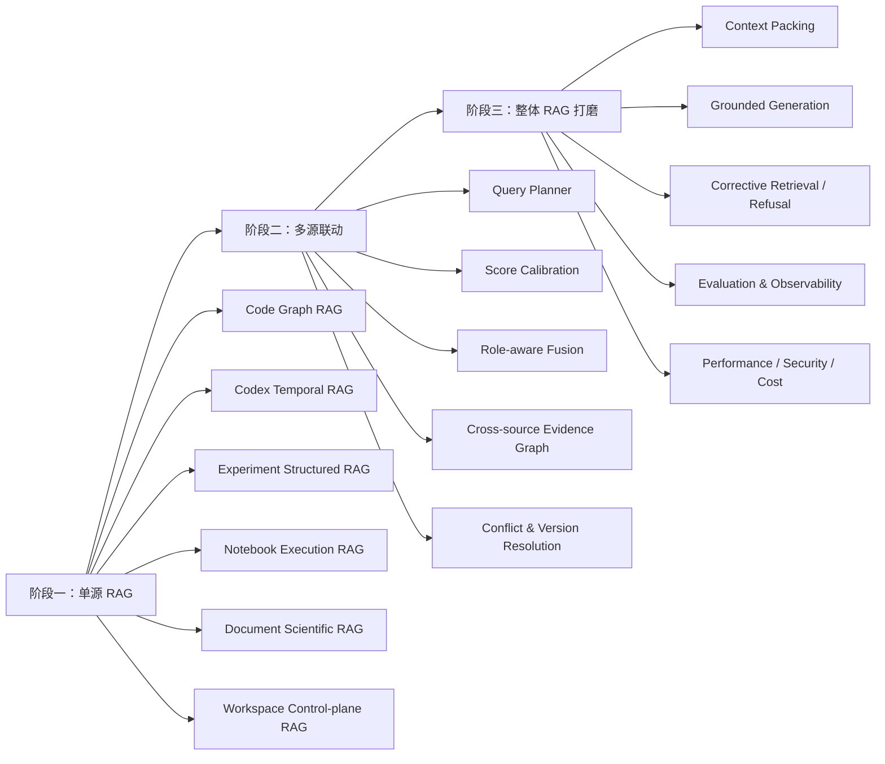

# 多源研发证据 RAG 优化设计文档集

状态：原始路线图仓库内工程已完成；`DEFAULT_V1 / QUALITY_HOLD /
PRODUCTION_RELEASE_EXTERNAL_BLOCKED`  
基线日期：2026-07-27  
工程状态更新：2026-07-29  
适用项目：`evidence-rag`  

> 当前逐项实施证据以
> [development/05_ORIGINAL_ROADMAP_IMPLEMENTATION_MATRIX.md](development/05_ORIGINAL_ROADMAP_IMPLEMENTATION_MATRIX.md)
> 为准。本文保留最初的架构动机和演进顺序；历史“尚未实施”描述不得覆盖最新矩阵。
>
> 2026-08-06 独立成熟度审查发现了可复现性、真实 raw read-back、Live Wiki grounded
> answer、真实六源覆盖和完整回归缺口。后续实际执行顺序与 Gate 以
> [RAG + Wiki 全阶段成熟化执行总纲](development/10_RAG_WIKI_MATURITY_PROGRAM.md)
> 、[持续执行台账](development/11_RAG_WIKI_MATURITY_EXECUTION_LEDGER.md)、
> [全阶段目标分解与验收卡](development/14_RAG_WIKI_STAGE_OBJECTIVE_BREAKDOWN.md)、
> [G1I-01 Binding Foundation 可执行规格](development/15_G1_BINDING_FOUNDATION_EXECUTION_SPEC.md)和
> [G0 Portable Python Identity 与 V6–V11 执行记录](development/16_G0_PORTABLE_PYTHON_IDENTITY_AND_V6_EXECUTION_RECORD.md)、
> [G0 Owner Admission 与远程 CI Handoff](development/17_G0_OWNER_ADMISSION_AND_REMOTE_CI_HANDOFF.md)、
> [G0 Clean Checkout 全链重放](development/18_G0_CLEAN_CHECKOUT_FULL_REPLAY.md)、
> [G0 Portable Exclusion 与 Release-ready 语义](development/19_G0_PORTABLE_EXCLUSION_AND_RELEASE_READY_SEMANTICS.md)、
> [G1 Binding Foundation 实施就绪审计](development/27_G1_BINDING_FOUNDATION_IMPLEMENTATION_READINESS_AUDIT.md)
> 、[G1 Entry Decision Packet 与 BF-01–15 Trace](development/28_G1_ENTRY_DECISION_AND_REQUIREMENT_TRACE_PACKET.md)
> 、[G0 前端路由供应链风险关闭](development/29_G0_FRONTEND_ROUTER_SUPPLY_CHAIN_CLOSURE.md)
> 、[G1 Entry 离线验证器实施记录](development/30_G1_ENTRY_OFFLINE_VERIFIER_EXECUTION_RECORD.md)
> 、[G1 Entry 签署与安全组装 Runbook](development/31_G1_ENTRY_SIGNING_HANDOFF_AND_ASSEMBLY_RUNBOOK.md)
> 、[G0 npm 安装脚本准入与 V18–V20 执行规格](development/32_G0_NPM_INSTALL_SCRIPT_ADMISSION.md)
> 、[G0 Owner Review Packet 与 V20 Runbook](development/33_G0_OWNER_REVIEW_PACKET_AND_V20_RUNBOOK.md)
> 、[全阶段原子目标图与 V21+ 执行 Runbook](development/34_FULL_STAGE_ATOMIC_OBJECTIVE_GRAPH_AND_V21_RUNBOOK.md)
> 、[G2 Live Wiki Raw-verified Grounded Answer 执行规格](development/35_G2_LIVE_WIKI_GROUNDED_ANSWER_EXECUTION_SPEC.md)
> 、[G3 Canonical Query Plan、Scope、as-of 与一致快照执行规格](development/36_G3_CANONICAL_QUERY_PLAN_SCOPE_ASOF_EXECUTION_SPEC.md)
> 、[G4 六源真实语料授权、分代物化、Backfill、删除传播与回滚执行规格](development/37_G4_SIX_SOURCE_CORPUS_MATERIALIZATION_BACKFILL_EXECUTION_SPEC.md)
> 为准；历史
> `ENGINEERING COMPLETE` 只保留其当时的隔离工程含义。

## 1. 文档目的

这组文档把当前系统从“版本化证据底座 + 规则型混合检索”演进为“单源最优、跨源协同、
证据可校验”的完整 RAG。实施顺序严格遵循：

1. 建立当前质量基线和统一协议。
2. 分别优化每一种数据源，单源不过关不进入联合检索。
3. 在单源候选质量稳定后，建设跨源查询规划、分数校准和证据图联动。
4. 最后优化上下文、生成、拒答、性能、安全、评测和可观测性。
5. 每个阶段同步沉淀可用于简历和面试的架构决策、实验数据与故障案例。

## 2. 阅读顺序

| 文档 | 解决的问题 | 主要读者 |
| --- | --- | --- |
| [00_CURRENT_STATE_AND_TARGET.md](00_CURRENT_STATE_AND_TARGET.md) | 当前系统到底处于什么水平，目标架构是什么 | 全员 |
| [sources/00_SOURCE_DESIGN_CONTRACT.md](sources/00_SOURCE_DESIGN_CONTRACT.md) | 每个来源必须满足的统一设计契约 | 架构、评审 |
| [sources/01_CODE_SOURCE_RAG.md](sources/01_CODE_SOURCE_RAG.md) | Code/Code Graph 如何解析、召回、扩图、重排和组装 | Code RAG |
| [development/README.md](development/README.md) | 单源开发方案的严格实施顺序与当前状态 | 研发负责人 |
| [development/01_CODE_SOURCE_DEVELOPMENT_PLAN.md](development/01_CODE_SOURCE_DEVELOPMENT_PLAN.md) | Code 单源拆到 Issue/PR、迁移、评测和发布的开发方案 | Code RAG |
| [sources/02_CODEX_SOURCE_RAG.md](sources/02_CODEX_SOURCE_RAG.md) | Codex 事件流如何形成 Goal-aware Temporal RAG | 会话 RAG |
| [sources/03_EXPERIMENT_SOURCE_RAG.md](sources/03_EXPERIMENT_SOURCE_RAG.md) | Run/Metric/Dataset/Config 如何结构化检索和比较 | 实验 RAG |
| [sources/04_NOTEBOOK_SOURCE_RAG.md](sources/04_NOTEBOOK_SOURCE_RAG.md) | Revision/Execution/Cell/Output 如何独立检索 | Notebook RAG |
| [sources/05_DOCUMENT_SOURCE_RAG.md](sources/05_DOCUMENT_SOURCE_RAG.md) | Paragraph/Claim/Table/Figure/Citation 如何检索与验证 | 文档 RAG |
| [sources/06_WORKSPACE_SOURCE_RAG.md](sources/06_WORKSPACE_SOURCE_RAG.md) | 研究控制面如何做状态、时间和证据覆盖检索 | Workspace RAG |
| [01_SINGLE_SOURCE_RAG_DESIGN.md](01_SINGLE_SOURCE_RAG_DESIGN.md) | 旧版单源总览，仅用于快速理解；实现以 `sources/*` 为准 | 全员 |
| [02_MULTI_SOURCE_FUSION_RAG_DESIGN.md](02_MULTI_SOURCE_FUSION_RAG_DESIGN.md) | 六个来源如何规划、校准、融合、关联和裁决 | 架构、算法 |
| [03_GLOBAL_RAG_HARDENING.md](03_GLOBAL_RAG_HARDENING.md) | 上下文、生成、评测、性能、安全如何形成生产闭环 | 架构、平台 |
| [04_IMPLEMENTATION_ROADMAP.md](04_IMPLEMENTATION_ROADMAP.md) | 按什么顺序实施，每阶段以什么指标退出 | 项目负责人 |
| [05_INTERVIEW_AND_RESUME_GUIDE.md](05_INTERVIEW_AND_RESUME_GUIDE.md) | 如何真实、量化地讲清这个项目 | 项目作者 |
| [06_TECHNICAL_REFERENCES.md](06_TECHNICAL_REFERENCES.md) | 技术选型与论文依据 | 设计评审者 |

## 3. 面试文档同步索引

每个源的设计文档与面试稿一一对应：

| 设计 | 面试与简历材料 |
| --- | --- |
| Code | [01_CODE_SOURCE_INTERVIEW.md](interview/01_CODE_SOURCE_INTERVIEW.md) |
| Codex | [02_CODEX_SOURCE_INTERVIEW.md](interview/02_CODEX_SOURCE_INTERVIEW.md) |
| Experiment | [03_EXPERIMENT_SOURCE_INTERVIEW.md](interview/03_EXPERIMENT_SOURCE_INTERVIEW.md) |
| Notebook | [04_NOTEBOOK_SOURCE_INTERVIEW.md](interview/04_NOTEBOOK_SOURCE_INTERVIEW.md) |
| Document | [05_DOCUMENT_SOURCE_INTERVIEW.md](interview/05_DOCUMENT_SOURCE_INTERVIEW.md) |
| Workspace | [06_WORKSPACE_SOURCE_INTERVIEW.md](interview/06_WORKSPACE_SOURCE_INTERVIEW.md) |
| 六源联合 | [07_MULTISOURCE_INTERVIEW.md](interview/07_MULTISOURCE_INTERVIEW.md) |

同步规则见
[00_INTERVIEW_SYNC_CONTRACT.md](interview/00_INTERVIEW_SYNC_CONTRACT.md)。总览
[05_INTERVIEW_AND_RESUME_GUIDE.md](05_INTERVIEW_AND_RESUME_GUIDE.md) 用于统一口径，
细节与当前数据以对应源面试稿为准。

## 4. 开发方案顺序

单源开发方案与目标设计分开维护：

- `sources/*` 定义每个来源最终应具备什么能力；
- `development/*` 定义这些能力具体改哪些代码、如何迁移、测试、评测、灰度和回滚；
- Code C0–C7、Codex X0–X5、Experiment E0–E5、Notebook N0–N6、
  Document D0–D6、Workspace W0–W6 的仓库内工程均已完成；
- M5–M7 的 planner/calibration/fusion/typed graph/Evidence Pack/evaluator/performance
  admission/security/release contracts 已完成；
- 未完成的是必须由正式库 owner、远程服务或 production 流量完成的 migration/backfill、
  replay、benchmark、shadow/canary、quality qualification 与默认 V2 发布。

开发入口见 [development/README.md](development/README.md)，统一约束见
[00_SINGLE_SOURCE_DEVELOPMENT_CONTRACT.md](development/00_SINGLE_SOURCE_DEVELOPMENT_CONTRACT.md)。

## 5. 总体设计原则

### 5.1 单源先优

不同来源具有不同的最小事实单位和正确性标准：

| 来源 | 最小事实单位 | 主要检索信号 | 正确性的核心 |
| --- | --- | --- | --- |
| Code | Symbol / AST Block / DiffHunk | 标识符、代码向量、类型化图路径 | 符号与版本准确 |
| Codex | Turn Item / Episode / Patch | 目标、时序、文件、命令、验证关系 | 事件顺序和事实状态准确 |
| Experiment | Run / Metric / Config / DatasetVersion | 精确过滤、结构化查询、数值匹配 | 数值、单位、版本和聚合准确 |
| Notebook | Revision / Execution / Cell / Output | Cell 类型、执行顺序、参数、dataflow | 输出来源和 stale 状态准确 |
| Document | Section / Claim / TableCell / Figure | 层级文本、多表示、引用关系 | 原文位置和 Claim 支撑关系准确 |
| Workspace | Topic / Iteration / WorkItem | 状态过滤、关系遍历、短文本检索 | 当前状态和归属准确 |

因此，系统不建设一个“万能向量索引”，而是建设六个可独立评测的 Source Retriever。

### 5.2 联合层不比较原始分数

BM25 分数、余弦相似度、图路径分和 SQL 精确匹配分不可直接相加。联合层只接收经过
来源内校准后的 `relevance_probability`，并把以下概念分开：

- `retrieval_relevance`：证据是否回答当前问题。
- `source_authority`：该来源对当前问题类型是否权威。
- `relation_confidence`：一条关系是否可信。
- `fact_status`：事实是确认、推断、反证、失败还是过期。
- `version_alignment`：证据版本是否适用于目标 Scope。

### 5.3 Graph 是检索算子，不只是展示层

图关系必须参与候选生成、路径打分和上下文组装。仅在 Top-K 结果出来后显示一跳邻居，
不算 Graph RAG。Graph 扩展必须受查询意图、边类型、最大跳数、边置信度、版本和 ACL
共同约束。

### 5.4 先证据裁决，后自然语言生成

回答前必须形成结构化 Evidence Pack，至少包含：

- 已确认事实；
- 支撑证据；
- 反证与失败证据；
- 版本差异；
- 缺失角色；
- 证据路径；
- Citation Map；
- 是否满足回答条件。

LLM 只能基于 Evidence Pack 生成，不允许直接消费未经裁决的原始 Top-K。

### 5.5 指标必须可复现

简历和面试只使用已进入 Evaluation Run、具有基线、配置和数据集版本的结果。设计目标、
预期收益和论文结论不能写成项目已经实现的收益。

## 6. 三层演进视图

## 7. 当前文档完成边界

当前已完成：

- 六个单源的来源边界、当前实现审计、查询任务、目标模型、索引、算法、Context、治理、
  评测、实施与完成定义；
- 六份单源面试稿；
- 六源联合 Planner、calibration、role fusion、typed graph、conflict/version、
  EvidencePackV2、评测和上线设计；
- 联合层面试稿；
- Code、Codex、Experiment 的详细开发计划，以及 Notebook/Document/Workspace/M5–M7
  的逐项实施矩阵和单会话证据日志；
- 六源各自的 Golden/evaluator、隔离持久化、专用 retrieval/rerank/context/governance；
- M5–M7 的 exact 60-case Foundation、联合 pipeline/evaluator、性能/安全/release
  工程合同。

当前尚未完成：

- 正式库 migration/backfill；
- 远程 embedding/reranker/LLM 与真实 ANN/backend/hardware benchmark；
- 真实 production 单源与 60-case 联合 replay、消融、P95/成本数据；
- shadow/canary、质量 qualification 和默认 V2 切换。

因此简历可以写“完成仓库内工程设计与实现”，但仍不能写未经 production Evaluation
Run 支持的 Target 指标、提升、上线或质量资格。

## 8. 文档同步规则

每个实施阶段合并前，同时更新三类材料：

1. **设计记录**：问题、候选方案、取舍、接口和风险。
2. **实验记录**：数据集版本、基线、变量、指标、结果和失败案例。
3. **面试证据卡**：本人负责部分、技术难点、量化收益、线上或回归证据、可以现场解释的
   代码入口。

如果一个优化没有评测结果，只能在设计文档中标记为“计划”或“实验中”，不能进入简历
完成项。
