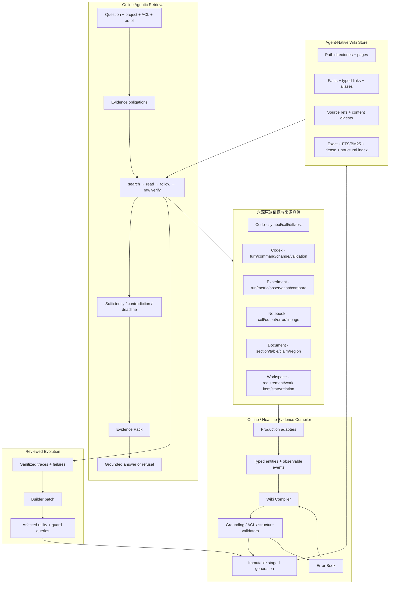

# Evidence-Compiled Agent-Native Wiki + RAG 技术报告

版本：2026-08-03  
工程状态：`REPOSITORY_ENGINEERING_COMPLETE`  
发布状态：`DEFAULT_V1 / QUALITY_HOLD / NO_RELEASE`

## 1. 项目中的 RAG 到底是什么

本项目的 RAG 不是“把文本切块、写入向量库、取 top-k 后交给大模型”。它是一套面向工程研发知识的
**证据编译、知识组织、主动导航、原文核验和受约束生成系统**。

原始知识来自六个语义完全不同的领域：Code、Codex 会话、Experiment、Notebook、Document 和
Workspace。系统必须回答的不只是“哪段文字相似”，还包括：

- 当前实现在哪里、由哪个 commit/generation 支持；
- 一次会话究竟提出、执行和验证了哪些变更；
- 一个实验结论能否在相同 dataset/seed/unit/environment 下比较或复现；
- Notebook 的输出、错误和参数如何沿执行顺序传播；
- 文档 claim 的页码、区域和版本是什么；
- 需求、工作项、代码、会话和实验如何形成一条可审计证据链。

所以核心定义是：

> **RAG = 在受治理的知识快照中，为问题构造证据义务；用混合检索和 Wiki 导航找到路径；回到原始来源核验；构造 Evidence Pack；最后只生成能由精确 citation 支持的 claim，否则明确拒答。**

Wiki 也不是页面 UI。它是 RAG 的派生知识组织层：把六源原始证据编译成路径化、可搜索、可批量读取、
可沿链接继续探索、可增量重建的机器知识空间。事实权威始终属于 raw source，Wiki 只负责找路和压缩
搜索空间。

## 2. 完整架构

架构中有三条不可跨越的边界：

1. **raw/derived boundary**：Wiki、摘要、关系和 inferred fact 都不能覆盖原始证据；
2. **retrieval/answer boundary**：检索阶段只能交付 Evidence Pack，不能冒充最终回答；
3. **engineering/release boundary**：fixture 和 isolated benchmark 能证明工程合同，不能自动获得生产资格。

## 3. 知识建模：从 chunk RAG 到 evidence RAG

### 3.1 六源保留来源语义

系统不把所有内容降成无类型 chunk。每个来源拥有自己的最小事实单元和正确性约束：

| 来源 | 检索单元 | 关键真值与约束 |
|---|---|---|
| Code | file、symbol、call、diff、test | repository/ref/full commit、span、publication、ACL |
| Codex | thread、turn、item、observable event、derived fact | call/result pairing、role、exit、target、reasoning exclusion |
| Experiment | experiment、run、definition、series、observation | dataset、seed、unit、direction、status、environment、comparability |
| Notebook | run、cell、output、error、parameter、lineage | execution order、environment、typed task、reproduction |
| Document | document、section、table、claim、page region | version、page、bbox、OCR certainty、canonical locator |
| Workspace | project、topic、iteration、work item、state | current/history、proposed/completed、evidence backlinks |

每个记录绑定 `project/scope/ACL/generation/watermark/publication/stable_version/locator/content_sha256`。
这些字段不是附加 metadata，而是能否成为答案证据的前置条件。

### 3.2 Wiki IR

Wiki Compiler 把来源实体编译成：

- directory：路径和 children 的显式目录记录；
- page：architecture/capability/component/decision/change/experiment/procedure/finding/issue/requirement；
- fact：带事实类型、状态、来源和 digest 的最小陈述；
- link：有方向、有类型、有反向索引的关系；
- source ref：回到 raw object 的 authority、locator、generation 与 content digest；
- manifest：绑定整代 records、source generations、compiler/evaluator authority。

逻辑路径用于稳定寻址，物理键同时绑定 project、generation 和 visibility partition。不同 ACL 的片段
不会先合并再过滤；目录、别名、反链、搜索索引和缓存都使用同一 visibility 边界。

### 3.3 Immutable generation

编译先写 staging generation，完整验证后再原子切换 active pointer。读取方在一次 navigation 中固定
generation，发布与回滚不能产生 mixed-generation trajectory。子记录、父目录、manifest 和 active
pointer 的写序保证避免半发布；portable verifier 可离线重算完整 record membership 和 checksum。

## 4. 检索系统：召回、融合、重排和知识导航

### 4.1 多路候选召回

Wiki 搜索不是单一路径：

- **Exact**：路径、ID、版本、symbol、run、commit 等硬标识；
- **Sparse/FTS5/BM25**：错误信息、命令、术语、名称和长尾 token；
- **Dense**：可替换 provider 的语义向量通道，必须显式配置和 benchmark；
- **Structural**：目录邻近、typed links、反向 links、source roles；
- **Temporal/state**：as-of、active generation、current/history/stale/contradicted；
- **Raw fallback**：Wiki 缺口时调用现有 governed multi-source pipeline。

候选在通道内归一化，经 RRF 融合，再按 exact/role/authority/version/structure 信号重排。远程 embedding
和 reranker 都是可插拔优化，不是系统正确性的依赖；未配置时仍可用 exact+sparse+structural 完成
确定性导航。

### 4.2 Query classification 与 evidence obligations

查询理解不是关键词规则。`query-understanding-hybrid-v2` 采用双路径：配置 App LLM 后执行 constrained JSON
semantic planning；离线时执行冻结训练样本的 TF-IDF word/character n-gram centroid classifier，以 cosine +
temperature softmax 输出九类意图和六来源的完整 posterior、归一化 entropy、confidence 和 query complexity。
模型结果再与本地 posterior 校准，且不能扩大请求的 source/project/repository/commit/as-of/ACL 范围。

复杂问题进一步按 evidence obligation 分解为最多四个可独立检索的子问题；本地路径使用 bounded clause
segmentation 与 MMR，模型路径使用受约束语义分解。检索执行最多三条，并用 `Σ 1/(60+rank)` 的 RRF 合并，
跨查询重复出现的 entity 获得稳定增益。App 显示 top posterior、不确定性、复杂度和 Q1–Qn，用户能看清系统如何
理解问题，而不是只看到最终答案。

在此基础上，Wiki 查询再按 local detail、multi-hop、comparison、temporal、global、explore 分类。planner
不只是选来源，还产生 evidence obligation，例如 implementation、validation、rationale、current version、
counter evidence。

每个 obligation 记录：

- 必需 role 和 source；
- 当前 supporting pages/source refs；
- satisfied/missing/unauthorized/stale 状态；
- 允许的搜索、读取、link hop、raw read 和 token budget。

这比固定 top-k 更接近 retrieval-as-reasoning：下一步动作取决于当前缺失的证据，而不是一次检索后直接
生成答案。

### 4.3 Navigator 状态机

Navigator 的动作集合是：

1. `search`：为未满足 obligation 找入口页；
2. `read`：批量读页和 facts；
3. `follow`：沿 typed links 横向或纵向扩展；
4. `verify`：按 source ref 回查 raw evidence；
5. `stop`：证据充分、明确不可回答、预算耗尽或 deadline 到达。

所有次数、深度、tokens 和 deadline 有硬上限。空搜索有 patience；无 query anchor 的页面不能继续图扩展；
显式 ID、版本、日期和路径 token 作为硬相关性约束，普通词经过 lexical relevance admission。这样能阻止
“搜不到目标但被泛化 implementation 页填满”的伪支持。

### 4.4 主流 RAG 技术如何组合

| 技术族 | 本系统中的正确位置 |
|---|---|
| Hybrid Search | exact/sparse/dense/structural 的召回互补 |
| RRF/DBSF | 跨通道融合，避免直接比较异构原始分数 |
| Cross-encoder/late interaction | 候选二阶段重排，需成本和隐私准入 |
| Query rewriting/decomposition | 生成 bounded 子查询与 obligation，不允许无限 Agent 循环 |
| Corrective RAG | 缺 role 时有限补检；证据仍不足则拒答 |
| Self-RAG/verification | claim-citation verifier、counter evidence 和 refusal，而非模型自评分即真值 |
| GraphRAG local/global/DRIFT | typed graph 的局部、综述和探索路由，不对所有问题生成社区摘要 |
| Hierarchical/PageIndex-style retrieval | Document/Notebook 源内层级和 Wiki directory 导航 |
| Temporal KG | state、valid time、as-of、change trace 和 staleness |
| Contextual compression | Wiki 页和 facts 缩小搜索空间，最终 citation 仍落回 raw evidence |
| RAG caching | generation+ACL+path 精确键的 bounded cache，不缓存未治理回答 |

## 5. Context Engineering 与可信回答

### 5.1 Evidence Pack

Navigator 不是直接返回拼接文本，而是生成 `EvidencePackV2`：

- verified/reported/observed/inferred facts 分层；
- matched roles、missing/stale/unauthorized roles；
- counter evidence、qualifiers、version differences；
- source-specific rendered evidence；
- canonical citations 与 raw fact digests；
- supported/partial/contradicted/insufficient/unavailable 决策；
- token accounting 和完整 content digest。

pack 的 included fact IDs、citations、rendered evidence 和 token sum 必须精确一致。调用方不能自报
denominator、truth 或 evidence membership。

### 5.2 Grounded generation

智能查询有两种模式：

- `evidence`：只返回导航和 Evidence Pack，不调用生成器；
- `answer`：可选生成器只输出结构化 claims，每个 claim 必须声明 citation IDs 和 required fact IDs。

验证器检查 citation 是否存在、是否精确绑定同一 fact、required facts 是否完整、claim terms 是否由引用
蕴含，以及 derived fact 是否有足够 review authority。验证失败就退回检索交接；pack 已不可回答时，无论
claims 是否为空都返回 final refusal。

### 5.3 Refusal 是一等结果

以下情况不得猜测：scope 不唯一、ACL 不满足、source unavailable、not indexed、timeout、required role
缺失、冲突、不可比较、元数据不足或显式 unanswerable。响应包含固定 reason 和 remediation，而不是空答案
或成功状态。120-case 工程评测中，10 个 unanswerable case 的 correct refusal 为 10/10。

## 6. Wiki Compiler、Error Book 与 Builder

### 6.1 Compiler

Compiler 接收六源 generation，执行 deterministic normalization、页面分组、fact/source-ref/link 构建、
dependency propagation 和 manifest 生成。增量编译只重建受影响 records，并验证与 clean rebuild 的逻辑
等价性。LLM 如参与，只能提出 proposal，不能直接写 active Wiki。

### 6.2 Error Book

结构错误、缺 source ref、ACL 冲突、orphan link、stale page、导航 miss、premature stop 和 unsupported
claim 进入有状态 Error Book。错误记录绑定发现 generation、影响范围、约束和关闭证据，用于后续编译，
而不是简单日志。

### 6.3 Builder

Builder patch 是 content-addressed、受审、不可变的变更建议。它在同一初始 Wiki 上比较 before/after：

- affected queries：目标问题是否提升；
- guard queries：无关能力是否退化；
- hard gates：ACL、raw grounding、结构、secret/path 和 mixed generation 是否为零。

只有 utility 为正且 guard/hard gates 全过才可 stage；在线请求不能直接改 Wiki。当前实现完成工程闭环，
但真实流量的长期 patch utility 仍属于生产延期项。

## 7. 智能体、Codex 插件与产品接入

### 7.1 MCP/Agent 工具面

MCP server `0.2.0` 暴露 21 个受治理工具，其中 Wiki 核心工具为：

- `wiki_navigation_status`
- `wiki_search`
- `wiki_read`
- `wiki_follow`
- `wiki_navigate`
- `evidence_read`
- `wiki_propose_patch`

工具 schema 显式约束 project、ACL、generation、路径、预算和 deadline。Agent 先读 status，再做 bounded
search/read/follow；复杂问题用 navigate；需要最终证明时读 raw evidence；patch 只是 proposal，不能越过
review/publish。

### 7.2 Codex 插件

`plugins/research-project-bridge` 是实际可安装的 Codex plugin，而不是文档占位：

- `.codex-plugin/plugin.json` 声明版本 `0.2.0+wiki.20260803`；
- `.mcp.json` 连接真实 MCP server，通过环境变量注入 token；
- 四个 skills 覆盖管理研究项目、执行研发、审阅证据、导航 Agent-Native Wiki；
- skill 中引用的工具必须是 server capability 的子集；
- 插件不嵌入本地绝对路径、secret 或默认写权限。

### 7.3 API 与 Wiki Workbench

产品 API 覆盖 status、search、navigate、pages、read、follow、evidence、Error Book、Builder patch、compile、
publish 和 rollback。智能查询通过 `/v1/query` 的显式 `X-RAG-Wiki-Engine: wiki_v1` opt-in，默认请求仍走
V1。

产品交付面是 macOS / Windows 原生 Tauri App；React Workbench 是 App 内嵌资产和自动化验收面，不再作为独立
Web 产品。设置页提供 OpenAI-compatible provider、base URL、model 和 API key。key 由 macOS Keychain 或
Windows Credential Manager 保存，WebView 不可见；公开 profile 只保存 URL/model，启动时由 native host 将
secret 注册到后端进程内存。远程 provider 强制 HTTPS，loopback 可使用 HTTP。

Wiki Workbench 提供路径树、服务端分页/筛选、页面详情、facts/links/source refs、导航 trace、evidence
obligations、raw verify、Error Book 和 Builder 状态；智能查询额外展示理解算法、意图 posterior、entropy、
complexity、来源建议和子查询。UI 只展示和操作受治理合同，不参与事实裁决。

## 8. 性能和容量设计

### 8.1 在线性能策略

- search-first routing，避免逐层遍历整棵 Wiki；
- batch page reads 和 bounded parallel raw reads；
- exact cache key `(project, generation, visibility, logical_path, kind)`；
- RLock + OrderedDict LRU，默认 4096 entries/64 MiB，按 canonical bytes 计费；
- oversize reject、确定性 eviction、publish/rollback 后不混代；
- remote dense/rerank 显式 timeout 和外部推理开关；
- Navigator 独立限制 search/read/link/raw/token/deadline。

### 8.2 S 层实测

capacity v4 对 362 pages、950 source refs 的独立 SQLite generation 测得：

| 操作 | P95 |
|---|---:|
| path get | 0.307584 ms |
| directory list | 0.353 ms |
| hybrid search | 10.893417 ms |
| standard navigation | 80.346333 ms |
| deep navigation | 86.228667 ms |
| compile | 267.919667 ms |
| publish | 169.019667 ms |
| rollback | 228.916083 ms |

数据库 48,328,704 bytes，peak allocation 15,108,599 bytes，S 层设定 SLO 全过。该结果是 immutable
engineering evidence，不外推为 M/L、50k pages 或生产硬件容量；后者需要新的正式镜像和并发授权。

## 9. 质量、安全与可观测性

### 9.1 Evaluation-first

Wiki Golden 固定 120 cases、10 slices、membership、labels、required roles/sources、expected paths/source refs、
hard negatives、unanswerable truth 和 eligible denominators。review row 不能自报真值。quality artifact 的
verifier 只使用 portable files 离线重算，不重新检索。

quality v3：

- 110/110 path recall、full evidence、obligation completion、raw citation binding、premature-stop avoidance；
- 10/10 correct refusal；
- 120/120 ACL safety、unsupported claim safety、membership、no execution errors；
- P50/P95/P99 navigation 10.881208/16.099334/34.080333 ms；
- 状态 `ENGINEERING_FIXTURE_NON_QUALIFIED / QUALITY_HOLD`。

历史 v2 曾真实暴露 correct refusal 0/10；系统没有删除或美化该 artifact，而是修复 query relevance 和
answer authority 后发布 v3。这个过程说明评测不是装饰，而是能发现“候选内部自洽但与问题无关”的 RAG
核心错误。

### 9.2 安全硬门

- request/project/source/repository/scope/ACL 全链路绑定；
- visibility partition 在编译、索引、链接、缓存和读取中一致；
- secret、prompt injection、POSIX/Windows/UNC/encoded path 在截断前检查；
- reasoning 不进入检索证据；
- canonical SHA-256 绑定 contracts、components、records、artifacts；
- symlink、越 root、DB/WAL/SHM/pyc、nonfinite、extra/delete/tamper fail-closed；
- 一次 navigation 固定 generation，reader/publish 并发不能混代。

### 9.3 可观测 trace

响应记录 query hash、generation、obligations、每轮 action、输入/输出 IDs、diagnostic、page/raw reads、
stop reason、deadline、Evidence Pack 和 generator availability。trace 不记录原始 query、ACL、token 或 secret。

## 10. 工程完成度与真实边界

已完成：

- Wiki contracts/path/Golden/evaluator；
- separate WikiStore、atomic generation publish/rollback、ACL fragments、portable verifier；
- 六源 Compiler、incremental dependency、Error Book；
- hybrid search、obligation graph、Navigator、raw gateway、Evidence Pack；
- Builder utility/guard/hard-gate；
- runtime/API/intelligent query/MCP/Codex plugin/Workbench；
- bounded cache、concurrency、quality/capacity artifacts；
- 1923 项 safe backend tests、408 Python compile、30 frontend files/171 tests、typecheck/build 和浏览器验收。

尚未获得外部条件：

- 正式数据库所有者授权的只读镜像、迁移和 backfill；
- M/L 规模、真实并发和硬件成本；
- 远程 embedding/reranker/生成模型的生产质量与隐私资格；
- 真实用户流量的 shadow/canary、长期 Builder utility 和 rollback observation；
- reviewed release artifact 与默认引擎切换。

因此“完整”必须分层陈述：

| 层次 | 当前状态 |
|---|---|
| 仓库 Wiki+RAG 工程链路 | COMPLETE |
| isolated engineering quality/capacity | PASS / NON_QUALIFIED |
| production quality qualification | NOT_AVAILABLE |
| production release/default Wiki | HOLD / DEFAULT_V1 |

## 11. 后续生产路线

1. 获得正式数据所有者授权，构建只读脱敏镜像，不直接操作 service-owned DB；
2. 对真实数据执行 compiler parity、M/L capacity、并发、failover 和 rollback；
3. benchmark 本地/远程 embedding、reranker 和生成器，按质量、延迟、成本、隐私准入；
4. 运行 Wiki+raw 与 V1/V2 同 membership reviewed replay；
5. 采集 sanitized shadow trace，验证 Error Book/Builder utility；
6. `SHADOW_INTERNAL_100 → CANARY_5 → CANARY_25 → OPT_IN_100`；
7. 只有所有 required evidence `AVAILABLE` 且达门，才允许 release evaluator 讨论默认切换。

## 12. 技术参考与取舍

| 技术/方案 | 本项目吸收的核心 | 本项目的约束性改造 |
|---|---|---|
| LLM-Wiki | structured linked knowledge、retrieval-as-reasoning、Error Book | Wiki 不是最终 authority，必须 raw verify |
| WikiKV | path-as-key、预算导航、schema evolution、cache | generation manifest + ACL visibility + atomic pointer |
| WikiLoop | sufficiency-first、patch marginal utility、guard queries | 先 deterministic reviewed evaluator，不直接在线 RL |
| Microsoft GraphRAG | Local/Global/DRIFT workload 分流 | typed relation 和 raw citations，不强制社区摘要 |
| Agentic Retrieval | query decomposition、parallel subqueries、activity trace | bounded obligations、deadline、fail-closed |
| Hybrid Search/RRF | sparse+dense 融合与多阶段召回 | exact/source/structural/temporal 信号同等重要 |
| Temporal KG/Graphiti | episode/provenance/validity/as-of | generation/publication 与来源状态决定 authority |
| PageIndex/Hierarchical RAG | 文档层级导航 | 只作为 source-local 与 Wiki directory 策略 |
| Self/Corrective RAG | 检索反思、补检和自我校验 | verifier 基于冻结合同，不接受模型自评分作真值 |

项目最独到的设计不是使用了某个模型，而是把这些主流技术放进同一个可审计边界：

**Evidence Compiler 负责把异构事实组织成 Wiki，Navigator 负责有预算地找全证据，raw gateway 负责最终
核验，Evidence Pack 负责上下文和引用，Verifier 负责拒绝不受支持的生成，Builder 负责在离线审阅中演化
知识结构。**
