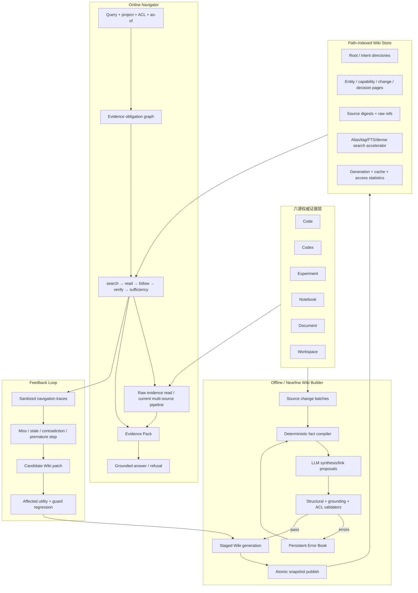

# Agent-Native Wiki + RAG 完整技术优化方案

版本：2026-08-03  
适用仓库：`/Users/example/project/rag`  
文档状态：`DESIGN_AUTHORITY / WR0-WR7 REPOSITORY_ENGINEERING_COMPLETE`  
当前真值：`EVIDENCE_COMPILED_AGENT_NATIVE_WIKI_RAG_IMPLEMENTED / DEFAULT_V1 / QUALITY_HOLD / NO_RELEASE`  
目标：`EVIDENCE_COMPILED_AGENT_NATIVE_WIKI_RAG / QUALITY_AND_SCALE_QUALIFIED`

> 本文中的 **Wiki** 特指 LLM-Wiki、WikiKV、WikiLoop 所代表的 agent-native
> knowledge organization / retrieval 技术：把原始知识编译成可搜索、可批量读取、可沿显式链接
> 分步导航、可增量修复的机器知识结构。它不是传统 Wiki 页面系统，也不是给现有 RAG 再加一个
> 展示界面。
>
> 本文完全替代本路径此前因术语误解产生的传统 Wiki 方案。旧方案不得继续实施。

---

## 0. 一句话结论

当前项目已经有一套较强的六源证据治理与多源执行底座，但它仍主要是：

```text
query → source routing → top-k candidates → graph expansion → Evidence Pack
```

成熟的 Wiki + RAG 应升级为：

```text
六源原始证据
→ 可验证的跨源 Wiki 编译
→ 版本化、路径化、可遍历的知识空间
→ Navigator 根据中间发现反复 search/read/follow/verify
→ 原始证据回查
→ Evidence Pack / grounded answer
→ Error Book + Builder 用失败反馈改进下一代 Wiki
```

因此，后续工作的核心不是继续横向堆更多 Retriever，而是把现有 Retriever、图和结构化查询
降为 Wiki 的构建工具、搜索加速器和原始证据回查层，并新增真正的 Wiki Compiler、Wiki Store、
Navigator 与 Builder 闭环。

---

## 1. 基线、原始缺口与最终闭合状态

### 1.1 已完成且必须复用的底座

最终工程 Gate 已证明当前仓库 L0–L3 工程合同完整，状态仍为
`DEFAULT_V1 / QUALITY_HOLD / NO_RELEASE`。下列能力不是本轮重做对象：

| 已有能力 | 当前模块 | 在 Wiki + RAG 中的新职责 |
|---|---|---|
| 六源 typed entity / retrieval / context | `rag/sources/{code,codex,experiment,notebook,document,workspace}` | Wiki Compiler 的权威输入与 raw fallback |
| project/scope/ACL/generation/watermark | 各来源 governance/store/runtime | Wiki snapshot、page fragment、cache 和导航的前置约束 |
| typed multi-source planner | `rag/planner_v2.py`、`multisource_foundation_v2.py` | 生成证据义务、Navigator 初始策略与成本预算 |
| 并行多源执行与 exactly-once fallback | `multisource_pipeline_v2.py` | `evidence_read` 和 Wiki 缺口补检工具 |
| typed bounded evidence graph | `evidence_graph_v2.py` | Compiler 链接候选和 Navigator lateral traversal |
| Evidence Pack / citation / refusal | `answer_v2.py`、Query Service | Wiki 导航后的最终证据编排与回答权威 |
| Golden、portable artifact、release gate | 各来源 evaluation/release 模块 | Wiki 编译、导航、Builder patch 和发布验收框架 |
| exact memory vector/cache/performance contracts | `performance_v2.py`、`performance_runtime_v2.py` | 小规模 correctness baseline；不是最终语义检索后端 |

### 1.2 设计启动时的核心缺口与本轮闭合结果

| 原始缺口 | 成熟系统要求 | 2026-08-03 仓库状态 |
|---|---|---|
| Wiki 知识形态 | 可编译、可组合、可演化的知识空间 | 已实现 page/directory/fact/link/source-ref、manifest 与 immutable generation |
| 检索范式 | agent 根据中间发现多轮导航 | 已实现 obligation 驱动的 search/read/follow/raw-verify bounded Navigator |
| 知识构建 | 增量 Compiler 组织跨源实体和意图页 | 已实现六源编译、依赖传播、增量等价与 Error Book |
| 自修复 | 失败归因与长期修复约束 | 已实现 Error Book 合同、受审 patch 与状态闭环；生产学习仍需真实观测 |
| 下游反馈 | before/after utility 与 guard queries | 已实现 Builder evaluator、affected/guard/hard-gate 发布阻断 |
| 细节保真 | Wiki 找路，最终事实回到 raw evidence | 已实现 source-ref、exact raw read/verify 与 Evidence Pack citation 绑定 |
| 语义搜索 | sparse+dense+fusion+rerank | 已实现 exact、FTS5/BM25、可替换 dense、structural、RRF 与可替换 reranker |
| 规模证明 | 缓存、容量、故障和 rollback | 已实现 bounded LRU、并发/不混代测试与 S 层 immutable capacity artifact |
| 发布 | quality、scale、shadow/canary 后才切换 | 工程 fixture hard gates 已过；生产质量/流量证据仍缺，继续 HOLD |

### 1.3 正确的成熟度表述

- **证据与治理底座：仓库工程完成。** 六源、版本、ACL、typed runtime、Evidence Pack 已复用。
- **传统多源 RAG：L0–L3 工程完成。** 默认 V1，真实质量与发布仍 hold。
- **Agent-native Wiki 内核：WR0–WR7 仓库工程完成。** Compiler、Store、Search、Navigator、Builder、API、Workbench、MCP 与插件均有可执行实现和测试。
- **生产资格：未获得。** 当前证据是 isolated engineering fixture 与 S 层容量点，不等于正式数据、外部模型、shadow/canary 或默认切换。

---

## 2. 技术基线：采用什么，不照抄什么

### 2.1 LLM-Wiki：知识编译与 Retrieval-as-Reasoning

LLM-Wiki 的关键不是 Markdown，而是三个系统属性：

1. **Compilability**：把 raw corpus 编译为目录、页面、事实、别名、标签、双向链接和 source refs；
2. **Composability**：Navigator 能 search、batch read、follow links，并根据中间证据继续找；
3. **Evolvability**：Error Book 跨 ingestion batch 保留错误模式和修复约束。

本项目采用这三个属性，但做两处关键增强：

- Wiki 页不是最终事实权威，回答必须落回六源 raw evidence；
- 页面按 project、generation、ACL visibility partition 分片，禁止通过摘要、别名和反链泄漏不可见知识。

### 2.2 WikiKV：路径索引、无混代读取与预算导航

采用：

- logical path 作为知识地址，physical key 使用 content/hash key；
- directory record 显式列出 children，常见 `list` 为单次 point lookup；
- child-first / parent-after write；
- reader 固定 snapshot，缓存 miss 或 stale child 时 fail-safe；
- L1/L2/L3 分层缓存；
- search-first routing 把逐层下降压缩为候选路径 + 0/1 次扩展；
- PageSplit / DimensionMerge 只在 workload 证据支持时执行。

不直接照搬：

- 第一版不引入新的分布式 KV；当前规模先使用独立的 SQLite-backed WikiStore；
- 不在在线请求中执行结构变更；全部写入在 offline/nearline staging generation 完成；
- 发布采用 generation manifest + active pointer，强于单记录更新，保证一次导航不混代。

### 2.3 WikiLoop：Builder–Navigator 反馈闭环

采用：

- Navigator 的目标顺序是 **先证据充分，再成本优化**；
- Builder patch 用同一初始 Wiki 的 before/after marginal utility 评分；
- affected queries 衡量目标收益，guard queries 阻止无关回归；
- Builder 和 Navigator 有不同 action schema、状态和评价指标。

不在第一阶段照搬 RL：

- 当前没有足够真实导航轨迹和 reviewed patch utility，直接做 joint RL 会把合成偏差放大；
- 先实现 deterministic/offline patch evaluator；
- 只有积累足量真实 trace、guard query 与人工审阅后，才评估 SFT/RL。

### 2.4 主流 RAG 技术在本方案中的位置

| 技术 | 在本项目中的作用 | 不应被误用为 |
|---|---|---|
| Sparse + dense hybrid | Wiki search 和 raw fallback 的候选召回 | Wiki 结构本身 |
| RRF/DBSF + cross-encoder/ColBERT | 多通道融合与二阶段重排 | 跨源事实真值判断 |
| Agentic query decomposition | 复杂问题拆解、并行子问题和 evidence obligations | 无预算的自由 Agent |
| GraphRAG Local/Global/DRIFT | 局部实体、全局综述、探索式问题的辅助策略 | 所有查询都做昂贵社区生成 |
| Temporal knowledge graph | 变更、状态、有效期、as-of 和因果路径 | 静态 Wiki link 的替代品 |
| Hierarchical document index/PageIndex 类技术 | Document/Notebook 内部结构导航 | 跨六源知识组织的唯一结构 |
| ANN/vector database | 中大规模语义候选生成 | 质量提升的自动保证 |

---

## 3. 目标架构：Evidence-Compiled Agent-Native Wiki RAG



### 3.1 核心原则

1. **六源证据是事实层，Wiki 是派生导航层。** Wiki 不得覆盖或改写原始证据。
2. **最终 citation 指向 raw evidence。** Wiki path 可作为导航 trace，但不单独承担事实证明。
3. **多跳优先 Wiki，局部细节保留 raw route。** 论文已显示 Wiki 对 single-document 细节可能丢失。
4. **所有读取绑定一个 generation。** 一次 Navigator trajectory 内禁止混合旧页和新页。
5. **ACL 在编译、索引、目录、链接、缓存、读取每层执行。** 不只在回答前过滤。
6. **LLM 只能提出派生内容，不能直接发布。** deterministic validator 与 source-grounding 是发布门。
7. **自演化不等于在线自改。** 所有 Builder patch 在 staging、回放和 guard 通过后发布。

---

## 4. Wiki 信息模型

### 4.1 不是按来源分六棵树，而是按用户意图组织

固定的 `code/`、`codex/`、`experiment/` 来源目录会把跨源推理重新切碎。第一版根目录采用
**意图锚定维度**：

```text
/
├── architecture/     系统、边界、依赖、接口、数据流
├── capabilities/     能力、需求、实现、验证、状态
├── components/       代码组件、服务、模块、API、数据模型
├── decisions/        决策、理由、替代方案、影响、有效期
├── changes/          变更、会话、diff、测试、发布、回滚
├── experiments/      假设、RunGroup、指标、数据集、环境、结论
├── procedures/       Notebook/操作流程/复现实验/调试步骤
├── findings/         经过证据支持的发现、claim、反证与限制
├── issues/           缺陷、风险、阻塞、失败、未决问题
├── requirements/     Requirement、acceptance、coverage、状态
└── sources/
    ├── digests/      去重后的证据摘要与 authority
    └── archives/     raw evidence locator；不复制正式库正文
```

这些目录是初始 schema，不是永久本体。`PageSplit`、`DimensionMerge` 仅在 fan-out、访问共现、
页面长度和质量数据证明收益时提议，并必须保持每个实体仍可达。

### 4.2 核心合同

```python
class WikiPageV1:
    page_id: str
    logical_path: str
    page_type: str
    title: str
    aliases: tuple[str, ...]
    tags: tuple[str, ...]
    summary: str
    facts: tuple[WikiFactV1, ...]
    links: tuple[WikiLinkV1, ...]
    source_refs: tuple[WikiSourceRefV1, ...]
    evidence_roles: tuple[str, ...]
    visibility_partition: str
    source_generation_set_digest: str
    compiler_version: str
    content_sha256: str
    status: Literal["active", "stale", "contradicted", "tombstoned"]

class WikiFactV1:
    fact_id: str
    subject: str
    predicate: str
    object: TypedValue
    qualifiers: tuple[Qualifier, ...]     # commit/run/seed/as_of/env/version...
    source_refs: tuple[str, ...]
    valid_from: datetime | None
    valid_to: datetime | None
    confidence: float
    authority: str
    review_status: str

class WikiLinkV1:
    link_id: str
    source_page_id: str
    target_page_id: str
    relation_type: str
    inverse_relation_type: str
    source_refs: tuple[str, ...]
    temporal_scope: TemporalScope | None
    review_status: str

class WikiSourceRefV1:
    ref_id: str
    source: Literal["code", "codex", "experiment", "notebook", "document", "workspace"]
    entity_id: str
    locator: str
    generation: str
    content_sha256: str
    acl_ref: str
    observed_at: datetime | None
```

### 4.3 页面分片与 ACL

不能把不同 ACL 的事实先合成一个 page，再在返回时删句子；标题、别名、页长和链接都会泄漏。
采用：

- `WikiPageShell`：只保存非敏感 canonical identity；
- `WikiPageFragment`：按 `visibility_partition` 保存 summary/facts/links；
- 读取时只合并调用者可见 fragment；
- directory child 只有在至少一个 fragment 可见时才出现；
- cache key 必须包含 `project + generation + acl_set_digest + logical_path + as_of`；
- Builder 禁止把两个 visibility partition 的内容合成一个 fragment。

### 4.4 跨源复合页面是本项目的独到核心

| 复合页面 | 典型证据链 |
|---|---|
| Capability | requirement → design claim → code component → test → experiment → current status |
| Change | Codex goal/decision → patch/diff → symbol/file → validation → release/rollback |
| Finding | notebook output → experiment metric → document claim → limitation/counter evidence |
| Decision | workspace decision → considered alternatives → supporting experiments → affected code |
| Reproduction | dataset/config/env → notebook procedure → run group → metric series → artifact |
| Issue | failure/error → impacted component → attempted changes → validation state → open blocker |

这使 Wiki 成为跨源可遍历知识空间，而不是六个搜索结果列表的再包装。

---

## 5. 六源 Wiki Compiler

### 5.1 编译职责

| 来源 | 确定性事实 | 主要页面 | 主要链接 |
|---|---|---|---|
| Code | repo/file/symbol/API/import/call/commit/diff/test | component、API、implementation、change | defines/calls/depends-on/changed-by/validated-by |
| Codex | goal/action/decision/patch/validation/failure/state | change、decision、issue、procedure | proposed/implemented/validated/failed/supersedes |
| Experiment | definition/run/group/metric/dataset/config/env/comparability | experiment、finding、reproduction | compares/supports/refutes/reproduces/uses |
| Notebook | revision/cell/execution/output/error/parameter/lineage | procedure、reproduction、finding、issue | produces/depends-on/executes/fails-with |
| Document | section/claim/table/figure/formula/reference/version | concept、finding、decision、requirement | states/supports/refutes/cites/qualifies |
| Workspace | topic/iteration/work item/requirement/decision/risk/acceptance | capability、requirement、decision、issue | requires/blocks/accepts/decides/owns |

### 5.2 编译流水线

```text
1. Resolve source batch
2. Bind project/scope/generation/ACL/authority
3. Filter low-information, prompt injection, secret, invalid locator
4. Extract deterministic facts from typed source contracts
5. Select existing pages by identity/alias/path/typed graph
6. Generate constrained page/link proposal
7. Recompute every fact/link/source-ref identity
8. Structural validation
9. Source-grounding and cross-page consistency validation
10. Write child/source records
11. Write parent directory records
12. Build search indexes and dependency map
13. Validate full staged generation
14. Publish manifest and atomically switch active generation
15. Emit invalidation event and Error Book entries
```

### 5.3 LLM 与确定性代码的边界

LLM 可做：

- page selection 候选补充；
- summary、aliases、tags 提议；
- 跨源关系候选；
- 未归一实体的 alias resolution 候选；
- unsupported fact / contradiction 的语义审查；
- Builder patch 提议。

LLM 不可做：

- 创建不存在的 raw source ref；
- 改写 source generation、ACL、commit、run、metric、status；
- 直接写 active Wiki generation；
- 以 summary 自证事实；
- 在缺原始引用时把推断发布为 verified fact；
- 删除未被选中的页面或跨越 visibility partition。

### 5.4 增量更新与失效

每个 page 保存 source dependency digest。新 source batch 到达时：

1. 根据 source entity IDs 找 affected pages；
2. affected pages 在 staging 中标记 stale；
3. 重新编译并传播到反链、目录摘要和 global digest；
4. 旧 generation 继续服务；
5. 只有完整验证通过后切 active pointer；
6. 删除/tombstone 必须移除可见链接，但旧 generation 保持可审计；
7. 若编译失败，继续服务旧 snapshot，同时 raw retrieval 可发现更新并提示 Wiki stale。

---

## 6. WikiKV 式路径存储与一致性

### 6.1 第一阶段后端选择

新增独立 `WikiStore`，不得把实验性 schema 直接加到外部服务持有的正式 evidence DB。第一阶段：

- isolated/service-owned SQLite database；
- authoritative record envelope 为 canonical JSON/MessagePack；
- FTS5 保存 title/aliases/tags/summary；
- typed links/dependencies 使用辅助表；
- raw 大对象继续由原 evidence store/content-addressed archive 保存；
- vector accelerator 是可替换 side index，不进入 Wiki truth digest。

建议逻辑表：

```text
wiki_generations
wiki_active_generation
wiki_records                 # logical_path + physical_hash + canonical payload
wiki_directory_children
wiki_facts
wiki_links
wiki_source_dependencies
wiki_alias_fts
wiki_error_book
wiki_patch_proposals
wiki_access_stats
wiki_navigation_traces       # sanitized/action-only
```

### 6.2 Key 与 snapshot

```text
logical address = /capabilities/evidence-grounded-answering
physical key    = SHA256(project_id, generation_id, visibility_partition, logical_path)
record digest   = SHA256(canonical record payload)
snapshot digest = SHA256(ordered record digests + compiler authority + source generation set)
```

内部 Wiki links 使用 generation-independent logical path；读取时在本次绑定的 generation 内解析。
这样发布新 generation 不需要重写正文中的所有链接，同时不会跨代跳转。

### 6.3 写入协议

1. 建立新的 staging generation；
2. 写 source digest / leaf page / fragment；
3. 写 links 和反链；
4. 最后写 parent directory child lists；
5. 跑 orphan、dangling、index diff、ACL、grounding、content hash 校验；
6. 写 immutable manifest；
7. 单事务更新 `wiki_active_generation`；
8. 发布 generation invalidation event；
9. 失败只删除 staging，绝不修改 active generation。

Reader 在请求开始时读取一次 active generation，并把它带到所有 search/read/evidence_read，
因此不会出现同一条导航路径前半段旧页、后半段新页。

### 6.4 缓存

| 层 | 内容 | 策略 |
|---|---|---|
| L0 request | 本次 path、visibility、source-ref resolution | 请求生命周期，硬上限 |
| L1 process | root、intent directories、hot page metadata | 预热，generation 变化整体换代 |
| L2 shared（规模达到后） | hot directories/pages/search result IDs | Redis LRU+TTL，key 含 generation/ACL digest |
| L3 authoritative | 完整 WikiStore | 不被动过期，靠 generation publish/invalidation |

缓存不得保存未分区的混合 page；query 文本不进入共享 cache key 或 access log，只保存不可逆 digest。

### 6.5 Schema 演化

`PageSplit` 触发条件：

- 页面超过 token/byte/fact/link 上限；
- 单页存在可分离实体子树；
- 高频 page 的局部查询反复读取大量无关 section。

`DimensionMerge` 触发条件：

- sibling directories 在真实导航中高共现；
- 合并后预计路径深度/调用数下降；
- 不降低实体可达性和 ACL 隔离。

所有演化先在 shadow Wiki 回放 affected + guard query，不在线自动提交。

---

## 7. Online Navigator：让检索本身成为推理过程

### 7.1 工具接口

公开给 Agent 的最小接口：

```python
wiki_search(query, scope, generation, filters, limit)
wiki_read(paths, scope, generation, as_of)
evidence_read(source_refs, scope, generation_set)
```

- `wiki_search` 优先 title/alias/tag/description，再搜索 page content；
- `wiki_read` 支持 batch read directory 或 pages，并返回可见 typed links；
- `evidence_read` 调用现有 source runtime/multi-source pipeline 回查原始证据；
- Agent 只有读权限；写入只能通过 `wiki_propose_patch` 进入 Builder staging。

### 7.2 Evidence Obligation Graph

现有 `required_roles` 升级为显式证据义务图。Navigator 不是“觉得够了”就停，而是必须覆盖任务合同。

示例：问题“哪个会话修改了这个符号，为什么改，是否验证？”

```text
symbol identity
  └─ change/diff evidence
       ├─ session/goal evidence
       ├─ decision/reason evidence
       └─ validation evidence
            ├─ command/target
            └─ observed result/status
```

每个 obligation 记录：`required_role`、`acceptable_source_types`、`min_count`、`independence`、
`freshness`、`as_of`、`status`、`support/counter`。未覆盖时只能继续检索、返回 partial 或拒答。

### 7.3 路由策略

| 查询类型 | 首选策略 | 备用策略 |
|---|---|---|
| 精确 ID/字段 | structured/raw direct | Wiki page lookup |
| 单实体局部细节 | raw hybrid first | Wiki 辅助发现 parent/alias |
| 2–4 hop bridge | Wiki search/read/follow | graph/raw corrective retrieval |
| 跨源 compare/causal | Wiki obligations + typed links | multi-source subqueries |
| 全局综述 | root/directory/global digests | GraphRAG-style community map-reduce |
| 探索研究 | Wiki directory + DRIFT-like follow-up | bounded query decomposition |
| stale/version/as-of | temporal pages + raw current/history | refusal with missing version |
| unanswerable/privacy | obligation/visibility check | grounded refusal |

这是 **Wiki-guided hybrid RAG**，不是强制所有问题走 Wiki。LLM-Wiki 在 single-document 细节上
可能弱于 raw retriever，因此局部 route 必须保留。

### 7.4 Navigator 状态机

```text
PLAN
→ SEARCH_PATHS | READ_DIRECTORY | READ_KNOWN_PAGE
→ ASSESS_PAGE
→ FOLLOW_LINKS | REFORMULATE_SEARCH | VERIFY_RAW
→ UPDATE_OBLIGATIONS
→ SUFFICIENT | PARTIAL_BUDGET | UNANSWERABLE | SECURITY_BLOCKED
```

停止条件：

- 所有 required obligations 有足量、可见、版本一致的 raw evidence；
- 达到 deadline/tool/page/raw-read/token budget；
- 连续空搜索达到 patience；
- 发现不可恢复的 scope/ACL/generation/authority 缺口；
- 至少执行一次 page read；只 search 不得生成答案。

### 7.5 Sufficiency-before-efficiency

成本只在证据完整后优化：

```text
before full evidence:
  maximize evidence recall, obligation coverage, valid tool actions

after full evidence:
  minimize search calls, page reads, raw reads, tokens and latency
```

否则 Navigator 会为了少调用工具而过早停止。Trace 只保存 action、path、digest、coverage 和耗时，
不保存模型隐式推理文本或不可控 chain-of-thought。

---

## 8. 搜索、图、向量和 rerank 如何协同

### 8.1 Wiki search 的多阶段管线

```text
path/exact alias hit
  + FTS5 title/alias/tag/summary
  + optional dense page embedding
  + typed graph/path priors
→ RRF/DBSF fusion
→ cross-encoder or ColBERT late-interaction rerank
→ top paths
→ Wiki read and agent judgement
```

第一阶段不把 dense 设为硬依赖：

- current/local hash 只作为测试 baseline；
- 真实语义 provider 候选至少比较 BGE-M3/Qwen3-Embedding 类多语模型；
- code、文档和 query embedding 可以使用不同 profile；
- reranker 单独评测，不能以 embedding 相似度代替事实权威；
- ANN 只影响候选生成，最终 citation 和 fact status 不受 ANN 分数决定。

### 8.2 Graph 的位置

现有 typed evidence graph 保留三种职责：

1. 编译期提出 page links；
2. Navigator 已知实体后的 lateral link traversal；
3. Wiki 缺口时回到 raw graph 做 corrective retrieval。

不立即迁移 Neo4j。当前问题首先是跨源 page/link 质量和导航算法，而不是图数据库品牌。

### 8.3 GraphRAG 的选择性采用

- **Local Search**：实体页 + raw text，适合具体组件/概念；
- **Global Search**：对 project/global directory digests 做 map-reduce，适合整体风险和主题；
- **DRIFT-like**：从全局摘要产生后续具体问题，适合探索；
- community report 只能是派生摘要，仍需 raw source refs；
- 只有 global/explore workload 使用昂贵社区摘要，不让普通查询承担成本。

### 8.4 PageIndex 类层级索引

用于 Document/Notebook 内部：目录、章节、cell group、output/error 层级定位。它是 source-local
导航插件，编译结果再进入跨源 Wiki；不能用单文档树替代整个研发知识 Wiki。

---

## 9. Error Book 与 Wiki Builder

### 9.1 Error Book 分类

除 LLM-Wiki 原有七类外，本项目扩展为：

| 类别 | 检测方式 | 默认修复 |
|---|---|---|
| dangling/missing reverse link | 全量 link diff | deterministic |
| incomplete page/section | schema validation | deterministic/template |
| malformed source ref | canonical locator/digest validator | deterministic |
| unseen overwrite | selected-page set diff | reject patch |
| directory/index mismatch | directory-record diff | deterministic |
| unsupported fact | source-grounded verifier | semantic review |
| cross-page contradiction | typed fact comparison | semantic review/counter fact |
| stale generation | dependency digest mismatch | recompile affected pages |
| alias collision | canonical identity/visibility check | split or scoped alias |
| ACL leakage | fragment and directory visibility tests | hard reject |
| over-compression/detail loss | raw answer succeeds but Wiki path fails | enrich page/source digest |
| premature Navigator stop | obligation incomplete at stop | Navigator policy/evaluator fix |
| path fan-out/overlength | access/fan-out/byte metrics | PageSplit proposal |
| unreachable entity | reachability audit | link/index repair |

生命周期：`DISCOVER → ATTRIBUTE → CONSTRAIN → INJECT → VERIFY → CLOSED`。每条记录保存
错误现象、root cause、可执行约束、受影响页面、验证器版本、首次/最近出现时间和关闭证据。

### 9.2 两层修复

- **每个 batch**：deterministic structural repair；
- **周期任务**：LLM semantic repair proposal；
- **最终发布前**：交替 bounded fix loop，超限则 generation 失败；
- constraint 注入下一批 Compiler，但不能替代 validator。

### 9.3 Builder patch 评分

每个 patch 定义：

- `Q_affected`：该页/链接直接服务的 query；
- `Q_guard`：邻近但不应退化的 query；
- `W_before` / `W_after`：同一个 source snapshot 上的两版 Wiki；
- utility：answer correctness、evidence recall、full completion、navigation cost；
- structure penalty：orphan、page growth、fragmentation、overlength、ACL risk。

接受条件：

```text
ΔU_affected > minimum_gain
AND every critical guard query has no regression
AND mean guard regression <= epsilon
AND all structural/security/grounding validators pass
AND edit size and fan-out remain within budget
```

第一阶段由离线 evaluator 执行，不做自动 RL。只有满足以下数据门才研究 WikiLoop 式训练：

- 至少 10k 条真实、脱敏、可复现 navigation trajectories；
- 至少 1k 个 reviewed patches；
- 每个主要 query slice 有 affected/guard coverage；
- held-out Navigator 证明 patch utility 可迁移；
- 训练和推理成本经过单独授权。

---

## 10. 安全、治理与事实边界

### 10.1 不可妥协的硬门

- project/scope/ACL/generation/as-of 任一无法唯一解析：fail closed；
- 不可见 page/alias/link/directory entry 均不得泄漏；
- source 中的 prompt/HTML/script/工具指令仅作为数据；
- secret、token、email、支付信息、绝对路径、UNC、DB sidecar 不进入 Wiki；
- page summary 不得成为 raw source；
- Builder、Navigator、用户反馈均不能改变源事实；
- stale/contradicted page 可用于找路，但不能作为最终 verified fact；
- answer 每个外部事实必须绑定 raw citation；
- citation 失败时删除 claim 或拒答，不能“近似引用”。

### 10.2 Prompt injection

编译前和读取前都运行 untrusted-content scanner。页面中保留必要原文时使用显式 data envelope：

```text
SOURCE_DATA_BEGIN
...untrusted evidence...
SOURCE_DATA_END
```

工具选择、scope、ACL、预算和终止由系统合同控制，source text 不得改变这些字段。

### 10.3 审计

保存：

- Wiki generation manifest；
- compiler/component/model authority；
- source dependency digest；
- page/link/fact digest；
- sanitized navigation actions；
- Evidence Pack/citation decision；
- Builder patch before/after/guard report；
- release decision 和 rollback evidence。

不保存：原始 query、ACL 列表、secret、模型 chain-of-thought、绝对本机路径。

---

## 11. 性能、容量与成本设计

### 11.1 在线和离线彻底分离

- **Online**：只读 active Wiki snapshot；search/read/follow/raw verify；
- **Nearline**：source batch 编译、Error Book structural repair；
- **Offline**：semantic repair、schema evolution、Builder patch replay、embedding rebuild；
- 在线请求不得触发 page rewrite、全量 reindex 或模型训练。

### 11.2 Navigator 预算

初始目标值必须通过 Golden 调参，不照抄论文：

| 模式 | path candidates | page reads | link hops | raw reads | retrieval deadline |
|---|---:|---:|---:|---:|---:|
| exact/local | 1–3 | 1–3 | 0–1 | 1–4 | 300 ms |
| bridge | 3–5 | 4–8 | 2–4 | 2–8 | 1.5 s |
| compare/causal | 3–6 | 6–12 | 2–4 | 4–12 | 2.5 s |
| global/explore | 5–10 | 10–20 | ≤5 | 6–16 | 4 s |

这是**检索层目标**，不含最终生成模型时间。预算耗尽必须返回 partial/missing obligations。

### 11.3 容量分层

| 层级 | Wiki nodes | source refs | 推荐后端 | 迁移条件 |
|---|---:|---:|---|---|
| S | ≤50k | ≤500k | SQLite FTS5 + optional embedded USearch | 当前优先 |
| M | 50k–1M | 0.5M–10M | SQLite/Postgres metadata + Redis + Qdrant/USearch | P95/并发/重建超门 |
| L | >1M | >10M | sharded KV/object store + distributed search/vector | 有真实生产负载才授权 |

向量内存预估至少使用 `N × dimension × 4 bytes × 1.5`，再加 ANN 图约 20–30% 和服务余量。
不能在无数据时默认上分布式向量库。

### 11.4 SLO

发布前至少证明：

- path Get P95 ≤ 10 ms（本机 S 层）；
- directory list P95 ≤ 20 ms；
- Wiki search P95 ≤ 150 ms（不含 remote reranker）；
- standard navigation retrieval P95 ≤ 1.5 s；
- deep/global navigation retrieval P95 ≤ 4 s；
- snapshot publish 不阻塞在线 read；
- active-generation rollback ≤ 30 s；
- memory/cache 有硬上限，压力下只降级成本，不放宽安全门。

### 11.5 降级顺序

```text
remote reranker off
→ dense off, keep FTS/path
→ reduce candidate/page budgets
→ disable global digest expansion
→ Wiki stale: raw multi-source fallback
→ raw evidence insufficient: partial/refusal
```

任何时候都不能以“性能降级”为由关闭 ACL、generation、source-grounding 或 citation verifier。

---

## 12. 评测体系与发布门

### 12.1 新 Wiki Golden

基于现有六源 Golden 和 immutable fixtures 新建至少 120 条 reviewed Wiki query：

| Slice | 最少数量 |
|---|---:|
| local raw-detail non-regression | 15 |
| 2-hop bridge | 20 |
| 3+ hop / high fan-in | 15 |
| compare / causal / validation | 15 |
| temporal / as-of / stale | 10 |
| global / aggregate | 10 |
| exploratory / DRIFT-like | 10 |
| unanswerable / refusal | 10 |
| ACL / privacy / prompt injection | 10 |
| incremental update / contradiction | 5 |

必须覆盖六源单独、两源组合、三源以上组合，并冻结 required evidence、acceptable paths、raw refs、
counter evidence、denominator 和 unavailable 条件。

### 12.2 对照组

同一 membership、同一 source snapshot、同一 answer model：

1. current V1；
2. current governed multi-source V2；
3. Wiki-only；
4. Wiki + raw fallback；
5. Wiki + Builder patch candidate。

Wiki-only 不是预期默认赢家；真正目标是 Wiki+raw 在多跳上显著提升，同时 local raw-detail 不退化。

### 12.3 指标

**编译质量**：

- page/fact/source coverage；
- unsupported fact rate；
- dangling/reverse/index errors；
- alias collision；
- link precision/recall；
- contradiction/stale rate；
- compilation cost/throughput；
- incremental propagation lag。

**导航质量**：

- evidence recall/precision；
- full-evidence completion；
- premature stop rate；
- valid tool rate；
- search/read/raw calls；
- path length vs shortest reviewed path；
- raw fallback rate；
- obligation coverage。

**回答质量**：

- answer correctness；
- claim support；
- citation precision/completeness；
- counter-evidence handling；
- refusal correctness；
- stale/version correctness。

**系统质量**：

- P50/P95/P99；
- cache hit、CPU、RSS、disk、compile cost；
- no mixed generation；
- ACL/secret/path/injection violations；
- rollback time。

### 12.4 硬门与目标门

硬门：

- ACL/secret/cross-project/mixed-generation 泄漏 = 0；
- dangling/malformed/unreachable published records = 0；
- unsupported critical fact = 0；
- citation 指向不存在或不匹配 raw evidence = 0；
- Builder critical guard regression = 0。

质量目标：

- reviewed fact grounding precision ≥ 99%；
- multi-hop full-evidence completion ≥ 90%；
- claim citation completeness ≥ 97%；
- unanswerable false-answer rate ≤ 2%；
- local-detail 对 current V2 non-inferior（绝对下降不超过 1pp）；
- multi-hop evidence completion 相对 current V2 至少 +8pp，且 bootstrap CI 不跨 0；
- Builder affected utility 为正，mean guard regression ≤ 0.5pp。

阈值可以在 Foundation Gate 后依据真实 baseline 校正，但不得在看到 treatment 结果后降低。

### 12.5 Portable artifact

每个正式 evaluation run 至少固定：

```text
manifest.json
wiki_snapshot_manifest.json
golden_queries.jsonl
evidence_obligations.jsonl
navigation_traces.jsonl
raw_evidence_refs.jsonl
answers.jsonl
compiler_metrics.json
retrieval_metrics.json
performance.json
security.json
checksums.json
```

Verifier 必须离线重算 membership、denominator、facts、links、navigation metrics 和 checksums，
不得调用 Retriever、LLM、正式 DB 或网络。

---

## 13. Runtime、API、Agent 与 UI 边界

### 13.1 Runtime

新增显式 opt-in engine，例如 `rag_engine=wiki_v1`，默认继续 V1。运行时组成：

```text
WikiStore
WikiSearchIndex
WikiNavigator
RawEvidenceGateway (existing six-source runtime)
EvidenceObligationEvaluator
EvidencePackAdapter
WikiTraceSanitizer
```

Wiki runtime authority、snapshot digest、source generation set、component identities 必须进入 trace 和
release evidence。缺任一项 exactly-once fallback 到现有 V1/V2，不得部分执行后伪装成功。

### 13.2 Agent 接入

Codex/其他 Agent 通过 MCP/内部 tool contract 使用：

- `wiki_search`；
- `wiki_read`；
- `evidence_read`；
- `wiki_navigation_status`；
- `wiki_propose_patch`（只创建候选，不发布）。

Agent 不能直接访问 Wiki DB、绕过 ACL、切换 generation 或写 Error Book closed 状态。

### 13.3 UI 只是可解释与审阅面

UI 应展示：

- query plan 和 evidence obligations；
- search/read/follow 的可见路径；
- page facts 到 raw evidence 的下钻；
- missing/stale/contradicted 状态；
- Builder patch before/after 与 guard 结果；
- snapshot/version/quality/release 状态。

UI 不参与事实裁决，也不是 Wiki 核心完成的判断标准。

---

## 14. 代码模块拆分

建议新增：

```text
src/evidence_rag/rag/wiki/
├── __init__.py
├── contracts_v1.py          # page/fact/link/source/snapshot/error/trace contracts
├── paths_v1.py              # canonical logical path and physical key
├── store_v1.py              # staged generation, point get/list, atomic publish/rollback
├── compiler_v1.py           # source batch → deterministic facts → proposals
├── validators_v1.py         # structural/ACL/grounding/cross-page validation
├── error_book_v1.py         # persistent lifecycle and constraints
├── search_v1.py             # exact/alias/FTS/dense/fusion/rerank
├── obligations_v1.py        # query evidence obligation graph
├── navigator_v1.py          # bounded search/read/follow/verify state machine
├── evidence_gateway_v1.py   # adapter to current multi-source/source runtimes
├── builder_v1.py            # patch staging and before/after utility
├── runtime_v1.py            # lazy governed runtime and exactly-once fallback
├── evaluation_v1.py         # compiler/navigation/answer/performance metrics
└── release_v1.py            # snapshot/artifact/shadow/canary/default gate
```

各来源新增薄编译适配器，不改写现有来源真值：

```text
rag/sources/<source>/wiki_compiler_v1.py
```

禁止把 Wiki 逻辑塞回 `multisource_pipeline_v2.py` 形成单个巨型文件；现有 pipeline 作为 raw gateway。

---

## 15. 实施路线图

### WR0 — Wiki Foundation 与 Golden（4–6 人日）

- 冻结术语、contracts、query slices、120-case membership；
- 固定现有六源 authority 与 source snapshot；
- 建立 Wiki/current-V2/raw 三组 baseline harness；
- 零 production run、零默认发布。

完成门：Foundation Gate P0/P1=0。

### WR1 — Wiki IR、Path Store、Snapshot（6–9 人日）

- page/fact/link/source fragment contracts；
- SQLite WikiStore、path-as-key、directory O(1) list；
- staged generation、active pointer、rollback；
- ACL fragment/cache key、tombstone、portable verifier。

完成门：混代/partial read/ACL/orphan/digest 对抗全部通过。

### WR2 — 六源 Compiler 与 Error Book（10–15 人日）

- 六个 source adapters；
- deterministic facts、LLM proposal schema；
- source-grounding、cross-page consistency；
- Error Book 生命周期和两层修复；
- incremental dependency propagation。

完成门：六源 fixture 可重复编译、零结构错误、reviewed grounding 达标。

### WR3 — Search 与 Navigator（8–12 人日）

- exact/alias/FTS first；
- optional dense provider benchmark；
- Evidence Obligation Graph；
- bounded state machine、sufficiency checks、raw verify；
- local/bridge/compare/global/explore route。

完成门：Wiki Golden 上 navigation 与 raw fallback 可复现，premature stop 达标。

### WR4 — Evidence Pack、QueryService、Agent 集成（6–9 人日）

- `WikiNavigator → EvidencePackV2`；
- raw citations、counter evidence、partial/refusal；
- explicit engine opt-in、authority、fallback；
- MCP/internal tools；
- minimal inspector trace。

完成门：默认 V1 不变，Wiki opt-in 正反主路和 exactly-once fallback 通过。

### WR5 — Builder Feedback Loop（8–12 人日）

- navigation failure → patch proposal；
- affected/guard query selection；
- before/after utility；
- patch staging、review、publish；
- PageSplit/DimensionMerge proposals。

完成门：恶意/无益 patch 不能发布，正向 patch 可复现提升且 guard 不退化。

### WR6 — 性能与容量（6–10 人日）

- L0/L1 cache，必要时 Redis L2；
- search-first routing、batch reads、parallel safe reads；
- S/M capacity benchmark；
- ANN/remote reranker admission；
- failover/rollback/load tests。

完成门：目标层 P95、RSS、disk、compile throughput 和 rollback 全有 immutable evidence。

### WR7 — Quality、Shadow、Canary、Release（8–12 人日）

- Wiki+raw 120-case 正式 run；
- current V2 对照、slice audit；
- shadow traffic、Error Book drift、stale/ACL/security observation；
- canary 5%→25%→opt-in 100%；
- 仅所有质量/规模门通过后讨论 default Wiki RAG。

完成门：reviewed registry 有完整 artifact；否则保持 `DEFAULT_V1 / QUALITY_HOLD`。

### 15.1 总体工期

复用现有底座后，完整实现仍约 **52–75 人日**：

- 单人串行：约 10–15 周；
- 3 条互斥写锁工作流并行：约 4–7 周完成 L3 工程；
- 再加 2–4 周真实数据、负载、shadow/canary，才可能进入 L4/L5。

“一天完成”最多能完成 contracts/原型/fixture，不可能诚实完成 Wiki 编译质量、真实导航收益、
规模压测和发布证据。

---

## 16. 并行开发与过程记录

若采用多任务并行，固定四条写锁：

1. **Wiki Data Plane**：contracts/paths/store/snapshot；
2. **Compiler Plane**：source adapters/validators/Error Book；
3. **Navigator Plane**：search/obligations/navigation/raw gateway；
4. **Evaluation & Gate**：Golden/harness/artifact/review，只读实现。

主控维护单一过程记录，至少包含：

- 当前 milestone、authority、active tasks；
- 文件写锁；
- 设计决策与变更原因；
- 测试/benchmark 实际数字；
- open P0/P1/P2；
- quality/release 真值；
- 下一步和停止条件。

任何任务不得以“代码存在”替代独立 Gate，也不得把 synthetic smoke 冒充 production quality。

---

## 17. 最终 Definition of Done

只有以下全部成立，才能称“完整、成熟的 Wiki + RAG”：

### 工程

- 六源可以增量编译为同一个 agent-native Wiki；
- page/fact/link/source refs 可从 raw evidence 重建；
- snapshot 原子发布、回滚、缓存失效和不混代；
- Navigator 真实执行 search/read/follow/raw verify；
- Builder/Error Book 真实闭环且不能越权发布；
- QueryService/Agent API 可达，默认/opt-in/fallback 清晰。

### 质量

- Wiki Golden、current V2 对照和 raw-detail non-regression 通过；
- multi-hop/full-evidence 有统计显著收益；
- unsupported fact、citation、counter evidence、unanswerable 达门；
- Builder affected utility 为正、guard regression 受控。

### 安全与一致性

- ACL/secret/path/prompt injection/cross-project/mixed-generation 硬门为零；
- stale/contradicted/unsupported 页面不直接支持最终回答；
- 所有回答 claim 可落回 raw source；
- active snapshot、artifact 和 authority 可离线验证。

### 性能与发布

- 目标 S/M 数据层完成真实 P95/P99、并发、RSS、disk、cost 验收；
- shadow/canary/rollback 有真实 observation；
- reviewed release registry 非空且通过；
- 在此之前继续 `DEFAULT_V1 / QUALITY_HOLD / NO_RELEASE`。

---

## 18. 技术参考与采用结论

| 参考 | 本方案采用内容 |
|---|---|
| [LLM-Wiki](https://arxiv.org/abs/2605.25480) | retrieval-as-reasoning、structured linked pages、search/read/follow、Error Book |
| [WikiKV](https://arxiv.org/abs/2606.14275) | path-as-key、schema evolution、budgeted navigation、snapshot/cache 思想 |
| [WikiLoop](https://arxiv.org/abs/2607.26604) | sufficiency-before-efficiency、patch marginal utility、guard regression |
| [Microsoft GraphRAG](https://microsoft.github.io/graphrag/query/overview/) | local/global/DRIFT workload 分流 |
| [Azure AI Search Agentic Retrieval](https://learn.microsoft.com/en-us/azure/search/agentic-retrieval-overview) | query decomposition、并行子查询、semantic rerank、activity log |
| [Qdrant Hybrid Queries](https://qdrant.tech/documentation/search/hybrid-queries/) | sparse+dense、RRF/DBSF、多阶段/late-interaction 检索模式 |
| [Graphiti](https://github.com/getzep/graphiti) | temporal episode/provenance/validity 的知识图设计参考 |
| [FlagEmbedding](https://github.com/FlagOpen/FlagEmbedding) | 多语 dense/sparse/reranker 候选，必须本地 benchmark 后准入 |
| [PageIndex](https://github.com/VectifyAI/PageIndex) | Document/Notebook source-local 层级导航参考 |

这些技术不是依赖清单。每项只有在本项目 Golden、容量、成本和安全 Gate 通过后才进入 production。

---

## 19. 实施结果与下一发布边界

WR0–WR7 已按本文主线完成仓库内实现，实际模块位于
`src/evidence_rag/rag/wiki/`，产品 API 位于 `src/evidence_rag/wiki/router.py`，智能查询通过
显式 `X-RAG-Wiki-Engine: wiki_v1` 接入 `/v1/query`，Codex/MCP 能力由
`plugins/research-project-bridge` 和 `src/evidence_rag/codex_bridge/` 提供。完整证据见
`09_WIKI_RAG_IMPLEMENTATION_WORKLOG.md` 和最终工程复核报告。

当前应执行的不是继续堆仓库功能，而是外部授权后的生产资格阶段：

1. 由正式库所有者提供只读快照或脱敏镜像，完成 M/L 层容量和并发压测；
2. 对远程 embedding/reranker/生成模型做本项目 Golden benchmark 与成本/隐私验收；
3. 用真实导航 trace 评估 Error Book 和 Builder patch 的长期 utility；
4. 执行 shadow → canary → opt-in，完成 rollback observation；
5. 只有 reviewed release evaluator 允许时才讨论默认 Wiki RAG。

当前准确状态为：

`AGENT_NATIVE_WIKI_RAG_REPOSITORY_ENGINEERING_COMPLETE / ENGINEERING_FIXTURE_NON_QUALIFIED / DEFAULT_V1 / QUALITY_HOLD / NO_RELEASE`
