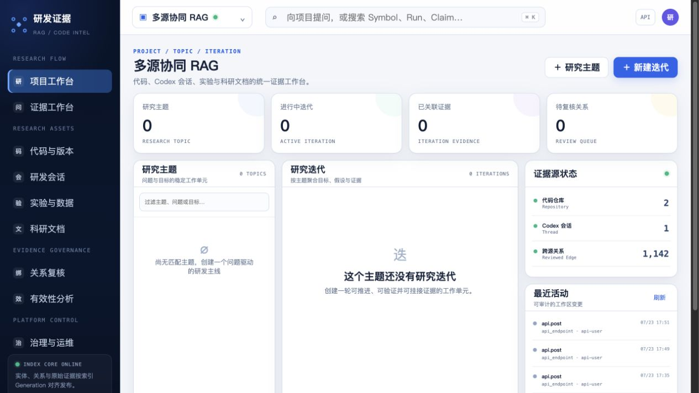
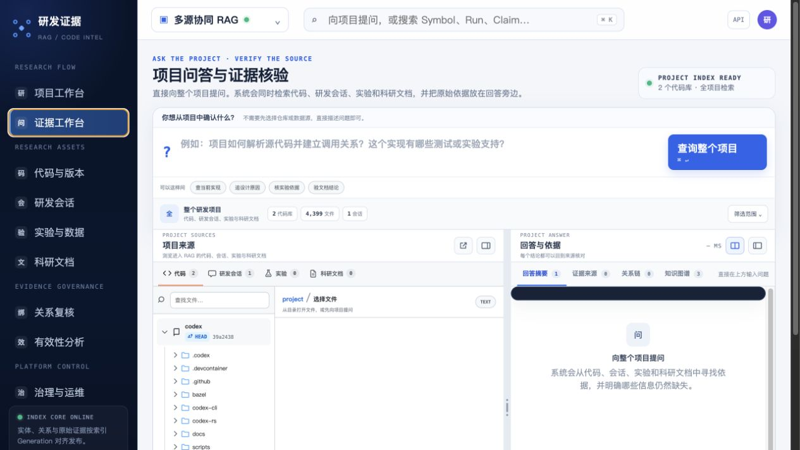
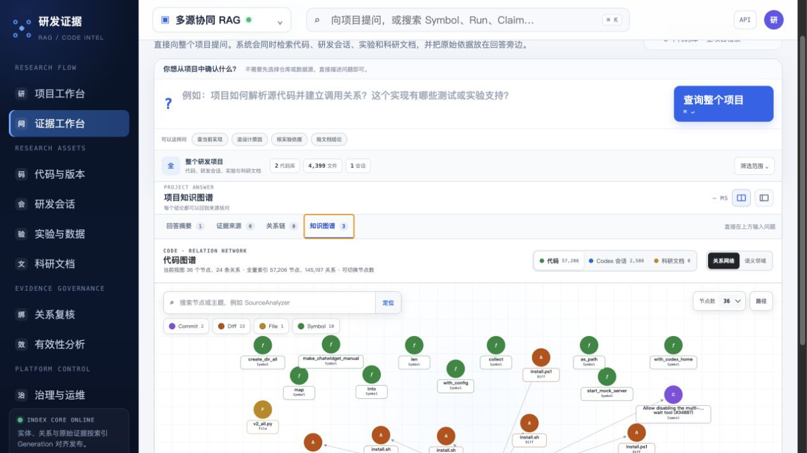
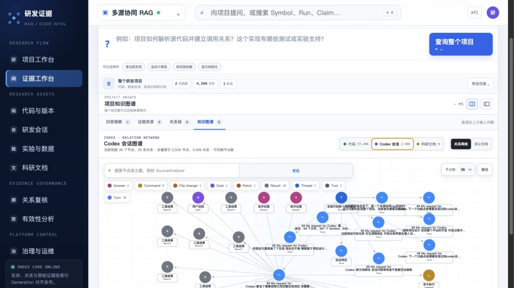
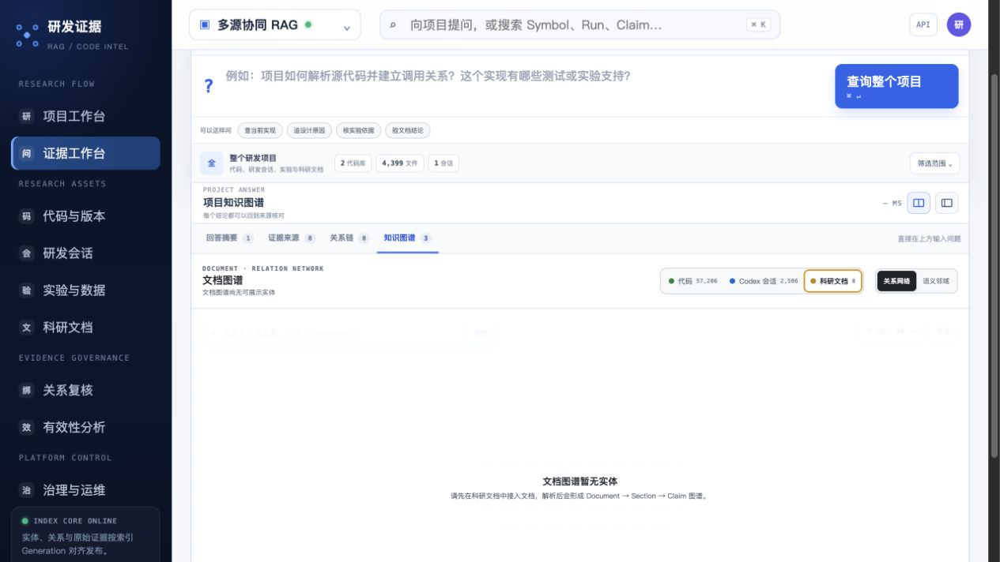
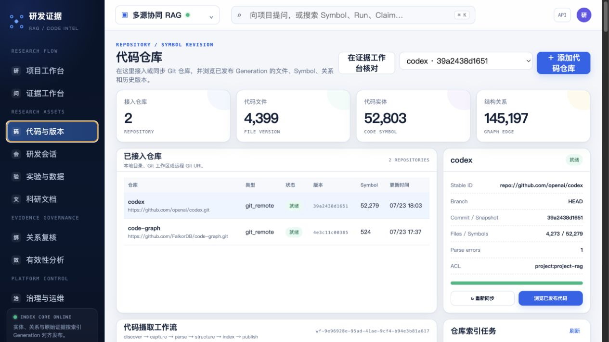
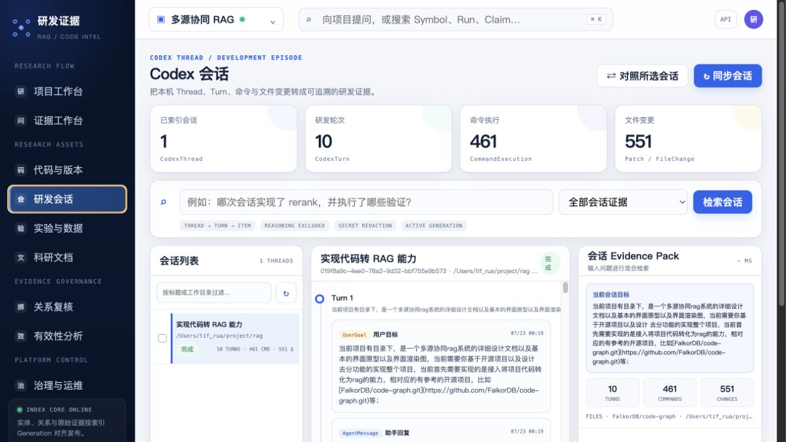
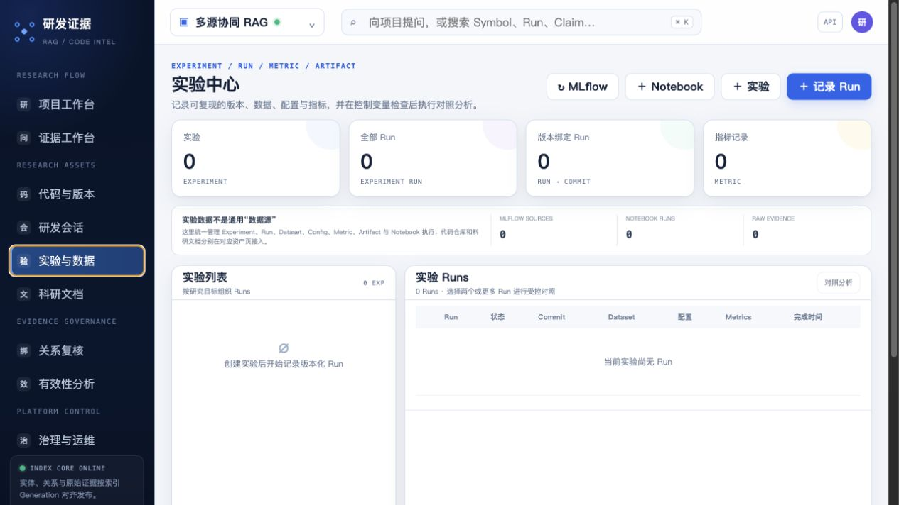
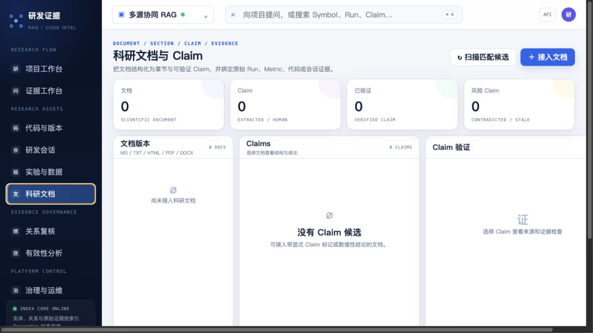

# 多源研发证据 RAG 界面审计

审计日期：2026-07-23  
审计范围：项目工作台、证据工作台、三类图谱、代码/会话/实验/文档资产页  
用户目标：快速找到来源、看清关系、核对原文，并理解下一步该做什么

## 总体结论

当前产品已经有真实数据和较完整的功能入口，但界面仍按“后端能力清单”组织，而不是按用户任务组织。最严重的问题不是颜色或圆角，而是：

1. 图谱被埋在“证据工作台 → 回答与依据 → 知识图谱”第三层 Tab 中，没有独立工作空间。
2. “三类来源”没有形成统一模型：代码、Codex、文档各自切换，但实验完全不进入图谱；跨源总览也不存在。
3. 代码图谱总量有 57,206 个节点，默认却只展示 36 个；60 节点样本中有 39 个 DiffHunk、16 个 CodeSymbol，抽样被单一类型挤占。
4. 当前节点只支持点选、双击聚焦和画布平移；节点 `pointerdown` 被直接排除，实际拖动测试前后位置完全不变。
5. 项目首页显示“跨源关系 1,142”，但当前数据库中的 1,142 条 `platform_edges` 全部是 `contains_diff` 与 `parent`，不是跨源绑定；真正的 Binding、Claim Evidence、Run、Document 都是 0。
6. 全站大量正文和控制文本只有 7–9px；文档页在当前桌面宽度出现横向滚动，影响可读性和操作稳定性。

## 分步审计

### 1. 项目工作台 — 需改进

- 优点：一级导航分组基本清楚，项目级状态有统一入口。
- 主要问题：四个 0 指标占据最强视觉位置，但右侧又显示已有仓库、会话和 1,142 条关系，用户无法理解“项目为空”和“来源有数据”为什么同时成立。
- 建议：首页只回答三个问题：项目有什么、现在健康吗、下一步做什么。技术性 Generation 说明下沉到运维。

### 2. 证据工作台 — 严重

- 提问区、范围区、四类来源浏览器、答案区和四个结果 Tab 同屏叠加，首屏出现过多层级。
- “知识图谱”是答案区的第四个 Tab，用户无法从导航直接进入。
- 左右工作区有效高度被顶部提问区大量占用，图谱模式下这个问题更明显。
- 建议：证据工作台只负责“提问 → 回答 → 核对来源”；图谱通过“在图谱中展开”跳入独立页面。

### 3. 代码图谱 — 严重

- 当前视图 36 / 总量 57,206，用户看到的是固定小样本，不是可连续探索的图谱。
- 60 节点 API 样本中 39 个是 DiffHunk，导致 Repository、目录、文件、Symbol 的结构骨架缺失。
- 节点拖动实测失败；代码只对空白画布注册平移，命中节点时直接返回。
- 标签与类型说明都常驻，画布下半部分被截断，细字和密集控件降低可读性。
- 建议：采用“按类型配额的骨架子图 + 按需展开相邻节点 + 聚类折叠”，而不是固定 24/36/60 个随机可见节点。

### 4. Codex 会话图谱 — 严重

- Turn、Command、Result 节点集中堆叠，长文本标签互相覆盖。
- 多个节点只有“工具结果”“命令执行”等泛化名称，无法区分具体对象。
- 当前默认样本偏向最近三轮和大量执行项，没有先形成 Thread → Turn → Goal/Patch/Validation 的可读骨架。
- 建议：默认按 Turn 分组折叠，先显示 Goal、Decision、Patch、Validation；Command/ToolResult 作为可展开的二级节点。

### 5. 科研图谱空态 — 阻塞

- 空态如实说明没有实体，这是正确的。
- 但第三域被命名为“科研文档”，没有覆盖设计文档中的 Experiment、Run、Metric、Dataset、Artifact。
- 空态没有直接的“接入文档”或“创建实验”主操作。
- 建议：第三域统一为“科研图谱”，同时覆盖科研文档与实验事实；空态提供两个明确入口。

### 6. 代码与版本 — 需改进

- 首屏仓库列表和当前仓库详情相对清楚。
- 同一页面继续承载摄取工作流、任务历史、Git 历史、全部文件和 Symbol 浏览，页面过长，核心浏览任务被推到折叠线以下。
- 建议：主页面保留“仓库列表 → 文件树/代码 → 版本详情”；摄取流程和历史任务进入“活动与运行记录”抽屉。

### 7. 研发会话 — 严重

- 三栏结构方向正确，但中心时间线默认直接铺开所有 UserGoal、AgentMessage、CommandExecution 和 ToolResult。
- 原始命令 JSON 与工具结果噪声远高于 Goal、Decision、Patch、Validation，用户很难理解会话做了什么。
- 建议：默认显示“研发摘要时间线”，原始事件按 Turn 折叠；右侧只显示选中 Turn 的证据包。

### 8. 实验与数据 — 需改进

- 空数据时同时出现 MLflow、Notebook、实验、Run 四个同级动作，没有明确起点。
- 空指标、空列表和空表格重复表达同一状态。
- 建议：首次使用只显示一个引导流程：“选择接入方式 → 创建/映射 Experiment → 查看 Runs”；有数据后再恢复管理界面。

### 9. 科研文档 — 严重

- 文档、Claim、Claim 验证三栏在无数据时仍全部占位。
- 当前桌面宽度已经出现页面级横向滚动。
- “扫描匹配候选”在没有文档和 Claim 时仍然与“接入文档”并列，动作时机不合理。
- 建议：空态只保留接入文档；有文档后使用“文档列表 → 原文/结构 → Claim 检查器”，右栏在选中 Claim 后以抽屉出现。

## 可访问性风险

- 多处 7–9px 字号远低于稳定阅读所需尺寸，浅灰文字也存在对比度风险。
- 图谱主要操作依赖双击、右键和图标按钮，发现性较差；需要可见的操作说明和键盘等价入口。
- SVG 节点已有 `role="button"`、`tabindex` 与 Enter/Space 选择，这是当前实现的优点。
- 未完成键盘全流程、屏幕阅读器、缩放 200%、移动端重排与颜色对比度的实测，因此不能据此判断符合 WCAG。

## 优先级

1. P0：新增独立“图谱探索”页面；补齐跨源总览和科研图谱。
2. P0：修复图谱抽样、节点拖动/固定、按需展开和标签碰撞。
3. P0：把证据工作台收敛为问答核验，不再承载完整图谱。
4. P1：按统一模板重构四类资产页，减少同屏职责和空面板。
5. P1：正文最小 12px、控制最小 32px、消除 1280px 桌面横向滚动。

## 证据边界

本次审计基于 2026-07-23 本地真实运行界面、DOM、API、SQLite 数据和桌面视口截图。科研文档与实验当前没有数据，因此只能审计空态，无法验证有数据时的列表、详情、筛选和跨源关系；也未执行移动端、屏幕阅读器和完整键盘导航测试。
